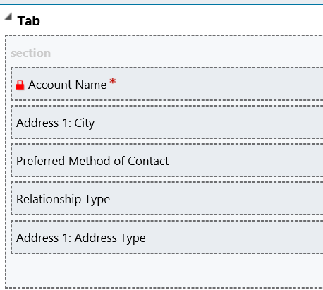

# Add or remove the fields in a form (section)

Applies to Dynamics 365 for Customer Engagement apps version 9.1.0

[!include[cc-beta-prerelease-disclaimer](../../includes/cc-beta-prerelease-disclaimer.md)]

You add or remove the fields from the form (section) by navigating to the respective entities and quick view forms.

> [!NOTE]
> This procedure shows how to modify the **Customer Profile** form (card) in the Customer summary form of the **Conversation** entity. However, the process is similar for other forms (cards).

1.  Sign in to Microsoft Dynamics 365.

2.  Go to **Settings** > **Customization** > **Customize the system**.

3.  Expand **Components** > **Entities** > **Account** and select **Forms**.

4.  Select **Customer summary**, which is of the form type **Quick View Form**.

5.  In the form, select the section for which you want to add a field, and then in the **Field Explorer** pane, double-click the field you want to add to the form. For example, double-click the **Address 1: Address Type** field from the **Field Explorer** pane. The field is added to the section.

 > [!div class=mx-imgBorder]
 >   

6.  Select **Save** and then select **Publish**.

> [!TIP]
> To create a new quick view form, see [How to create a quick view form](https://docs.microsoft.com/en-us/dynamics365/customer-engagement/customize/create-edit-quick-view-forms#create-a-quick-view-form)  

You can also use the previous procedure to add or remove fields in other forms (cards). In step 3, select the entity that is shown in the following table, and then, in step 4, select the quick view form that is shown. Then follow steps 5 through 6.

| **Card**         | **Entity**         | **Quick View Form** |
|------------------|--------------------|----------------------|
| Customer profile | Account > Forms | Customer summary         |
| Customer profile | Contact > Forms | Customer summary         |
| Issue snapshot   | Case > Forms    | Issue Snapshot       |
| Recent cases     |                 |                      |

> [!div class="nextstepaction"]
> [Next topic: Customize the conversation form](customize-conversation-form.md)

## See also

- [Omni-channel system customizers](omni-channel-engagement-hub-customizer.md)
- [Customize Customer summary form](customize-customer-360-page.md)
- [How to modify the position or alignment of the section](how-modify-position-alignment-form-section-customer360.md)
- [How to modify the section properties of the form](how-modify-section-properties-form-section.md)
- [Configure agent and supervisor configurations in Unified Service Desk](create-agent-supervisor-configurations-unified-service-desk.md)
- [Configure notification (Screen pop) for agents](configure-notification-screen-pop-agents.md)
