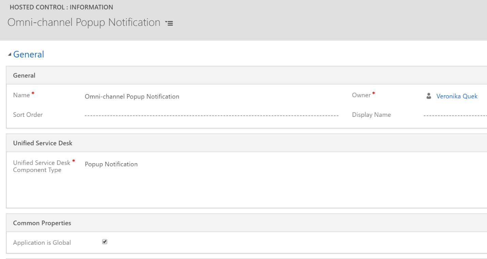

# Step 2: Create hosted controls

Applies to Dynamics 365 for Customer Engagement apps version 9.1.0

[!include[cc-beta-prerelease-disclaimer](../../includes/cc-beta-prerelease-disclaimer.md)]

1.  Sign in to Microsoft Dynamics 365 for Customer Engagement instance.

2.  Go to **Settings** > **Unified Service Desk**.

3.  Select **Hosted Controls** and select **+ New**.

4.  On the page for new hosted control, specify the following.

| **Field**                           | **Value**                       |
|-------------------------------------|---------------------------------|
| Name                                | Omni-channel Popup Notification |
| Unified Service Desk Component Type | Popup Notification              |
| Application is Global               | Select the checkbox             |

 > [!div class=mx-imgBorder]
 >   

5.  Save the hosted control.

> [!div class="nextstepaction"]
> [Next topic: Step 3: Create events](alertnotification-step3-create-the-events.md)

## See also

- [Configure notification (Screen pop) for agents](configure-notification-screen-pop-agents.md)
- [Step 1: Create forms to define layout and behavior of the notification](alertnotification-step1-create-forms-define-layout-behavior-notification.md)
- [Step 4: Create an action call to display the notification](alertnotification-step4-create-action-call-display-notification.md)
- [Step 5: Add the action calls to the events](alertnotification-step5-add-action-calls-events.md)
- [Step 6: Add the hosted controls, events, and action calls to the agent and supervisor configurations](alertnotification-step6-add-hosted-controls-events-action-callsagent-supervisor-configurations.md)
- [Configure toast notification in Unified Service Desk](configure-toast-notification-unified-service-desk.md)
