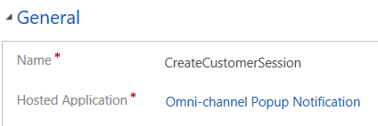
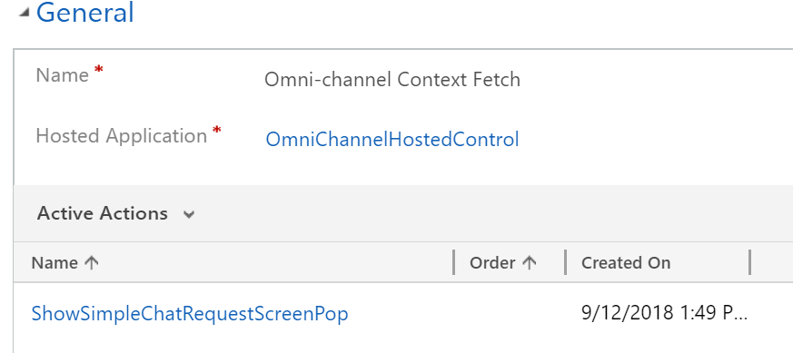

# Step 3: Create the events

Create the following events:

-   CreateCustomerSession

-   IncomingRequestRejected

-   TimedOut

-   Omni-channel Context Fetch

1.  Sign in to Dynamics 365.

2.  Go to **Settings** &gt; **Unified Service Desk**.

3.  Select **Events** and select **+ New**.

4.  In the new event page, specify the following details.

| **Field**          | **Value**                       |
|--------------------|---------------------------------|
| Name               | CreateCustomerSession           |
| Hosted Application | Omni-channel Popup Notification |

1.  Save the event.

    Repeat the steps from 3 - 5 to create **IncomingRequestRejected**, **TimedOut**, and **Omni-channel Context Fetch** events.

    For the Omni-channel Context Fetch event, specify the following details.

| **Field**          | **Value**                  |
|--------------------|----------------------------|
| Name               | Omni-channel Context Fetch |
| Hosted Application | OmniChannelHostedControl   |

  

