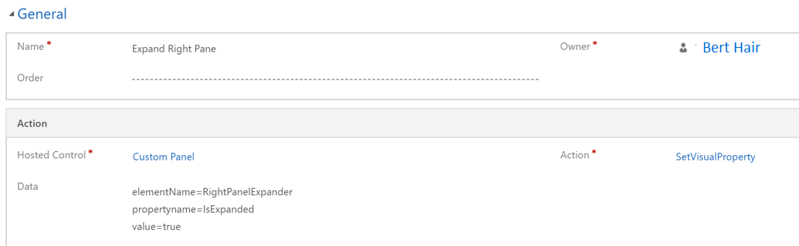
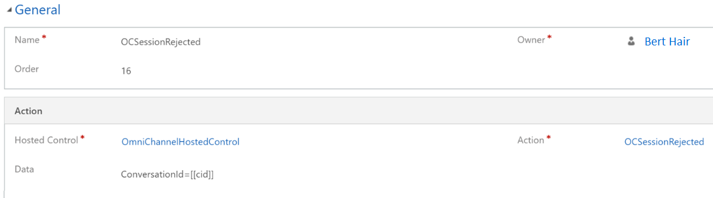

# Step 4: Create an action call to display the notification

Applies to Dynamics 365 for Customer Engagement apps version 9.1.0

1. Sign in to Microsoft Dynamics 365 for Customer Engagement instance.

2. Go to **Settings** > **Unified Service Desk**.

3. Select **Action Calls** and select **+ New**.

4. In the new page, specify the following details.

 | **Field**      | **Value**                       |
 |----------------|---------------------------------|
 | Name           | CloseUSDPopUpNotification       |
 | Hosted Control | Omni-channel Popup Notification |
 | Action         | Close                           |

5. Save the action call.

6. Repeat steps 1 through 5 to create the following additional action calls.

 <table>
    <tr>
        <th>Field</th>
        <th>Value</th>
    </tr>
    <tr>
        <td>Name</td>
        <td>ShowSimpleChatRequestScreenPop</td>
    </tr>
    <tr>
        <td>Hosted Control</td>
        <td>Omni-channel Popup Notification</td>
    </tr>
    <tr>
        <td>Action</td>
        <td>Show</td>
    </tr>
    <tr>
        <td>Data</td>
        <td>formname=SimpleChatRequestPopUpForm  
            top=10  
            left=98  
            timeout=120  
            stack=true  
            stackHeight=50  
            cid=[[ConversationId]+]  
            from=[[From]+]  
            isUniqueContactRecognized=[[IsUniqueContactRecognized]+]  
            jobTitle=[[contact_jobtitle_0]+]  
            email=[[contact_emailaddress1_0]+]  
            state=[[contact_Address1_Stateorprovince_0]+]  
            city=[[contact_Address1_City_0]+]  
            position=absolute  
            isAccept=TRUE  
            isReject=TRUE</td>
    </tr>
    <tr>
        <td>Condition </td>
        <td>[[RequestType]] == "1"</td>
    </tr>

 </table>

 | Field          | Value                           |
 |----------------|---------------------------------|
 | Name           | Expand Right Pane               |
 | Hosted Control | Omni-channel Popup Notification |
 | Action         | SetVisualProperty               |
 | Data           | elementName=RightPanelExpander propertyname=IsExpanded value=true |

 > [!div class=mx-imgBorder]
 >   

 | Field          | Value                 |
 |----------------|-----------------------|
 | Name           | CreateCustomerSession |
 | Order          | 10                    |
 | Hosted Control | CRM Global Manager    |
 | Action         | CreateSession         |

 > [!div class=mx-imgBorder]
 >   

 | Field          | Value                        |
 |----------------|------------------------------|
 | Name           | Omni-channel Presence Status |
 | Hosted Control | OmniChannelHostedControl     |
 | Action         | OCPresenceUpdate             |

 > [!div class=mx-imgBorder]
 >   

 | Field          | Value                                       |
 |----------------|---------------------------------------------|
 | Name           | OCSessionAccepted                           |
 | Order          | 15                                          |
 | Hosted Control | OmniChannelHostedControl                    |
 | Action         | OCSessionAccepted                           |
 | Data           | ConversationId=\[\[cid\]\]   SessionTabId=\[\[$Session.ActiveSession\]\]   From=\[\[from\]\] |

 > [!div class=mx-imgBorder]
 >   

 | Field          | Value                           |
 |----------------|---------------------------------|
 | Name           | ExecuteKBSearchOnDataAvailable  |
 | Order          | 20                              |
 | Hosted Control | CRM Global Manager              |
 | Action         | ExecuteOnDataAvailable          |
 | Data           | milliseconds=5000   \[\[$Context.PRECHATANSWER3\]\]  |

 | Field          | Value            |
 |----------------|------------------|
 | Name           | FireSessionTimer |
 | Order          | 20               |
 | Hosted Control | SessionTimer     |
 | Action         | FireEvent        |

 > [!div class=mx-imgBorder]
 >   

 | Field          | Value                     |
 |----------------|---------------------------|
 | Name           | Load Default Agent Script |
 | Order          | 150                       |
 | Hosted Control | Agent Script HC           |
 | Action         | GotoTask                  |
 | Data           | Welcome Script            |

 > [!div class=mx-imgBorder]
 >   

 | Field        | Value        |
 |---------------|---------------|
 | Name          | Load Agent Session Search Page With Condition |
 | Order         | 20                                           |
 | Hosted Control| AgentSessionSearchPage |
 | Action         | Navigate |
 | Data           | url=/main.aspx?pagetype=control&controlName=MscrmControls.OCSearchRuntime.OCSearchRuntimeControl&navbar=off |
 | Condition      | '\[\[isUniqueContactRecognized\]\]'=='False' |

 > [!div class=mx-imgBorder]
 >   

 | Field          | Value                                                                                                                                              |
 |----------------|----------------------------------------------------------------------------------------------------------------------------------------------------|
 | Name           | Load Agent Session Overview Page  |
 | Order          | 200           |
 | Hosted Control | Session Overview  |
 | Action         | Navigate   |
 | Data           | url=/main.aspx?navbar=off&cmdbar=false&pagetype=entityrecord&etn=msdyn\_ocliveworkitem&formid=5fe86453-73ea-4821-b6dd-ddc06e1755a1&bodyOnly=true\#   Hidenav=true |

 > [!div class=mx-imgBorder]
 >   

 | Field          | Value              |
 |----------------|--------------------|
 | Name           | Focus on Overview  |
 | Order          | 220                |
 | Hosted Control | CRM Global Manager |
 | Action         | ShowTab            |
 | Data           | Session Overview   |

 > [!div class=mx-imgBorder]
 >   

 | Field          | Value                      |
 |----------------|----------------------------|
 | Name           | OCSessionRejected          |
 | Order          | 16                         |
 | Hosted Control | OmniChannelHostedControl   |
 | Action         | OCSessionRejected          |
 | Data           | ConversationId=\[\[cid\]\] |

 > [!div class=mx-imgBorder]
 >   

 | Field          | Value                      |
 |----------------|----------------------------|
 | Name           | OCSessionTimeout           |
 | Order          | 16                         |
 | Hosted Control | OmniChannelHostedControl   |
 | Action         | OCSessionTimeout           |
 | Data           | ConversationId=\[\[cid\]\] |

 > [!div class=mx-imgBorder]
 >   

> [!div class="nextstepaction"]
> [Next topic: Step 5: Add the action calls to the events](alertnotification-step5-add-action-calls-events.md)

## See also

- [Configure notification (Screen pop) for agents](configure-notification-screen-pop-agents.md)
- [Step 1: Create forms to define layout and behavior of the notification](alertnotification-step1-create-forms-define-layout-behavior-notification.md)
- [Step 2: Create hosted controls](alertnotification-step2-create-hosted-controls.md)
- [Step 3: Create events](alertnotification-step3-create-the-events.md)
- [Step 6: Add the hosted controls, events, and action calls to the agent and supervisor configurations](alertnotification-step6-add-hosted-controls-events-action-callsagent-supervisor-configurations.md)
- [Configure toast notification in Unified Service Desk](configure-toast-notification-unified-service-desk.md)
