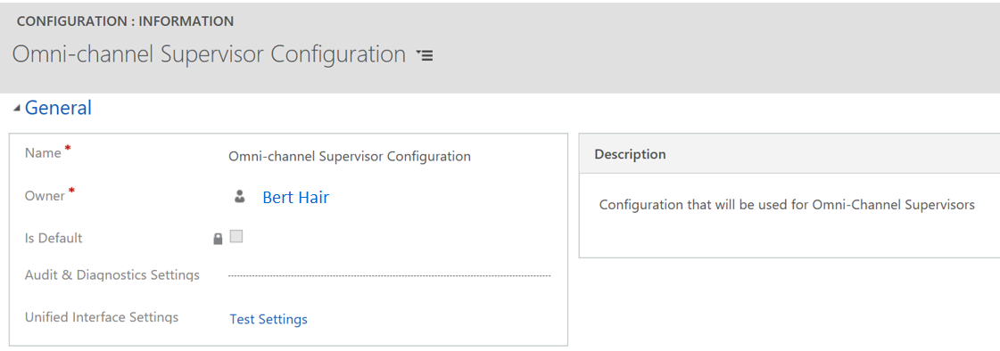

# Create agent and supervisor configurations in Unified Service Desk

Applies to Dynamics 365 for Customer Engagement apps version 9.1.0

[!include[cc-beta-prerelease-disclaimer](../../includes/cc-beta-prerelease-disclaimer.md)]

A configuration in Unified Service Desk helps you filter access to components that are shown to users in the Omni-channel Engagement Hub application. Follow these steps to create an agent configuration and a supervisor configuration.

1.  Sign in to Dynamics 365.

2.  Go to **Settings** > **Unified Service Desk**.

3.  Click **Configuration**.

4.  Click **New**.

5.  On the **New Configuration** page, in the **Name** field, type **Omni-channel Agent Configuration** and then select **Save**.

6.  Now, repeat the step 4 and 5 to create **Omni-channel Supervisor Configuration**.

Omni-channel Supervisor Configuration

 > [!div class=mx-imgBorder]
 >   

Omni-channel Supervisor Configuration

 > [!div class=mx-imgBorder]
 >   

> [!div class="nextstepaction"]
> [Next topic: Configure notification (Screen pop) for agents](configure-notification-screen-pop-agents.md)

## See also

- [Omni-channel system customizers](omni-channel-engagement-hub-customizer.md)
- [Customize Customer summary form](customize-customer-360-page.md)
- [How to modify the position or alignment of the section](how-modify-position-alignment-form-section-customer360.md)
- [How to modify the section properties of the form](how-modify-section-properties-form-section.md)
- [Add or remove the fields in the form](add-remove-fields-form-section.md)
- [Customize the conversation form](customize-conversation-form.md)
