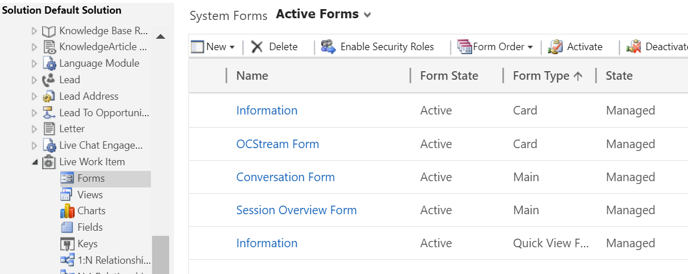

# Customize the conversation forms

Applies to Dynamics 365 for Customer Engagement apps version 9.1.0

[!include[cc-beta-prerelease-disclaimer](../../includes/cc-beta-prerelease-disclaimer.md)]

As a system customizer, you might want to customize the conversation forms to suit your business requirements for the agents who use Omni-channel Engagement Hub and Common Data Service. You can customize the following forms:

-   Conversation Form

-   Omni-channel Session Form

## Modify the position or alignment of a form

1.  Sign in to Microsoft Dynamics 365.

2.  Go to **Settings** > **Customization** > **Customize the system**.

3.  Expand **Components** > **Entities** > **Conversation** and then select **Forms**.

4.  Select either **Conversation Form** or **Omni-channel Session Form** from the list.

 > [!div class=mx-imgBorder]
 >   

5.  Drag and drop the field in the order you want to align. You can align the fields within the same section or from one section to another section.

6.  Select **Save** and select **Publish**.

## Add or remove fields

1.  Sign in to Microsoft Dynamics 365.

2.  Go to **Settings** > **Customization** > **Customize the system**.

3.  Expand **Components** > **Entities** > **Conversation** and then select **Forms**.

4.  Select either **Conversation Form** or **Omni-channel Stream Form** from the list.

5.  Add or remove the forms (card) for which you want to change the properties.

    - To remove a form (card), select the field, and select the **Remove** option from the **Home** tab.

    - To add a form (card), drag and drop the field from the **Field Explorer** to the section you want to add.

6.  Select **Save** and select **Publish**.

> [!div class="nextstepaction"]
> [Next topic: Configure agent and supervisor configurations in Unified Service Desk](create-agent-supervisor-configurations-unified-service-desk.md)

## See also

- [Omni-channel system customizers](omni-channel-engagement-hub-customizer.md)
- [Customize Customer summary form](customize-customer-360-page.md)
- [How to modify the position or alignment of the section](how-modify-position-alignment-form-section-customer360.md)
- [How to modify the section properties of the form](how-modify-section-properties-form-section.md)
- [Configure notification (Screen pop) for agents](configure-notification-screen-pop-agents.md)
- [Configure alert notification in Unified Service Desk](configure-alert-notification-unified-service-desk.md)
