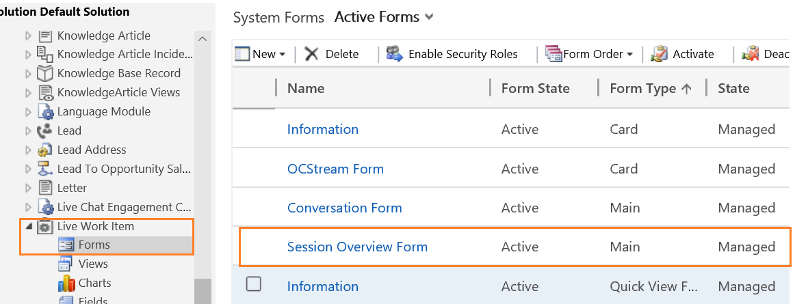

# Modify the position or alignment of a form (card) in the Customer summary

Applies to Dynamics 365 for Customer Engagement apps version 9.1.0

[!include[cc-beta-prerelease-disclaimer](../../includes/cc-beta-prerelease-disclaimer.md)]

1. Sign in to Dynamics 365 for Customer Engagement instance.

2. Go to **Settings** > **Customization** > **Customize the system**.

3. Expand **Components** > **Entities** > **Conversation** and then select **Forms**.

4. Select **Session Overview Form** in the list.

 > [!div class=mx-imgBorder]
 >   

5. Drag and drop the form (card) in the order you want to align.

6. Select **Save** and then select **Publish**.

> [!div class="nextstepaction"]
> [How to modify the section properties of the form](how-modify-section-properties-form-section.md)

## See also

- [Omni-channel system customizers](omni-channel-engagement-hub-customizer.md)
- [Customize Customer summary form](customize-customer-360-page.md)
- [Add or remove the fields in the form](add-remove-fields-form-section.md)
- [Customize the conversation form](customize-conversation-form.md)
- [Configure agent and supervisor configurations in Unified Service Desk](create-agent-supervisor-configurations-unified-service-desk.md)
- [Configure notification (Screen pop) for agents](configure-notification-screen-pop-agents.md)
