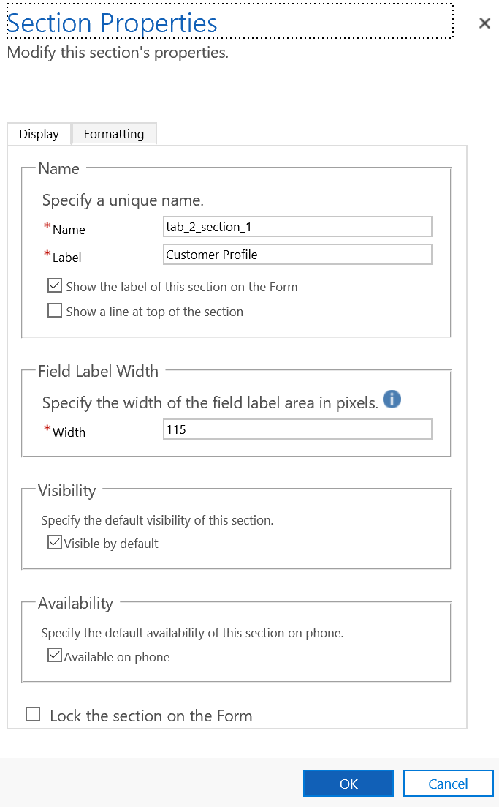
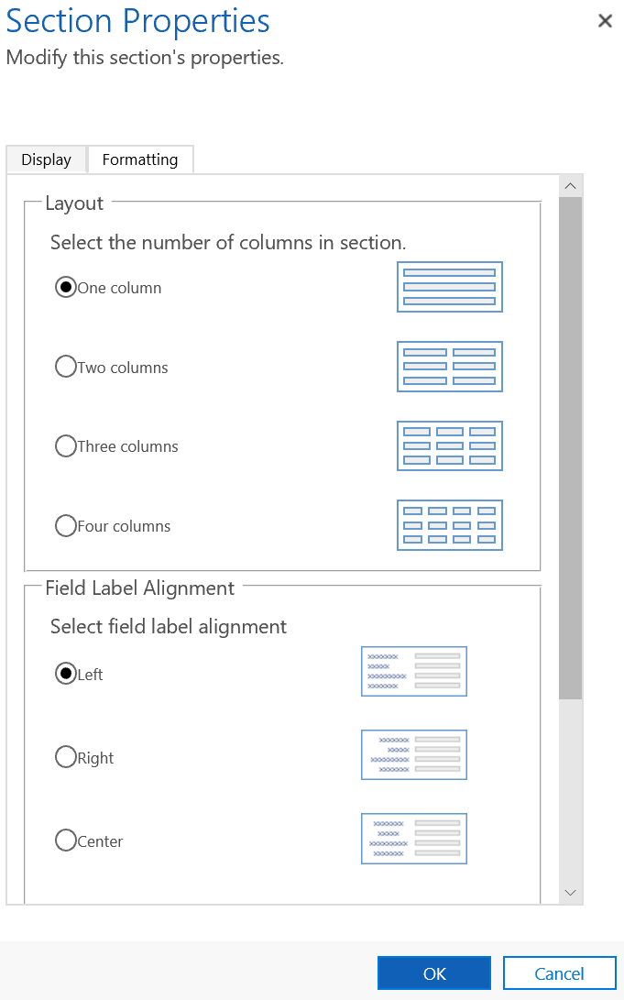

# How to modify the section properties of the form

1.  Sign in to Dynamics 365.

2.  Go to **Settings** &gt; **Customization** &gt; **Customize the system**.

3.  Expand **Components** &gt; **Entities** &gt; **Live Work Item** and select **Forms**.

4.  Select **Session Overview Form** from the list.

5.  Double-click the card for which you want to change the properties.

6.  In the **Section Properties**, you can modify the following:

| Tab        | Container             | Field                                      |
|------------|-----------------------|--------------------------------------------|
| Display    | Name                  | Name                                       |
|            |                       | Label                                      |
|            |                       | Show the label of this section on the Form |
|            |                       | Show a line at top of the section          |
| Formatting | Field Label Width     | Width                                      |
|            | Visibility            | Visible by default                         |
|            | Availability          | Available on phone                         |
|            | Layout                | Select the number of columns               |
|            | Field Label Alignment | Select field label alignment               |
|            | Field Label Position  | Select field label position                |

<table>
 <tr> 
    <th>Tab</th>
    <th>Container</th>
    <th>Field</th>
 </tr>
 <tr>
    <td>Display</td>
    <td>Name</td>
    <td>Name</td>
  </tr>
   <tr>
    <td rowspan="3"></td>
    <td rowspan="3"></td>
    <td>Label</td>
  </tr>
   <tr>
    <td>Show the label of this section on the Form</td>
  </tr>
   <tr>
    <td>Show a line at top of the section</td>
  </tr>    
  <tr>
    <td>Formatting</td>
    <td>Field Label Width</td>
    <td>Width</td>
  </tr>
  <tr>
    <td rowspan="5"></td>
    <td>Visibility</td>
    <td>Visible by default</td>
  </tr>
  <tr>
    <td>Availability</td>
    <td>Available on phone</td>
  </tr>
  <tr>
    <td>Layout</td>
    <td>Select the number of columns</td>
  </tr>
  <tr>
    <td>Field Label Alignment</td>
    <td>Select field label alignment</td>
  </tr>
  <tr>
    <td>Field Label Position</td>
    <td>Select field label position</td>
  </tr>  
</table>

   

1.  Select **OK** to save the changes.

2.  Select **Save** and select **Publish**.

> [!div class="nextstepaction"]
> [Add or remove the fields in the form](add-remove-fields-form-section.md)

## See also

[Omni-channel system customizers](omni-channel-engagement-hub-customizer.md)

[Customize customer 360 form](customize-customer-360-page.md)

[How to modify the position or alignment of the section](how-modify-position-alignment-form-section-customer360.md)

[Customize the conversation form](customize-conversation-form.md)

[Configure agent and supervisor configurations in Unified Service Desk](create-agent-supervisor-configurations-unified-service-desk.md)

[Configure notification (Screen pop) for agents](configure-notification-screen-pop-agents.md)