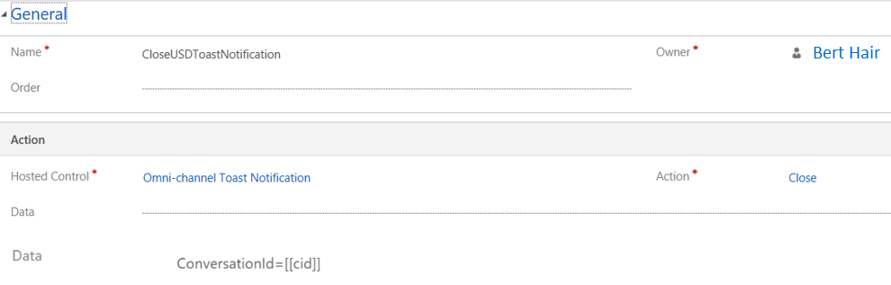

# Step 4: Create an action call to display the notification 

1. Sign in to Dynamics 365.

2. Go to **Settings** > **Unified Service Desk**. 

3. Select **Action Calls** and select **+ New**. 

4. On the page for the new action call, specify the following details. 

 | Field           | Value                            |
 |-----------------|----------------------------------|
 | Name            | CloseUSDToastNotification        |
 | Hosted Control  | Omni-channel Toast Notification  |
 | Action          | Close                            |

5. Save the action call.

 > [!div class=mx-imgBorder]
 > 

6. Repeat steps 3 through 5 to create the following additional action calls.

 | Field           | Value                                        |
 |-----------------|----------------------------------------------|
 | Name            | ShowCaseEntityNotification                   |
 | Order           | 10                                           |
 | Hosted Control  | Omni-channel Toast Notification              |
 | Action          | Show                                         |
 | data            | formname=CaseEntityNotification   top=85   left=95   timeout=60   stack=true   stackHeight=50   EntityDisplayName=\[\[EntityDisplayName\]+\]   EntityLogicalName=\[\[EntityLogicalName\]+\]   EntityId=\[\[EntityId\]+\]   ConversationId=\[\[ConversationId\]+\] |

 > [!div class=mx-imgBorder]
 > 

 | Field           | Value                          |
 |-----------------|--------------------------------|
 | Name            | Expand Right Pane              |
 | Hosted Control  | Custom Panel                   |
 | Action          | SetVisualProperty              |
 | data            | elementName=RightPanelExpander   propertyname=IsExpanded   value=true   left=95   timeout=60   stack=true                      |
 > [!div class=mx-imgBorder]
 > 

 | Field           | Value                 |
 |-----------------|-----------------------|
 | Name            | CreateCustomerSession |
 | Order           | 10                    |
 | Hosted Control  | CRM Global Manager    |
 | Action          | SetVisualProperty     |

 > [!div class=mx-imgBorder]
 > 

 | Field           | Value                                  |
 |-----------------|----------------------------------------|
 | Name            | Set Entity Session Property in Context |
 | Order           | 11                                     |
 | Hosted Control  | CRM Global Manager                     |
 | Action          | CopyToContext                          |
 | Data            | ISENTITYSESSION=True   CRMCONTACTID=010101                     |

 > [!div class=mx-imgBorder]
 > 

 | Field           | Value            |
 |-----------------|------------------|
| Name            | CollapseLeftPanel |
| Order           | 12                |
| Hosted Control  | Custom Panel      |
| Action          | SetVisualProperty |
| Data            | elementname=LeftPanelParent    propertyname=Visibility   value=$Expression('\[\[$Context.IsCaseSession\]+\]'=='True' || '\[\[$Context.ISENTITYSESSION\]+\]'=='True' || '\[\[$Session.IsGlobal\]+\]'=='True' || '\[\[$Context.cticallincoming\]+\]'=='1'? "Collapsed" : "Visible")  |

 > [!div class=mx-imgBorder]
 > 

 | Field           | Value                                  |
 |-----------------|----------------------------------------|
 | Name            | Load Form for Case Entity              |
 | Order           | 30                                     |
 | Hosted Control  | FOO Entity Page                        |
 | Action          | Open\_CRM\_Page                        |
 | Data            | LogicalName=\[\[EntityLogicalName\]+\]   id=\[\[EntityId\]+\]                    |

 > [!div class=mx-imgBorder]
 > 

 | Field           | Value                                       |
 |-----------------|---------------------------------------------|
 | Name            | OCSetSessionTabIdForEntitySession           |
 | Order           | 45                                          |
 | Hosted Control  | OmniChannelHostedControl                    |
 | Action          | OCSetSessionTabIdForEntitySession           |
 | Data            | ConversationId=\[\[ConversationId\]\]   SessionTabId=\[\[$Session.ActiveSession\]\]  |

 > [!div class=mx-imgBorder]
 > 

 | Field           | Value                       |
 |-----------------|-----------------------------|
 | Name            | OCSessionTimeout            |
 | Order           | 16                          |
 | Hosted Control  | OmniChannelHostedControl    |
 | Action          | OCSessionTimeout            |
 | Data            | ConversationId=\[\[cid\]\]  |

 > [!div class=mx-imgBorder]
 > 

> [!div class="nextstepaction"]
> [Next topic: Step 5: Add the action calls to the events](toastnotification-step5-add-action-calls-events.md)

## See also

- [Configure toast notification in Unified Service Desk](configure-toast-notification-unified-service-desk.md)
- [Step 1: Create forms to define layout and behavior of the notification](toastnotification-step1-create-forms-define-layout-behavior-notification.md)
- [Step 2: Create hosted controls](toastnotification-step2-create-hosted-controls.md)
- [Step 3: Create events](toastnotification-step3-create-the-events.md)
- [Step 6: Add the hosted controls, events, and action calls to the agent and supervisor configurations](toastnotification-step6-add-hosted-controls-events-action-callsagent-supervisor-configurations.md)
- [Configure alert notification in Unified Service Desk](configure-alert-notification-unified-service-desk.md)
