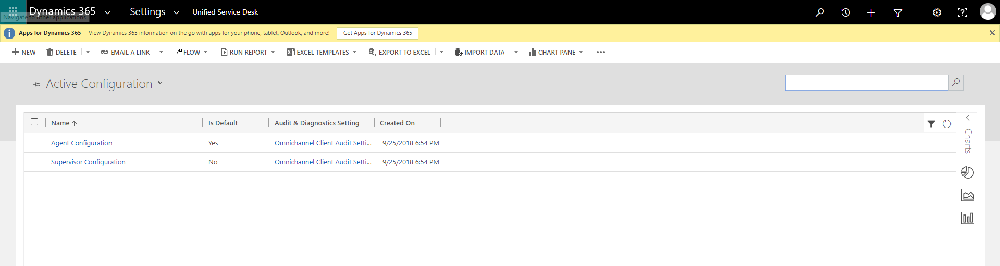
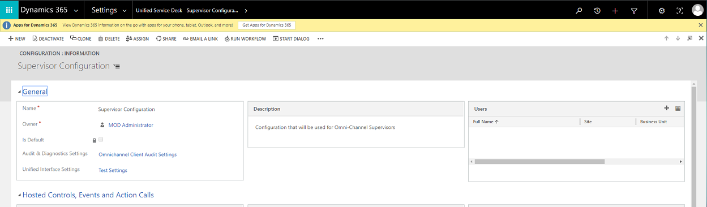

# Add users to the supervisor configuration

Before users can access the supervisor dashboard in Unified Service Desk, you must add them to the supervisor configuration. Follow these steps to add users to the supervisor configuration.

1. Sign in to Microsoft Dynamics 365.
2. Go to **Settings** \> **Unified Service Desk**, and then select **Configuration**.
3. On the **Configuration** page, select **Supervisor Configuration**.

    

4. In the **Users** section, select **Add User record**, and enter the user name of the user that you want to add.

    

5. Save and close the configuration.

The users are added to the supervisor dashboard. When those users sign in to Omni-channel Engagement Hub, the supervisor dashboard appears.
