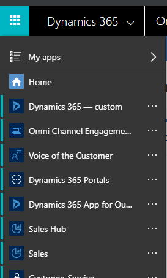
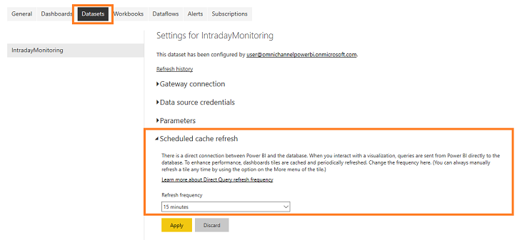

# Private preview: Configure the supervisor dashboard to appear in Omni-channel Engagement Hub

The following illustration shows an overview of the process for configuring the supervisor dashboard to appear in Omni-channel Engagement Hub.

## Step 1: Prerequisites

Review the following prerequisites before you start to configure the supervisor dashboard:

- You have administrative privileges for Microsoft Dynamics 365.
- You must have a Microsoft Power BI Pro license for all supervisors.
- You must have a Microsoft Azure account.

## Step 2: Register an Azure AD native app that has Power BI API permissions

Create a native app in Azure Active Directory (Azure AD) and grant it access to the Power BI representational state transfer (REST) application programming interfaces (APIs). Follow these steps to register an Azure native app.

1. Open the [Power BI application registration](https://dev.powerbi.com/apps) page, and sign in to the app.
2. Enter the following basic information: the name, type of the app, and the URL.

    > [!NOTE]
    > In the **App Type** field, select **Native**.

3. In the **Choose APIs to access** section, select all the APIs under **Dataset APIs**, **Report and Dashboard APIs**, and **Other APIs**.
4. Select **Register App**.

    The app is registered, and the client ID is shown. For example, the client ID might be **2da2165-0def-4252-b4cb-760534af096d**.

5. Make a note of the client ID.

For more information, see [Register with the Power BI App Registration Tool](/power-bi/developer/register-app).

You're now ready to create an Azure key vault for your application.

## Step 3: Create a key vault

A key vault for your tenant helps you securely store passwords, certificates, and other secrets. Follow these steps to create a key vault.

1. Sign in to the [Azure portal](http://portal.azure.com).
2. Create a key vault. For more information, see [Create a vault](/azure/key-vault/quick-create-portal#create-a-vault).
3. Add the following secrets to the new key vault.

    | Key         | Value (Secret) |
    |-------------|----------------|
    | PowerBiUser | Your admin user name, such as `admin@contoso.onmicrosoft.com` |
    | PowerBiPass | Your admin password |

For more information, see [Add a secret to Key Vault](/azure/key-vault/quick-create-portal#add-a-secret-to-key-vault).

## Step 4: Grant the omni-channel app access to the key vault

Follow these steps to grant your native app access to the new key vault.

1. Sign in to the [Azure portal](http://portal.azure.com), and open the key vault that you created.
2. Go to **Access policies**.
3. Select **Add new**, and then select **Configure from template (optional)** as **Key, Secret, & Certificate Management**.
4. Select **Select principal**, and add the **OmniChannel** app that is registered during the consent flow.
5. Save and close.
6. In the **Overview** section, copy the value in the **DNS Name** field. You will use this value to provision Power BI reports in your workspace.

For more information, see [Authorize the application to use the key or secret](/azure/key-vault/key-vault-get-started).

Your application is now secured and ready to be used in the Dynamics 365.

## Step 5: Sign in to Power BI and create an app workspace

In Power BI, create an app workspace to add and refine collections of dashboards and reports that are intended for supervisors. Follow these steps to create an app workspace.

1. Sign in to the Power BI service, and then go to **Workspaces** &gt; **Create app workspace**.
2. Enter the required information, and save the workspace.

    The workspace is created.

3. In the workspace URL, make a note of the workspace ID.

    For example, when a workspace is created, the URL is `https://msit.powerbi.com/groups/7b712501-788g-41e9-a136-30484a39f09f/groupWelcome`. In this case, the workspace ID is **7b712501-788g-41e9-a136-30484a39f09f**.

For more information, see [Create workspaces with your colleagues in Power BI](/power-bi/service-create-workspaces).

## Step 6: Provision Power BI reports in your workspace

When you provision the Power BI reports, the **IntradayMonitoring** and **LiveMonitoring** reports will be available in your workspace. These reports are required in order to create dashboards for supervisors. Follow these steps to provision the supervisor reports.

1. Sign in to Dynamics 365, and open the **Omni Channel Engagement Hub** app.

    

2. Select the **Site Map** button , and then select **Supervisor experience** \> **Overview dashboard**.

    The analytics view appears.

    

3. Select **New**.

    The **Power BI Analytics Configuration** page appears.

    

4. Enter the following information:

    - **Power BI native app ID**: Enter the client ID that you made a note of when you were registering the Azure AD native app to embed Power BI content in [Step 2: Register an Azure AD native app with Power BI API permissions](#step-2-register-an-azure-ad-native-app-with-power-bi-api-permissions).

        For example, the ID of the Power BI native app might be **2da2165-0def-4252-b4cb-760534af096d**.

    - **Power BI workspace ID**: Enter the workspace ID that was created when you were creating an app workspace in [Step 5: Sign in to Power BI and create an app workspace](#step-5-sign-in-to-power-bi-and-create-an-app-workspace).

        For example, the Power BI workspace ID might be **1d3b66s1-650f-44f7-8bc9-d9bdc67e8540**.

    - **Azure Key Vault URI:** Enter the key vault URI that you obtained when you were creating the Power BI application registration in [Step 4: Grant the omni-channel app access to the Key Vault](#step-4-grant-the-omni-channel-app-access-to-the-key-vault).

        For example, the key vault URI might be `https://yourkeyvault.vault.azure.net/`.

5. Save and close the configuration.

    The **IntradayMonitoring** report should now be available in your workspace.

    > [IMPORTANT]
    > Don't create more than one analytics configuration in your Dynamics 365. If you have more than one, the application uses only the configuration that you created last. If you want to add a new analytics configuration, first delete or inactivate the existing configuration.

6. Download the **LiveMonitoring** report file (.pbit file) from [GitHub](https://github.com/Microsoft/BusinessPlatformApps/tree/dev/Samples/D365OmniChannel/Preview).<!-- This is to be changed -->

You now have the reports that you need to configure the dashboards in Power BI.

## Step 7: Configure Power BI dashboards by using Power BI Desktop

Create the Power BI dashboard out of the two reports that are available to you: **Intraday Monitoring** and **Live Conversations**. When you provision the workspace, the following data sets and reports are available:

- IntradayMonitoring (data set)
- LiveMonitoring (data set)
- Intraday Monitoring (report)
- Live Conversations (report)

> [IMPORTANT]
> In Power BI, share the dashboards with all supervisors who use Omni-channel Engagement Hub. Otherwise, supervisors can't view the dashboards when they sign in to Omni-channel Engagement Hub. For more information, see [Share your Power BI dashboards and reports with coworkers and others](/power-bi/service-share-dashboards).

Follow these steps to configure Power BI dashboards.

1. Open the **Power BI Desktop** app, and sign in by using your credentials.
2. Go to the workspace that you created in [Step 5: Sign in to Power BI and create an app workspace](#step-5-sign-in-to-power-bi-and-create-an-app-workspace).
3. Go to **File** &gt; **Import** &gt; **Power BI template**, and select the **IntradayMonitoring.pbit** file that you downloaded.

    A dialog box appears.

4. Select **Edit** on the message.
5. In the **Power BI service** dialog box, select your workspace, and then select the data set.
6. Change to your organization created workspace, and then select the **MicrosoftDynamicsOCAnalytics** data set.

    > [!NOTE]
    > The **MicrosoftDynamicsOCAnalytics** data set might take up to 15 minutes to appear in the workspace that you created.

7. Publish and save the .pbix file to the workspace that you created.

    Reports are created.

8. Change the refresh rate of **IntradayMonitoring** data set to 15 minutes.

    a. Right-click the more options icon (...) and select **SETTINGS**. 
        

    b. On the settings page, go to **Datasets** tab and under **Scheduled cache refresh** change **Refresh frequency** to 15 minutes. 
        

    c. Select **Apply**.

1. Open the reports that are available in the workspace. For more information, see [Open a report in Power BI service](/power-bi/service-report-open).
1. Pin the required tiles to dashboards. For more information, see [Pin a tile to a Power BI dashboard from a report](/power-bi/service-dashboard-pin-tile-from-report).

    The following illustration shows what a dashboard looks like when you pin tiles to it.

    

11. Select **Set as featured** for the dashboard that you created.
12. Copy the URL of the dashboard for Unified Service Desk configuration.

For more information, see [Create a new report in Power BI service by importing a dataset](https://docs.microsoft.com/power-bi/service-report-create-new).

The dashboards are now ready, and you can configure Unified Service Desk to make the dashboards available to supervisors.

## Step 8: Configure Unified Service Desk to show the supervisor dashboard

You must configure Unified Service Desk to show the supervisor dashboards when a supervisor signs in to the workspace in omni-channel. Follow these steps to configure Unified Service Desk.

1. Sign in to Dynamics 365, and go to **Settings** \> **Unified Service Desk**.

    The Unified Service Desk settings page appears.

2. Select **Action Calls**, and open **Load Supervisor Dashboard**.
3. In the **Action** section, in the **Data** field, enter `url=https://powerbi.com/dashboards/<id>`, where **\<id\>** is the ID of the dashboard that you saved in [Step 7: Configure Power BI dashboards by using Power BI Desktop](#step-7-configure-power-bi-dashboards-by-using-power-bi-desktop). Also add the **chromeless=1** and **nosignupcheck=1** parameters to the end of the URL.

    For example, the field value might be `url=https://powerbi.com/dashboards/g12466b5-a452-4e55-8634-xxxxxxxxxxxx?chromeless=1&nosignupcheck=1`.

4. Save and close the settings page.

The supervisor dashboard is configured, and supervisors can now sign in to omni-channel and view the dashboard.

> [!div class="nextstepaction"]
> [Next topic: Add users to the supervisor configuration](add-users-supervisor-configuration.md)