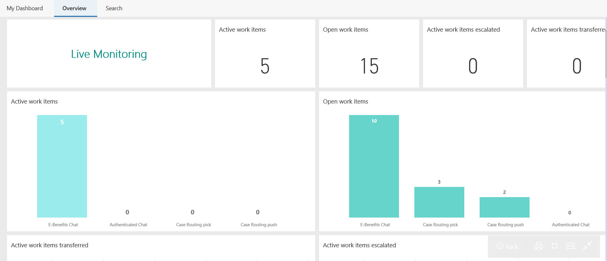
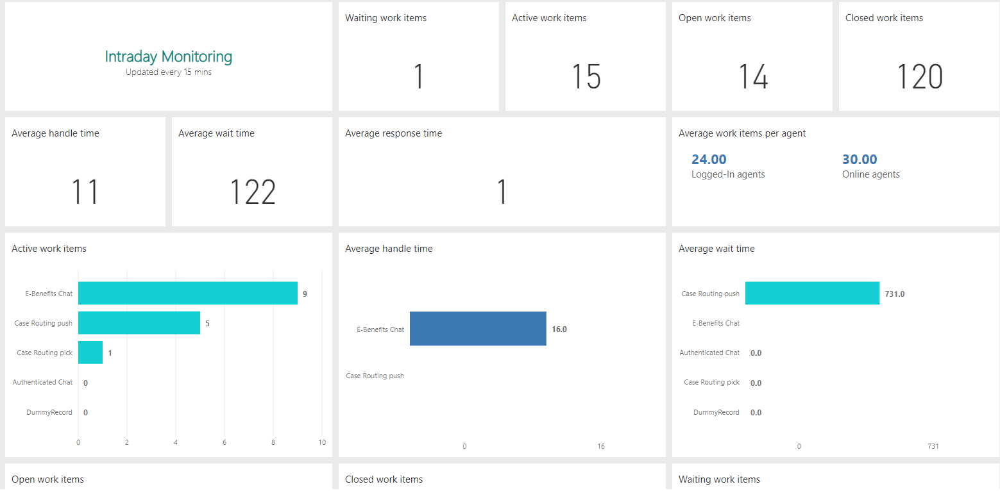
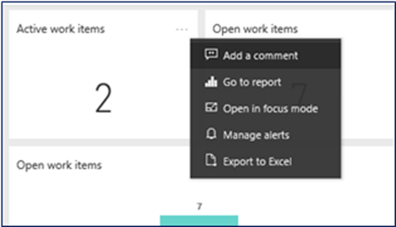
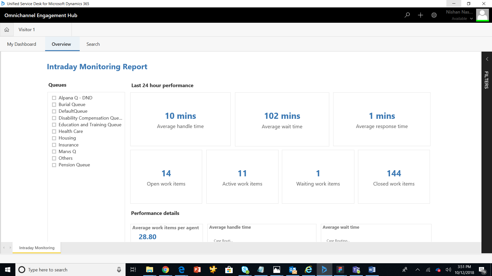

# Private preview: Introduction to supervisor dashboards

The **Overview** dashboard provides information about the health and key performance indicators (KPIs) of agents in your organization. The KPIs include the number of open work items, the number of active work items, and the number of active work items that have been escalated.

Typically, the **Overview** dashboard is divided into two sections:

- [Live monitoring](#live-monitoring)
- [Intraday monitoring](#intraday-monitoring)

## Live monitoring

The **Live monitoring** section shows information that is automatically updated to reflect the latest status of health parameters. This information includes the latest KPIs. The information that is displayed is based on active and open conversations.

The following illustration shows an example of the **Live monitoring** section.

This section of the dashboard consists of the following KPIs.

| KPI                                           | Description |
|-----------------------------------------------|-------------|
| Active and open conversations                 | The number of conversation that are in active and open state, and to be resolved.|
| Conversations exceeding 5 min wait time       | The number of conversations that are in active state and exceeded the time in queue threshold of five minutes. |
| Conversations exceeding 5 min handle time     | The number of active conversations that are exceeding the handle time threshold of five minutes. |
| Total conversations transferred               | The number of conversations that are active and transferred from one agent or supervisor to another agent or supervisor. |
| Open conversations                            | The number of work items that are in the **Open** state and that are available to be picked or pushed to an agent. |

## Intraday monitoring

The **Intraday monitoring** section provides information about the latest KPIs, the health of queues on the status of the agents on a given day. The information that is displayed is based on the performance of agents in the past 24 hours.

The following illustration shows an example of the **Intraday monitoring** section.

This section of the dashboard consists of the following KPIs.

> [!NOTE]
> All KPIs that the application shows are for the last 24-hour running window.

| KPI                          | Description |
|------------------------------|-------------|
| Agent availability           | Displays the distribution of agent presence status. The presence status of agents can be offline, busy, busy-do not disturb, at lunch, available, away, or your custom defined status. |
| Average handle time per conversations (mins) | The average time that is taken to complete a conversation from start to end and the KPI is calculated based on the conversations closed in the past 24 hours. |
| Average response time per session | The average time that an agent takes to accept a conversation. |
| Average wait time per conversations (mins) | The average time that an agent takes to respond to a conversation is waiting in the queue. |
| Average conversations per agent | The average number of conversations that are that are in active state and being handled by agents. The numbers are shows for both agents who are signed in (available, busy, and away) and for online agents (available and busy). |
| Conversation state           | The number of number of conversations that are in open, active, waiting and closed state. |
| Sessions consulted           | The number of consulting requests that agents have received and responded. |
| Average consult time         | The total average time spent by agents on consultation for other agents or supervisor, across all sessions. |
| Sessions abandon rate        | The percentage of sessions abandoned by agents due to timed-out or rejected requests. |
|Sessions abandoned| The number of sessions that are abandoned by agents.|

## View and filter report 

You can filter the information by viewing the reports and selecting the **Queues** that are custom defined for your organization. To view and select queue: 
1. Select the **More options** icon (…) on any KPI and then select **Go to report**, or simply select the KPI tile.
    
    
    
    The report opens as shown in the following example:
    
    

2. Select the queues as required and the information is filtered according to your selection.  
    For example, you are managing agents for a call center that handles requests on financial trading. The following queues are defined for your organization: DMAT, Payments, and Bank. Based on these queues, when you select DMAT and payments, you will see KPIs such as the ongoing work items, agents who are assigned to this process, and work items handled today. This helps you in quickly analyzing the KPIs and take necessary steps to improve outcomes. 

### See also

[Configure the supervisor dashboard](configure-supervisor-dashboard.md)