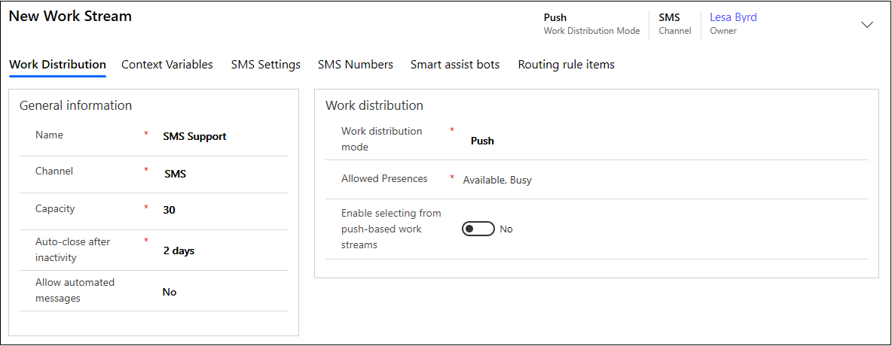
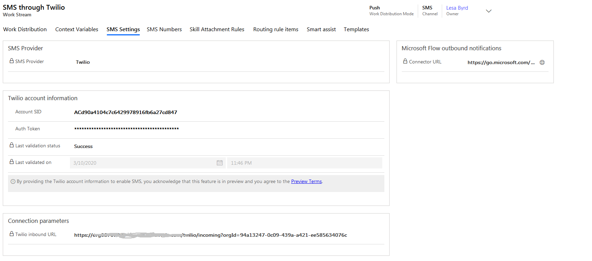

# Configure an SMS channel for Twilio

[!INCLUDE[cc-use-with-omnichannel](../../includes/cc-use-with-omnichannel.md)]

## Overview

The SMS channel through Twilio in Omnichannel for Customer Service allows your organization to connect to customers by using text messages. Your customers can send text messages through Twilio and connect with an appropriate customer service agent. Agents can view the incoming SMS requests on their dashboard and respond accordingly.

## Prerequisites

Make sure that the following prerequisites are met:

- SMS for Twilio is provisioned in Omnichannel for Customer Service. For information, see [Provision Omnichannel for Customer Service](omnichannel-provision-license.md).
- A Twilio account with phone number and subscription is available.

## Configure an SMS channel for Twilio in Omnichannel

### Step 1: Get Twilio account details

An SMS channel is enabled within Omnichannel for Customer Service by integrating with Twilio. This integration uses public APIs of Twilio for sending and receiving text messages.

1. In your Twilio account, note the ACCOUNT SID and AUTH TOKEN values. The values are required to create the SMS configuration in the Omnichannel Administration app.
2. Purchase support phone numbers through your Twilio account.

> [!NOTE]
>
> In this release, only long code type US phone numbers are supported.

### Step 2: Create a work stream

Perform the following steps to create a work stream for the SMS channel for Twilio:

1. Sign in to Omnichannel Administration.
2. Select **Work Streams** under **Work Distribution Management**.
3. Select **New**. The **New Work Stream **page appears.
4. In **General information**, do the following:
    - **Channel:** Select **SMS**.
    - **Auto-close after inactivity:** Select a value that indicates a duration of eight hours or more.
    - **Allow automated messages:** Accept the default value **No**. This option is for future use only.
5. In **Work distribution**, specify the necessary details. For information, see [Create a work stream](work-streams-introduction.md#create-a-work-stream).
   > [!div class=mx-imgBorder]
   > 
6. On the **SMS Settings** tab, do the following:
    - **SMS Provider:** Select Twilio.
    - **Account SID:** Enter the Twilio ACCOUNT SID.
    - **Auth Token:** Enter the Twilio AUTH TOKEN.
7. Select **Save**. The **Twilio inbound URL** is generated and displayed.
   > [!div class=mx-imgBorder]
   > 
8. On the **SMS Numbers** tab, select **New SMS Number**, and do the following:
    - **Number:** Specify the support phone number that you purchased from Twilio in the *<country_code><phone_number>* format, such as 14252306549. Make sure that you don't enter blank spaces or special characters.
    - **Type:** Select **Long code**.
    - **Description:** Specify optional description for the number.
    - **Operating Hours:** Specify the business hours when the customer support team is active and available to serve customers. You can specify a value only when the **Allow automated messages** option is set to **Yes** on the **Work Distribution Management** tab.

    > [!NOTE]
    >
    > You can configure only one phone number per work stream.
9. Select **Save**.
10. On the command bar, select **Validate API Key**. the Twilio account and phone number are validated.
11. Configure the routing rules on the **Routing rule items** tab. The routing rule for SMS works on **Mobile Phone** of the **Contact** entity. The customer is identified based on **Mobile Phone**, and the conversation is automatically linked to the contact record.
    > [!NOTE]
    >
    > To configure routing rules and other options in the work stream for Twilio, see the following:
    > - [Skill-based routing](overview-skill-work-distribution.md)
    > - [Productivity tools](productivity-tools.md)
    > - [Smart assist](smart-assist.md)
    > - [Templates](templates-overview.md)

### Step 3: Establish connection between Omnichannel and the Twilio account

Perform the following steps to configure the URL in Twilio for the SMS messages from Omnichannel to be processed in Twilio:

1. Copy the value in **Twilio inbound URL** of the work stream for Twilio.
2. Go to your Twilio account > **Phone Numbers** > **Active Numbers**, and select the SMS phone number.
3. Under the **Messaging** section, paste the Twilio inbound URL.

## Flow of data between Omnichannel for Customer Service - SMS channel and Twilio

### Incoming text messages

For an incoming text message sent by a customer to the support phone number, the message is first sent to the Twilio messaging service, and then pushed by Twilio to Omnichannel for Customer Service using the callback URL. After this, the message gets routed and associated to either a new or an existing conversation by Omnichannel for Customer Service.

### Outgoing Text Messages

For an outgoing message sent by an agent from within Dynamics 365, the message is first sent to the Twilio service and then Twilio sends it to the customer. In addition to the text message, Omnichannel for Customer Service uses the APIs provided by Twilio to send the customer's phone number, support phone number, and the Twilio account information (Account SID and the Auth Token) to the Twilio service.

### Twilio API Key Validation

When you validate the SMS settings while setting up the SMS channel, a call is made to Twilio to validate Account SID and Auth Token.

### See also

[SMS FAQ](../faqs.md#sms)
 
[Channels in Omnichannel](channels.md)