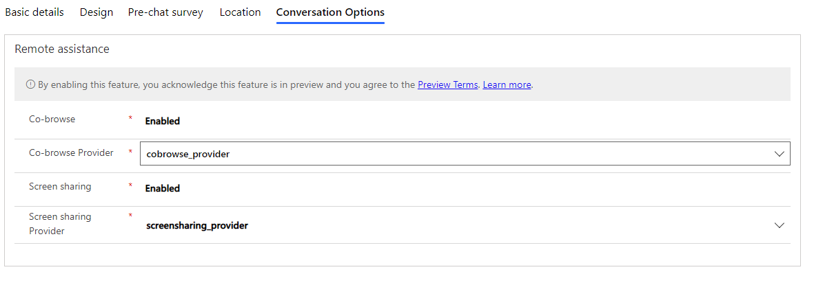

# Add a chat widget

[!INCLUDE[cc-use-with-omnichannel](../../includes/cc-use-with-omnichannel.md)]

1. Sign in to Omnichannel Administration.

2. Go to **Channels** > **Chat**.

3. Select **New**. The New Chat Widget page is displayed.

4. Select the **Basic details** tab and specify the information for the following fields.

    | Section | Field | Description | Example value |
    |---------------|------------------------|-----------------------------------|---------------------|
    | General information | Name | Specify the name of the widget. | Contoso chat |
    | General information | Language | Select the language of the chat widget from the list. | English - United States |
    | General information | Agent display name | Select an agent display name type from the list. There are four options - **Full name**, **First name**, **Last name**, and **Nick name**.   More information: [Configure agent display name](agent-display-name.md). | Full name |
    | General information | Authentication settings |Select an authentication setting from the list. This is an optional field. For more information about how to specify authentication settings, see [Create chat authentication settings](create-chat-auth-settings.md). | Chat authentication |
    | | | |
    | Work distribution | Work stream | Select a work stream from the list. Initially, a default a work stream is selected.  More information: [Understand and create work streams](work-streams-introduction.md).   **Note:**   If you save the chat widget, you can't edit the **Work stream** field. If you want to edit the field, you must delete the chat widget and create a new one. | Live work stream |
    | | | |
    | Proactive chat | Enable Proactive Chat | Select an option to enable or disable proactive chat.  More information: [Configure proactive chat](proactive-chat.md). | Yes |
    | | | |
    | File attachments | Enable file attachments for customers | Select an option to allow or deny customers to attach and send files as attachments.   More information: [Configure file attachment capability](configure-file-attachment.md). | Yes |
    | File attachments | Enable file attachments for agents | Select an option to allow or deny  agents to attach and send files as attachments.   More information: [Configure file attachment capability](configure-file-attachment.md). | Yes |
    | | | |
    | Chat Transcripts | Allow download of transcript |  Select an option to allow download of chat transcripts.   More information: [Configure download and email of chat transcripts](download-email-chat-transcripts.md). | Yes |
    | Chat Transcripts | Allow email of transcript |Select an option to allow emailing of chat transcripts.   More information: [Configure download and email of chat transcripts](download-email-chat-transcripts.md). | Yes |
    | Chat Transcripts | Email Template |If you selected **Yes** for the **Allow email of transcript** field, then the Email field is displayed to you. Select the email template from the list to send the chat transcript as an email to the customer. | Conversation transcript email template |
    | Chat Transcripts | From mailbox | If you selected **Yes** for the **Allow email of transcript** field, then the Email field is displayed to you. Select an mailbox detail from which the chat transcript email will be sent to the customer. | William Contoso |
    | | | |
    | Queue position | Show position in queue | Select an option to show customers their position in the queue when they are waiting to interact with an agent.   More information: [Show customers their position in a queue](show-queue.md). | Yes |
    | | | |
    | Code snippet | Widget snippet | Copy the snippet and embed it in the HTML source of your website where you need to display the chat widget. |

    > [!div class=mx-imgBorder]
    >     

5. Select the **Design** tab and specify the information for the following fields.

    | Section | Field | Description | Example value |
    |---------------|------------------------|-----------------------------------|---------------------|
    | Online | Theme color | Select a color from the list for the chat widget. | Blue |
    | Online | Logo | Logo for the chat widget. | https://oc-cdn-ocprod.azureedge.net/livechatwidget/images/chat.svg |
    | Online | Title | Specify the name for the widget that for the customers. | Let's Chat! |        
    | Online | Subtitle | Specify the name for the widget that for the customers. | We're Online |
    | Online | Position | Specify the name of the widget. | Regular shift |
    | Online | Operating hours | Select a operating hour window for the chat widget from the list.   More information: [Create and manage operating hours](create-operating-hours.md). |  |

    > [!div class=mx-imgBorder]
    > 

6. Select the **Pre-chat survey** tab and specify the information for the following fields.

    | Section | Field | Description | Example value |
    |---------------|------------------------|-----------------------------------|---------------------|
    | Pre-chat survey | Pre-chat survey | Select Yes or No to setup pre-chat survey in the chat widget. The survey is shown to users before a conversation is initiated. | Yes |
    | Pre-chat unauthenticated questions | Pre-chat unauthenticated questions | If you selected **Yes** for the **Pre-chat survey** field, then the **Pre-chat unauthenticated questions** section is displayed to you.   Add the pre-chat questionnaires   More information: [Configure a pre-chat survey](configure-pre-chat-survey.md). | Product |

    > [!div class=mx-imgBorder]
    > 

7. Select the **Location** tab and in the **Widget location** section, select **Add** to specify the website domain where the chat widget must be shown. The domain format should not include the protocol (for example, **http** or **https**).

8. In the **Visitor location** section, specify if you need to detect the visitor's location, and select the geo location provider. More information: [Set up location detection](geo-location-provider.md).

    > [!NOTE]
    > If no domains are specified, the chat widget can be embedded on any website without restrictions. If you specify a domain, the chat widget can be hosted only on the specified domain.

    > [!div class=mx-imgBorder]
    > 

9. Select the **Conversation options** tab, and specify the information for the following fields. 

    | Section | Field | Description | Example value |
    |---------------|------------------------|-----------------------------------|---------------------|
    | Remote assistance | Co-browse | Select to enable or disable third-party co-browse. You must install a third-party provider from AppSource in order to use the feature. | Enabled |
    | Remote assistance | Co-browse provider | Select the provider from the list. | Co-browse_provider |
    | Remote assistance | Screen sharing | Select to enable or disable third-party screen share. You must install a third-party provider from AppSource in order to use the feature. | Enabled |
    | Remote assistance | Screen sharing provider | Select the provider from the list.| Screen_sharing_provider|
    ||||
    |Calling | Calling options | Select a calling option from the list. You've the following options:   - No calling   - Video and voice calling   - Voice only | Video and voice calling |

   > [!div class=mx-imgBorder]
   > 
        
   > [!NOTE]
   > You can select one co-browse provider and/or one screen sharing provider for each chat widget. 

10. Select **Save** to save the configurations.   

### See also

[Configure a pre-chat survey](configure-pre-chat-survey.md)  
[Configure agent display name](agent-display-name.md) 
[Configure proactive chat](proactive-chat.md) 
[Configure file attachment capability](configure-file-attachment.md) 
[Create quick replies](create-quick-replies.md)  
[Create and manage operating hours](create-operating-hours.md)  
[Create chat authentication settings](create-chat-auth-settings.md)   
[Embed chat widget in Power Apps portals](embed-chat-widget-portal.md)
