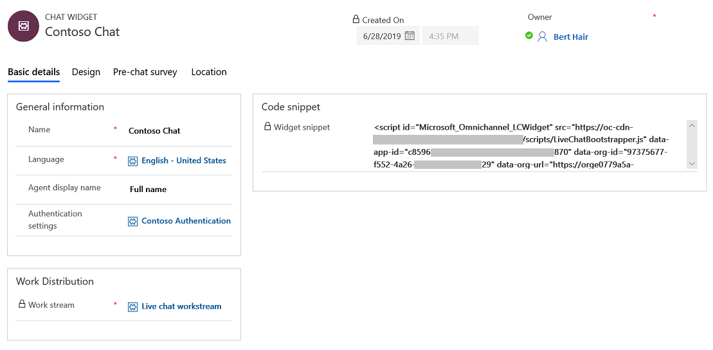
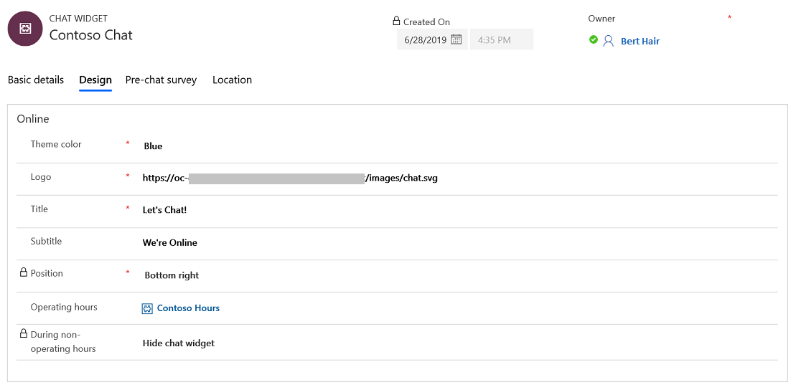
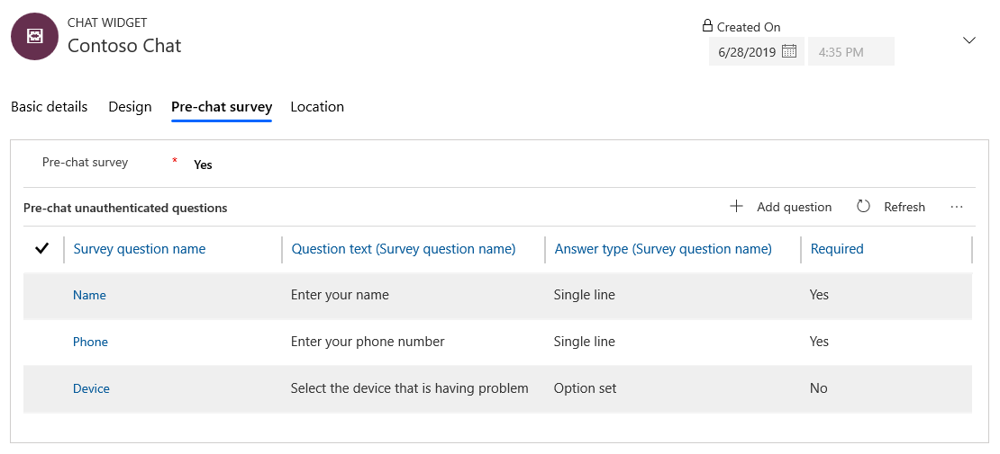
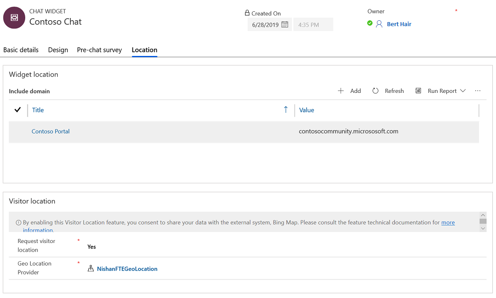

# Add a chat widget

[!INCLUDE[cc-use-with-omnichannel](../../includes/cc-use-with-omnichannel.md)]

1. Sign in to Omnichannel Administration.
2. Go to **Channels** &gt; **Chat**.
3. Select **New**. The New Chat Widget page is displayed.
4. Provide appropriate information on each of the following tabs:

    - **Basic details**:

        1. In the **General information** section, enter a name for the chat widget and select the agent name to be displayed. More information: [Configure agent display name](agent-display-name.md).
        
            You can optionally specify authentication settings. For more information about how to specify authentication settings, see [Create chat authentication settings](create-chat-auth-settings.md). You must save the record to enter more details.

        2. In the **Work Distribution** section, browse and select the work stream you created for the chat widget. By default, **Live chat workstream** is selected. More information: [Understand and create work streams](work-streams-introduction.md).
        
        > [!NOTE]
        > If you save the chat widget, you can't edit the **Work stream** field. If you want to edit the field, you must delete the chat widget and create a new one.
        
        3. In the **File attachments** section, select the options to allow or deny customers and agents to attach and send files as attachments. More information: [Configure file attachment capability](configure-file-attachment.md).
        4. In the **Chat Transcripts** section, select the options to download and email the chat transcripts. More information: [Configure download and email of chat transcripts](download-email-chat-transcripts.md).
        5. In the **Queue position** section, set the option to show customers their position in the queue when they are waiting to interact with an agent. More information: [Show customers their position in a queue](show-queue.md). 
        6. Copy the value in the **Code snippet** section and embed it in the HTML source of your website where you need to display the chat widget.
        
        > [!div class=mx-imgBorder]
        > 

    - **Design**: Use this tab to specify the theme color, logo, title, subtitle, and operating hours of the chat widget. More information: [Create and manage operating hours](create-operating-hours.md).

        > [!div class=mx-imgBorder]
        > 

    - **Pre-chat survey**: Use this tab to set up a pre-chat survey. This survey is shown to users before a conversation is initiated. More information: [Configure a pre-chat survey](configure-pre-chat-survey.md).

        > [!div class=mx-imgBorder]
        > 

    - **Location**:
        1. In the **Widget location** section, select **Add** to specify the website domain where the chat widget must be shown. The domain format should not include the protocol (for example, **http** or **https**).
        2. In the **Visitor location** section, specify if you need to detect the visitor's location. More information: [Set up location detection](geo-location-provider.md).

        > [!div class=mx-imgBorder]
        > 

        > [!NOTE]
        > If no domains are specified, the chat widget can be embedded on any website without restrictions. If you specify a domain, the chat widget can be hosted only on the specified domain.

### See also

[Configure a pre-chat survey](configure-pre-chat-survey.md)  
[Configure agent display name](agent-display-name.md) 
[Configure file attachment capability](configure-file-attachment.md) 
[Create quick replies](create-quick-replies.md)  
[Create and manage operating hours](create-operating-hours.md)  
[Create chat authentication settings](create-chat-auth-settings.md)   
[Embed chat widget in Dynamics 365 Portals](embed-chat-widget-portal.md)
