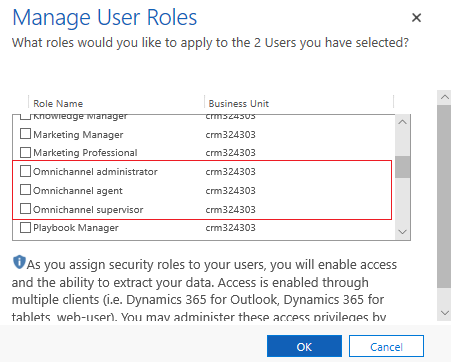

# Assign roles and enable users for Omnichannel for Customer Service

[!INCLUDE[cc-use-with-omnichannel](../../includes/cc-use-with-omnichannel.md)]

All users who are assigned the **Omnichannel administrator**, **Omnichannel supervisor**, or **Omnichannel agent** role are enabled for Omnichannel and become Omnichannel users. Additionally, agents and supervisors must be assigned the **Customer service app access** role along with the **Omnichannel agent** and **Omnichannel supervisor** role.

> [!NOTE]
> To configure Omnichannel, you must assign the **Omnichannel administrator** role mandatorily along with system administrator role.

Use the Microsoft 365 admin center to create user accounts for every user who needs access to Omnichannel for Customer Service. For more information, see  [Create users in the Common Data Service platform and assign security roles](../../admin/create-users-assign-online-security-roles.md).

Follow these steps to assign roles to users in the **Advanced Settings**:

1. Select **Settings** > **Advanced Settings** on the command bar. The **Settings** page is displayed in a new browser tab.

2. Select **Settings** > **Security** > **Users**.

3. Select the user or users from the list for whom you want to assign a security role.

4. Select **Manage Roles** in the menu.

   Only the security roles available for that user's business unit are displayed.

5. In the **Manage User Roles** dialog box, select a security role or roles that you want to provide to the user, and then select **OK**.

    - Customer service app access
    - Omnichannel administrator
    - Omnichannel agent
    - Omnichannel supervisor
    - Productivity tools user (For users of Dynamics 365 Productivity Tools)
    - Productivity tools administrator (For administrator of Dynamics 365 Productivity Tools)

    > [!div class=mx-imgBorder]
    > 

To view and manage omnichannel users, see [Manage users in Omnichannel for Customer Service](users-user-profiles.md).

## Understand roles and their privileges

Each role in Omnichannel for Customer Service can perform a set of actions based on the privileges. 

> [!NOTE]
> Omnichannel users (agents and supervisors) should be assigned **Customer service app access** role.

|Role  |Privileges  |
|---------|---------|
|**Omnichannel Administrator**      |  Can view user list / presence list / work stream list / queue list / PBI config list       |
|    |    Can edit roles of a user     |
|    |   Can edit default presence and default capacity of a user      |
|    |     Can edit queue assignment of a user    |
|    |    Can add / edit / delete presence     |
|    |      Can add / remove users from presence   |
|    |    Can add / edit / delete presence associations     |
|    |      Can add / edit / delete work streams   |
|    |   Can add / edit / delete channel settings, context settings, routing rules      |
|    |     Can add / edit / delete queues    |
|    |     Can add / remove agents from queue    |
|    |    Can view / add / edit / delete quick replies     |
|    |     Can add / edit / delete PBI config    |
|    |    Can view add / edit / delete operating hours    |
|    |    Can view add / edit / delete auth settings     |
|**Omnichannel Supervisor**     |  Can view user list / presence list / work stream list / queue list / PBI config list       |
||Can edit default presence and default capacity of a user|
||Can edit queue assignment of a user|
|| Can add / remove users from presence |
||Can add / remove agents from queue| 
|| Can view / add / edit / delete quick replies|
||Can view operating hours |
|**Omnichannel Agent**  |Can view user list / presence list / work stream list / queue list|
||Can view quick replies|
|**Productivity tools user**| Can read agent script |
|| Can read agent script step |
|| Can read workflow |
|| Can read `msdyn_actioninputparameter` |
|| Can read `msdyn_actionoutputparameter` |
|| Can read `msdyn_inputparameters`|
|| Can read `msdyn_macroconnector` |
|| Can read `msdyn_parameterdefinition` |
|| Can read `msdyn_designeroptions` |
|| Can read `msdyn_macroactiontemplate` |
|| Can read macro action |
|**Productivity tools administrator**| Can create / read / write / append / delete agent script |
|| Can create / read / write / append / delete agent script step |
|| Can create / read / write / append / delete agent script workflow |
|| Can read `msdyn_actioninputparameter`|
|| Can read `msdyn_actionoutputparameter`|
|| Can read `msdyn_inputparameters`|
|| Can read `msdyn_macroconnector` |
|| Can read `msdyn_parameterdefinition` |
|| Can read `msdyn_designeroptions` |
|| Can read `msdyn_macroactiontemplate` |
|| Can read `msdyn_macrosolutionconfiguration` |
|| Can create / read / write / append / delete macro action |
||

### See also

[Provision Omnichannel for Customer Service](omnichannel-provision-license.md)  
[Manage users in Omnichannel for Customer Service](users-user-profiles.md)  
[Guide agents with scripts](agent-scripts.md)  
[Automate tasks with macros](macros.md)