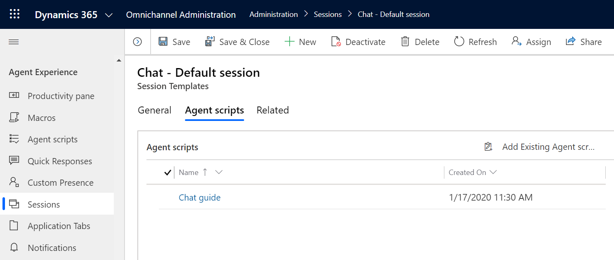

# Guide agents with scripts

[!INCLUDE[cc-use-with-omnichannel](../../includes/cc-use-with-omnichannel.md)]

## Overview of agent scripts

In the customer service industry, agents need to deal with continuous updates both to products and processes. Even after agents have been rigorously trained, recurrent human errors and delays in service delivery occur due to a lack of guidance in real-time customer scenarios. These issues lead to lower productivity and thus negatively affect customer satisfaction levels. To avoid errors and ensure that processes are adhered to, agents need guidance.

Agent scripts provide guidance to agents about what to do when they get a customer issue. The scripts ensure that only accurate, company-endorsed information is being shared, while also safeguarding the organization in regard to issues of legal compliance. Agent scripts help organizations to be unified, accurate, and effective while also being faster and more efficient in terms of customer handling.

Agent scripts reduce the human errors involved in the process, because agents know which actions they need to perform next while they interact with a customer, which enables them to adhere to business process. This, in turn, leads agents to provide quick resolutions for the issue (low average handling time) and improve customer satisfaction.

## Value propositions

- Minimization of human errors.

- Adherence to business processes.

- Lower average handling time.

- Improved customer satisfaction.

## Prerequisites

- Install Dynamics 365 Productivity Tools solution.

- Ensure that you have the **Productivity tools administrator** security role. To learn more, see [Assign roles and enable users](add-users-assign-roles.md).

- Ensure that agents and supervisors are assigned the **Productivity tools user** security role. To learn more, see [Assign roles and enable users](add-users-assign-roles.md).

## Walk-through to enable agent scripts

[Step 1: Create agent scripts](#step-1-create-agent-scripts)

[Step 2: Associate an agent script with a session template](#step-2-associate-an-agent-script-with-a-session-template)

[Step 3: Enable the productivity pane](#step-3-enable-the-productivity-pane)

## Step 1: Create agent scripts

First, you need to create agent scripts in the Omnichannel Administration app. The following procedure creates an example of an agent script for a chat session. You can modify this procedure for other types of sessions your agents are likely to encounter.

1. Sign in to the Omnichannel Administration app.

2. Under **Agent Experience**, select **Agent Scripts**.

3. On the **Active Agent scripts** page, select **+ New**.

4. On the **New Agent script** page, specify the following:

    | Field | Description | Value |
    |------------|------------------------------|-------------------|
    | Name | Provide a name for the agent script. | Chat session script |
    | Language | Select a language from the list. The languages that are enabled in Common Data Service appear in the list. | English |
    | Description | Describe the agent script. | This agent script is used for chat sessions. |

5. Select **Save**. The **Agent script steps** appears.

6. In the **Agent script steps** section, select **+ New Agent script step**. **Quick Create: Agent script step** appears.

7. Specify the following in the quick-create form.

    | Field | Description | Example Value |
    |--------------------|------------------------------|-------------------------------------------|
    | Name | Provide a name for the agent script step; this appears for the agent at runtime. You can use slugs for specifying the name of the step. To learn more, see [Slugs](automation-dictionary-keys.md#slugs-for-productivity-tools-macros-and-agent-scripts). | Example 1: Greet the customer.    Example 2: Hi {customer}  |
    | Order | Specify the order number based on which step is displayed to the agent. | 1 |
    | Action Type | Select an action type from the list: <ul> <li> Text instruction </li> <li> Macro </li> <li> Script </li> |
    | Description | Describe the step briefly for your reference. | This step opens a draft email to send the customer links to knowledge articles.    **Note:**   This field appears only when you select the **Action Type** value as **Target Macro** or **Target script**. |
    | Text instruction | Specify the text instructions the agent needs to follow and execute. This is a text field. Additionally, you can pass parameter values by using the slugs and OData queries. More information: [Pass parameter values](automation-dictionary-keys.md)   **Note:**   This field appears only if you select the **Text** value for the **Action Type** field. | Greet the customer with the welcome message from the quick reply repository. |
    | Target macro | Type the name of the configured macro in the text box, and then select the macro from the lookup results.    **Note:**   This field appears only if you select the **Macro** value for the **Action Type** field. | Email |
    | Target script | Type the name of the configured script in the text box, and then select the script from the lookup results.    **Note:**   This field appears only if you select the **Script** value for the **Action Type** field. | Close the session |

    > [!div class=mx-imgBorder] 
    > 

8. Select **Save and Close** to add, save, and close the quick-create form.

9. Select **Save** to save the changes.

    > [!div class=mx-imgBorder] 
    > 

The agent script is now configured.

## Step 2: Associate an agent script with a session template

After you configure the agent script and add the field to a form, you need to associate the agent script with a session template so that the agent script will load for agents based on the type of session they've opened.

1. Sign in to the Omnichannel Administration app.

2. Under **Templates**, select **Sessions**.

3. Select a template from the list for which you want to associate the template. For example, select the **Chat - Default Session** template.

4. Select the **Agent scripts** tab.

5. In the **Agent scripts** section, select **Add Existing Agent script**. The **Lookup Records** pane appears.

6. In the **Look for Records** box, select the search icon. Select the agent script from the list, and then select **Add**.

    > [!div class=mx-imgBorder] 
    > 

7. Select **Save**.

The agent script is associated with the session template.

## Step 3: Enable the productivity pane

After you've created the agent script, you need to enable the productivity pane to display the script to agents in Omnichannel for Customer Service. For more information, see [Enable the productivity pane to provide guidance to agents](productivity-pane.md).

> [!Note]
> - If you don't create agent scripts and enable the productivity pane, users won't see the pane in Omnichannel for Customer Service. 
>
> - We recommend that you remove the agent script control if you've customized a form and added agent script. If you don't remove the agent script control, agents will see the agent script control in the form and also in the productivity pane.

## Set the default agent script for agents

As an administrator, you can set different default agent scripts for agents who handle different services, customers, or products. You need a way to show these agents a script that's appropriate for the context of the conversation between them and the customer. With the agent script expression builder, you can define the conditions that define which script an agent is shown by default in Omnichannel for Customer Service.

Based on these conditions, when an agent accepts an incoming conversation, the agent script control selects a script from the different scripts that were made available for that particular session type and shows the script to the agent. In addition, agents can manually select a script from the list of available agent scripts if they need to switch between different scripts.

### Enable and build the expression

You can build the expression in the **Agent scripts** tab in the sessions template.

1. Sign in to Omnichannel Administration.

2. Under **Agent Experience**, select **Sessions**.

3. Go to the **Agent scripts** tab.

4. Set the **Enable build expression** toggle to **Yes**, and then select **Build Expression** to define the expression. The **Expression builder** page is displayed.

    > [!div class=mx-imgBorder] 
    > 

5. Select the **Condition** step, and then create the condition.

6. In the **If true** step, select **Add an action**. The **Condition** step is displayed. To learn about conditions, see [Use the automation dictionary to pass context data parameters](#use-the-automation-dictionary-to-pass-context-data-parameters).

7. Select the **Customer Service** tab, and then select **Set default agent script**.

    > [!div class=mx-imgBorder] 
    > 

8. Select a script from the **Agent script** list.

    > [!div class=mx-imgBorder] 
    > 

9. Follow steps 5 through 8 for the **If false** step.

10. Select **Save and close** to save the expression and close the builder.

Now, you've built the expression.

## Use the automation dictionary to pass context data parameters

As an administrator, you need to configure the condition by using the automation dictionary based on the evaluation of the condition. A script is set as default, and this script is displayed to the agent at runtime.

The automation dictionary provides you certain data parameter keys that you can use to build your condition. These parameter keys are resolved and replaced by contextual values at runtime.

To learn about the slugs for productivity tools, see [Slugs](automation-dictionary-keys.md#slugs-for-productivity-tools-macros-and-agent-scripts).

To learn more, see [Use the automation dictionary to pass data parameter keys](automation-dictionary-keys.md#pass-data-parameter-in-macros-and-agent-scripts).

### See also

[Agent scripts](../agent/agent-oc/oc-agent-scripts.md) 
[Macros](macros.md) 
[Smart assist](smart-assist.md) 
[Session templates](session-templates.md)