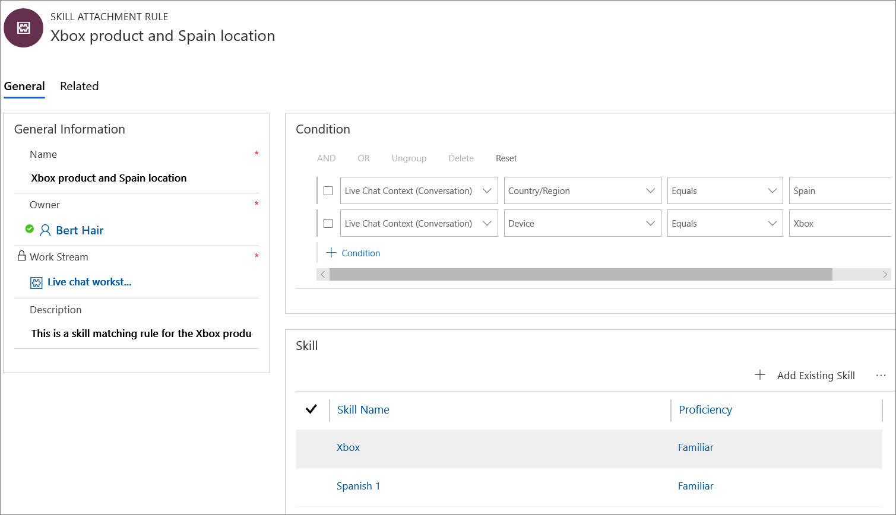
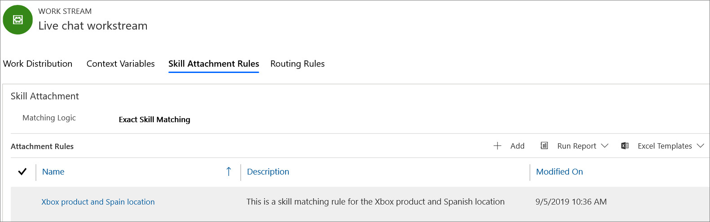

# Preview: Attach skills to conversation

[!INCLUDE[cc-use-with-omnichannel](../../includes/cc-use-with-omnichannel.md)]

[!include[cc-beta-prerelease-disclaimer](../../includes/cc-beta-prerelease-disclaimer.md)]

> [!IMPORTANT]
> - A preview is a feature that is not complete, as it may employ reduced privacy, security, and/or compliance commitments, but is made available before it is officially released for general availability so customers can get early access and provide feedback. Previews are provided “as-is,” “with all faults,” “as available,” and without warranty.​
> - This preview features does not come with technical support and Microsoft Dynamics 365 Technical Support won’t be able to help you with issues or questions.  If Microsoft does elect to provide any type of support, such support is provided "as is," "with all faults," and without warranty, and may be discontinued at any time.​
> - Previews are not meant for production use, especially to process Personal Data or other data that is subject to heightened compliance requirements, and any use of "live" or production data is at your sole risk.  All previews are subject to separate [Terms and Conditions](../../legal/dynamics-insider-agreement.md).

## Understand skill

In the portal, when the customer fills in the prechat survey questions, the system receives these as context variables. The omnichannel system attaches these variables to the incoming conversation as a skill, and then the work distribution engine matches the skills of the agents based on the exact or closest match criteria. Once the skill attached to the conversation matches the skill of an agent, then the work distribution engine assigns the conversation to that agent.

For example:

Kenny Smith, a customer from Spain, uses **Xbox** product and goes to **www.contoso.com** portal to initiate a chat with the Contoso customer service center. The pre-chat survey question prompts Kenny to choose a device, and Kenny chooses **Xbox**. As Kenny's geolocation is Spain, the Omnichannel system attaches the **Xbox** product and **Spanish** language as the skill to the conversation. After the skill attachment, the work distribution engine assigns the conversation to an agent with skill as **Xbox** and **Spanish**.

> [!Note]
> The system attaches the skills to a conversation based on the skill attachment rules.

## Match skills

When the skill attachment logic attaches a skill with a certain proficiency level, the work distribution system considers the attached proficiency level as the minimum criteria, and assigns the conversation to an agent only if the criteria are met.

If the minimum proficiency criteria are not met, then the system searches for the next best proficiency level based on the skill-matching criteria.

The two skill-matching types are:

- Exact skill matching
- Closest skill matching
 
### Exact skill matching

In exact skill matching, the skill attachment logic identifies the skills and proficiency level that an agent should have to work on the conversation. Next, the work distribution system searches for an agent with the required skills and proficiency level. 

The skill attachment logic identified proficiency level is set as minimum criteria while searching for the agents. 

- If the minimum proficiency criteria are not met, then the system searches for a higher proficiency level. 

- If no agent is found with a higher proficiency level, then the conversation remains in the queue.

The following table describes how exact skill matching works for a single or multiple-skill scenario.

| Skill scenario | Skill & proficiency criteria  | Description |
|--------|---------------------|-----------------|
| Single | Xbox = 4 |<ul><li> First, the system searches for an agent with **Xbox** = **4**, the minimum criteria. </li> <li> When the criteria are not met, the system searches for an agent with **Xbox** proficiency greater than **4**. </li> <li> If the criteria are not met, then the conversation (work item) remains in the queue. </li></ul>|
| Multiple |Xbox = 4   Spanish = 5 |<ul><li> First, the system searches for an agent with **Xbox** = **4** and **Spanish** = **5**, the minimum criteria for each. </li> <li> When the criteria are not met, the system searches for an agent with **Xbox** proficiency greater than **4**, and **Spanish** proficiency greater than **5**.</li> <li> If the criteria are not met, then the conversation (work item) remains in the queue. </li></ul> |

### Closest skill matching

In closest skill matching, the skill attachment logic identifies the skills and proficiency level that an agent should have to work on the conversation. Next, the work distribution system searches for an agent with the required skills and proficiency level. 

The skill attachment logic identified proficiency level is set as minimum criteria while searching for the agents, and when the system finds an agent with the necessary skill and proficiency level, it assigns the conversation to that agent.

- If the minimum proficiency criteria are not met, then the system searches for a higher proficiency level. 

- If no agent is found with a higher proficiency level, then the system searches for a lower proficiency level than the minimum criteria. System will assign the conversation to an agent if atleast one of the skills is matching the criteria.

- When skill proficiency level criteria are not met, then the work distribution system assigns the conversation based on the capacity and availability of the agent.

The following table describes how exact skill matching works for a single- or multiple-skill scenario.

| Skill scenario | Skill & proficiency  | Description |
|--------|---------------------|-----------------|
| Single | Xbox = 4 | <ul><li>First, the system searches for an agent with Xbox = 4 as this is the minimum criteria. </li> <li> When the criteria are not met, the system searches for an agent with **Xbox** proficiency greater than **4**. If found, the system assigns the conversation to the agent.</li> <li> When the greater than criteria are not met, the system searches for an agent with **Xbox** proficiency lesser than **4**. If found, the system assigns the conversation to the agent.</li><li> When the criteria are not met, the system assigns the conversation based on the capacity and availability of the agent. </li></ul>|
| Multiple |Xbox = 4   Spanish = 5 |<ul><li> First, the system searches for an agent with **Xbox** = **4** and **Spanish** = **5**, the minimum criteria. </li> <li> When the criteria are not met, the system searches for an agent with **Xbox** proficiency greater than **4**, and **Spanish** proficiency greater than **5**. </li> <li> When the greater than criteria are not met, the system searches for an agent with **Xbox** proficiency lesser than **4**, and **Spanish** proficiency lesser than **5**. If found, the system assigns the conversation to the agent.</li> <li>  When the lesser than criteria is not met, the system searches for an agent either with **Xbox** proficiency lesser than **4**, or **Spanish** proficiency lesser than **5**. If found, the system assigns the conversation to the agent.</li> <li> When the criteria are not met, the system assigns the conversation based on the capacity and availability of the agent. </li> </ul>|

> [!Note]
> The omnichannel system provides a score for the agents against each skill based on the above-mentioned scenarios. The system calculates the average score of the agent considering the skills and then, based on the score, assigns the conversation to the agents.

## Prerequisites

To attach skills, you need a workstream record. You can either create or use an existing workstream configuration.

## Create rules to attach a skill

1. Sign in to the **Omnichannel Administration** app.

2. Select **Work Streams** under **Work Distribution Management**.

3. Select a workstream from the list.

4. Select the **Skill Attachment Rules** tab.

5. Select a skill-matching option for the **Matching Logic** field. You can select one of the following:

    - [Exact skill matching](attach-skills.md#exact-skill-matching)
    - [Closest skill matching](attach-skills.md#closest-skill-matching)

    To learn more, see [Match skills](attach-skills.md#match-skills).

6. Select **+ Add** to create a new skill rule. The **SKILL ATTACHMENT RULE** page opens.

7. Specify the following in the **New Skill Attachment Rule** page.

    | Field | Description | Value |
    |--------|----------|-------------------|
    | Name | Provide a name for the skill rule. | Xbox product and Spain location |
    | Description | Describe the skill rule. | This is a skill-matching rule for the Xbox product and Spain location. |

8. Set up the condition. Select an **Entity**, **Attribute**, and **Operator**.   For example,

    | Entity | Attribute | Operator | Value |
    |-----------|-----------------|---------------------|---------------------|
    | Live Chat Context (Conversation) | Country/Region | Contains | Spain |

9. Select **Save** to save the record. After you save, the **Skill** section appears.

10. Select **+ Add Existing Skill**. The **Quick Create: Attach Skill** pane appears.

11. Select a skill from the lookup menu, and select a proficiency level from the list, and then select **Save and Close** to save and add the skill to the grid.

    > [!div class=mx-imgBorder] 
    > 

    If the condition (criteria) matches, then the omnichannel system attaches the skill.

11. Select **Save**. After you save, the rule appears in the **Attachment Rules** section of the workstream.

    > [!div class=mx-imgBorder] 
    > 

## See also

[Overview of skill-based routing](overview-skill-work-distribution.md)

[Enable skill-based routing and create rating model](enable-skill-routing-create-rating-model.md)

[Set up skills and assign agents](setup-skills-assign-agents.md)
