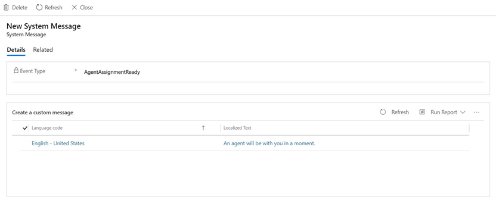

# Configure a custom chat message

[!INCLUDE[cc-use-with-omnichannel](../../includes/cc-use-with-omnichannel.md)]

You can configure your chat widget to show users customized system messages. For example, you might have a welcome message that's different from the standard "An agent will be with you in a moment" message when an end-user clicks on the chat widget. Customized messages are created in the same language of the chat widget for which you want to edit the message.

1. Sign in to Omnichannel Administration.

2. Go to **Channels** > **Chat**.

3. Open the chat widget in which you want to configure custom messages, and select the **Custom messages** tab.

4. On the **Custom Messages** page, select **Add**.

    > [!div class=mx-imgBorder]
    > 

5. On the **New system message** page, select the **Event type** drop-down menu, choose the event type, and then select **Save**.

    > [!div class=mx-imgBorder]
    > 

6. Select **Edit** to change the message.   

    > [!div class=mx-imgBorder]
    > 
    
7. In the **Edit system message** box, type the message you want to display, and then select **Save**.   

    > [!div class=mx-imgBorder]
    > 

### See also

[Add a chat widget](add-chat-widget.md)  
[Configure a pre-chat survey](configure-pre-chat-survey.md)  
[Configure agent display name](agent-display-name.md) 
[Configure proactive chat](proactive-chat.md) 
[Create quick replies](create-quick-replies.md)  
[Create chat authentication settings](create-chat-auth-settings.md)   
[Embed chat widget in Power Apps portals](embed-chat-widget-portal.md)
