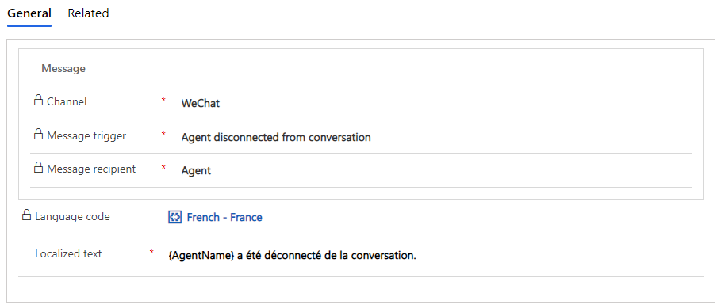
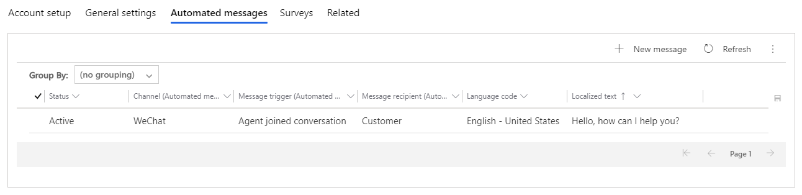
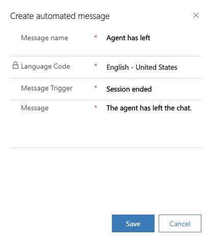
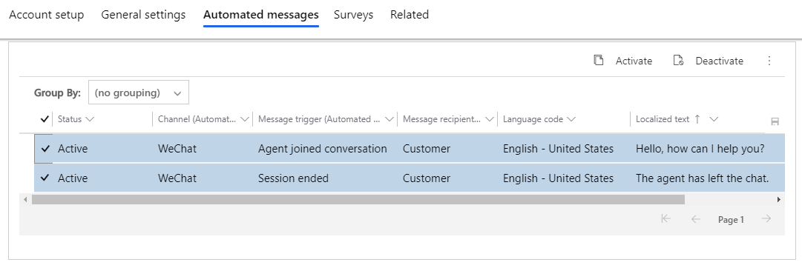

# Configure automated messages

[!INCLUDE[cc-use-with-omnichannel](../../includes/cc-use-with-omnichannel.md)]

[!include[cc-beta-prerelease-disclaimer](../../includes/cc-beta-prerelease-disclaimer.md)]

## Introduction

You can configure Omnichannel for Customer Service to send automated messages through chat, SMS, Microsoft Teams, or social channels. The **Automated messages* tab in each channel instance enables administrators to create channel-specific, locale-specific text. Administrators can customize, deactivate, and activate channel-level customer and agent-facing messages.  
    
## Display a list of all automated messages

You can view a list of all agent and customer-facing automated messages in your Omnichannel for Customer Service environment. Administrators can overwrite or deactivate the preconfigured, out-of-the-box automated messages for any channel instance. 

1. Sign in to Omnichannel Administration.

2. Go to **Settings** and click **Automated messages** to display a list of all automated messages.

    > [!div class=mx-imgBorder]
    > 
    
3. Select one or more of the records to edit the language code and text. If you want to deactivate the message(s), click the **Deactivate** button.

## Customize automated messages at the channel level

You can customize messages across instances within a channel. For instance, you can apply a change to all Facebook accounts, all SMS numbers, and so on. 

1. Click a message in the Automated messages list.

2. Edit the message text and click **Save**.

    > [!div class=mx-imgBorder]
    > 

## Customize automated messages at the channel instance level

You can customize automated messages at the channel instance level. For instance, you can apply a change to one specific Facebook account, one specific SMS number, and so on. If you don't create customized automated messages at the channel instance level, each instance will inherit the channel-level settings. Creating customized automated messages at the channel instance level overwrites the channel-level settings. 

1. Go to **Channels** and select the channel you will use to send automated messages. This example uses WeChat.
2. In the list of accounts, open the channel instance for which you want to configure an automated message.
3. Click the **Automated messages** tab and click **New message**.

    > [!div class=mx-imgBorder]
    > 
    
4. Enter the name of your message, select the message trigger, and then type your message. The **Language Code** field is determined by the language set in the **General settings** tab of the channel instance and cannot be modified here. Click **Save**.

    > [!div class=mx-imgBorder]
    > 
    
    The message is added to the list of channel instance-specific messages. To create localized versions of the message, repeat the steps for each language required. 

To deactivate messages at the channel instance level, select one or more messages, and click the **Deactivate** button.

    > [!div class=mx-imgBorder]
    > 

### See also

[Add a chat widget](add-chat-widget.md)  
[Channels](channels.md)  
