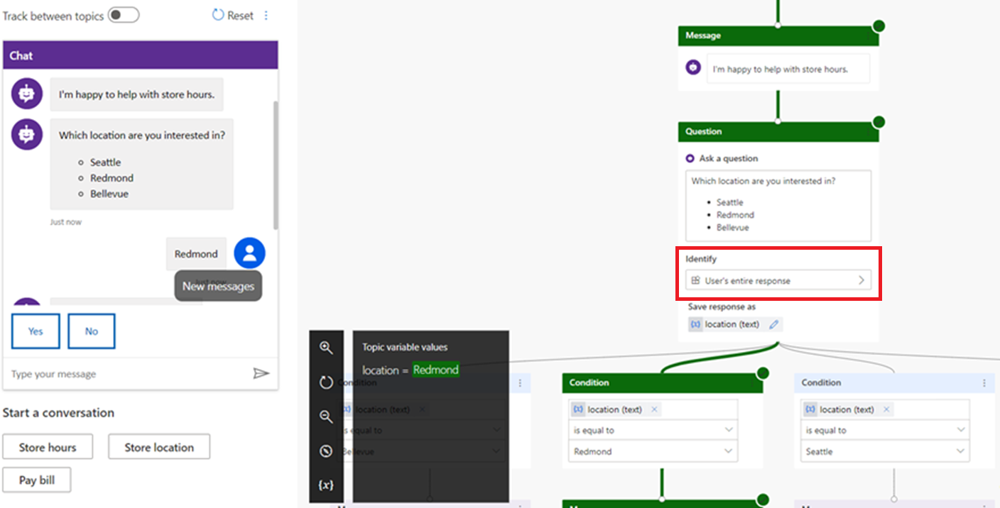

# Preview: Integrate a Power Virtual Agent bot

[!INCLUDE[cc-use-with-omnichannel](../../includes/cc-use-with-omnichannel.md)]

[!include[cc-beta-prerelease-disclaimer](../../includes/cc-beta-prerelease-disclaimer.md)]

> [!IMPORTANT]
> - A preview is a feature that is not complete, as it may employ reduced privacy, security, and/or compliance commitments, but is made available before it is officially released for general availability so customers can get early access and provide feedback. Previews are provided “as-is,” “with all faults,” “as available,” and without warranty.​
> - This preview features does not come with technical support and Microsoft Dynamics 365 Technical Support won’t be able to help you with issues or questions.  If Microsoft does elect to provide any type of support, such support is provided "as is," "with all faults," and without warranty, and may be discontinued at any time.​
> - Previews are not meant for production use, especially to process Personal Data or other data that is subject to heightened compliance requirements, and any use of "live" or production data is at your sole risk.  All previews are subject to separate [Terms and Conditions](../../legal/dynamics-insider-agreement.md).

Microsoft Dynamics 365 Power Virtual Agent for Customer Service allows organizations to automate routine conversations, letting agents focus on high-value interactions. When a conversation is escalated from a bot to a human agent, agents can see the full transcript of bot conversations and have complete context while engaging with customers.

Once you have created your bot and connected it to an Omnichannel for Customer Service environment, you can go to the Omnichannel configuration in order to add your bot to queues and configure context variables to route chat sessions to queues. 

## Prerequisites
* Product license - You need a product license for both Power Virtual Agents ([click here to start a trial](https://go.microsoft.com/fwlink/p/?LinkId=2092080&clcid=0x409)) and Omnichannel for Customer service ([click here to learn more](https://docs.microsoft.com/dynamics365/customer-engagement/omnichannel/try-chat-for-dynamics365))
* Role - In order to successfully complete these steps, signed in user must be a "Omnichannel Administrator" in Omnichannel. [Click here to learn more about managing and assigning user roles in Omnichannel](https://docs.microsoft.com/en-us/dynamics365/customer-engagement/omnichannel/administrator/add-users-assign-roles).
* Azure Application ID - You will need an application registered in Azure prior to connecting to Omnichannel. [Click here to learn more](https://docs.microsoft.com/en-us/azure/active-directory/develop/howto-create-service-principal-portal#create-an-azure-active-directory-application)
* Bot - You must have a preconfigured bot that can integrate with Omnichannel for Customer Service. For more information, see [Omnichannel setup & configure](https://github.com/MicrosoftDocs/dynamics-365-ai-pr/blob/pawant-ms-handoff/ai-docs/customer-service-virtual-agent/how-to-setup-omnichannel-handoff.md).

## Configure your Power Virtual Agent bot in Omnichannel
Once the Power Virtual Agent bot is created and configured to work with Omnichannel, you can configure it to hand off conversations to queues in Omnichannel. To receive incoming messages, the bot must be added to at least one queue. The bot will use the routing rules that were created at setup.  You can change them in the Work Streams section of Omnichannel.

To set up your Virtual Agent bot:
1. Connect virtual agent to Omnichannel and go to the Omnichannel configuration. For more information, see [Omnichannel setup & configure](https://github.com/MicrosoftDocs/dynamics-365-ai-pr/blob/pawant-ms-handoff/ai-docs/customer-service-virtual-agent/how-to-setup-omnichannel-handoff.md).

    
    
    The bot will be auto-created in Omnichannel, and you just need to finish setting it up.

2. Assign the bot to an existing queue.
    
    

3. Click Done. Now you're on the bot profile page and you can see that your bot is connected. 
    
    
    
    Your Virtual Agent bot is ready to accept and respond to customer-initiated conversations.
    
 4. Set escalation rules so the bot can route the queries to the appropriate agent. You can set up escalation rules in one of two ways:
 
    - **Add the bot to an existing human agent queue:**	If you add bot to existing human agent queue, you don’t need to change your existing routing rule. Existing routing rules will send incoming messages to the Power Virtual Agent. When a handoff is triggered, customers will be transferred from the Virtual Agent to the human agent according to the escalation routing rules.
    
    - **Create a bot queue and a human agent queue:** If you create two queues, you must create work streams containing context variables and appropriate routing rules to route the customer queries.

For information on working with queues, see [Work with queues in Omnichannel for Customer Service](queues-omnichannel.md).

> [!NOTE]
> If you have only one queue with bot and agents, and you didn't create a routing rule, the customer query is redirected to the same queue in case of escalation and picked up by an agent.

### Create a bot queue and a human agent queue

1. Select or create a work stream. For more information about work streams, see [Understand and create work streams](work-streams-introduction.md).

    
2. Create context variables.

You must use the context variables that were created during setup for the bot to handle the customer queries appropriately. The context variable is used in routing the incoming customer queries to the appropriate bots and agents. For information about context variables, see [Contextual variables available upon hand-off](https://github.com/MicrosoftDocs/dynamics-365-ai-pr/blob/pawant-ms-handoff/ai-docs/customer-service-virtual-agent/how-to-trigger-contextual-handoff.md#contextual-variables-available-upon-hand-off).

   > [!div class=mx-imgBorder]
   > 

3. Create a routing rule for the human agent and add it to the work stream.

    > [!div class=mx-imgBorder]
    > 

4.  Create a routing rule for the virtual agent and add it to the work stream.

    > [!div class=mx-imgBorder]
    > 

Routing rules route the incoming customer queries to their respective queues. Each routing rule has a condition and a destination queue. If the condition is evaluated as true, the customer query is routed to the destination queue. For bots, the condition is built by using the context variable.

Bots are developed to receive customer queries first, gain information of the query,  and then pass the query to a human agent, if required. To achieve this behavior, you must add a bot user to the queue and configure routing rules in a way that the incoming customer queries are routed to the queue with bot user.

Ensure to map the routing rules to the correct queues so that the queries are routed appropriately. For information about routing rules, see [Create and manage routing rules](routing-rules.md).

## Known limitations
- **Adaptive cards:** An adaptive card is a customizable card that can contain any combination of text, speech, images, buttons, and input fields. Power Virtual Agent supports adaptive cards for CSAT surveys.
- **Typing:** A bot receives a typing activity to indicate that the user is typing a response. A bot may send a typing activity to indicate to the user that it is working to fulfill a request or compile a response.
- **Suggested actions:** Suggested actions enable your bot to present buttons that the user can tap to provide input. Suggested actions appear close to the composer and enhance user experience. They enable the user to answer a question or make a selection with a simple tap of a button, rather than having to type a response with a keyboard.

Unlike buttons that appear within rich cards (which remain visible and accessible to the user even after being tapped), buttons that appear within the suggested actions pane will disappear after the user makes a selection. This prevents the user from tapping stale buttons within a conversation and simplifies bot development (since you will not need to account for that scenario).

When configuring the topics for your bot, we recommend not using suggested actions. In the **Identify** field, do not use Multiple choice options and instead select **User's entire response**.

## Privacy notice

You understand that your data may be transmitted and shared with external systems and that your data may flow outside of your organization's compliance boundary (even if your organization is in a Government Cloud environment). For example, your messages will be shared with the bot which could be interacting with a third-party system based on the integration done by you. For more information on how we process your data, please refer to the [Microsoft Privacy Statement](https://privacy.microsoft.com/en-us/privacystatement).

### See also

[Understand and create work streams](work-streams-introduction.md) 
[Work with queues in Omnichannel for Customer Service](queues-omnichannel.md) 
[Create and manage routing rules](routing-rules.md) 
[Add a chat widget](add-chat-widget.md) 
[Enable a bot to escalate and end conversation](../developer/bot-escalate-end-conversation.md)
