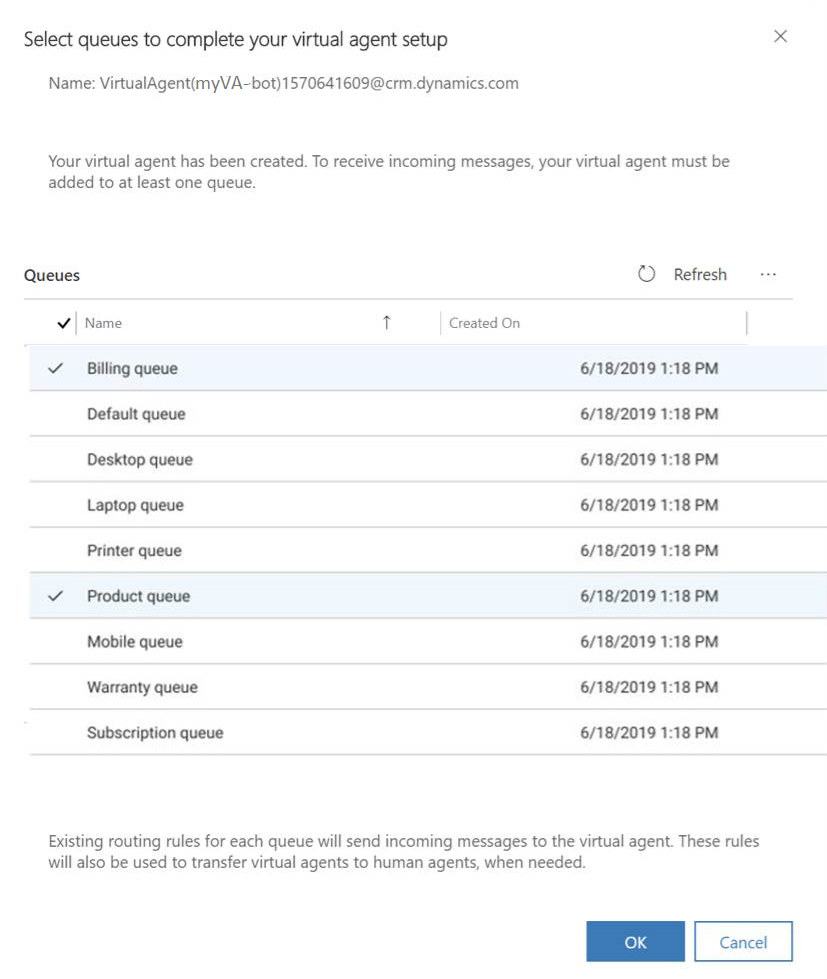

# Integrate a Power Virtual Agents bot

Microsoft Power Virtual Agents allows organizations to automate routine conversations, letting agents focus on high-value interactions. When a conversation is escalated from a bot to a human agent, agents can see the full transcript of bot conversations and have complete context while engaging with customers.

Once you have created your bot and connected it to an Omnichannel for Customer Service environment, you can go to the Omnichannel Administration app in order to add your bot to queues and configure context variables to route chat sessions to queues. 

## Prerequisites
* Product licenses - You need a product license for Power Virtual Agents ([start a trial](https://go.microsoft.com/fwlink/p/?LinkId=2092080&clcid=0x409)), Omnichannel for Customer service ([learn more](https://docs.microsoft.com/dynamics365/customer-engagement/omnichannel/try-chat-for-dynamics365)), and Microsoft Teams ([learn more](https://docs.microsoft.com/MicrosoftTeams/office-365-licensing)).
* Role - In order to successfully complete these steps, the signed-in user must be an Omnichannel Administrator. [Learn more about managing and assigning user roles in Omnichannel](add-users-assign-roles.md).
* Azure Application ID - You will need an application registered in Azure prior to connecting to Omnichannel for Customer Service. [Learn more](https://docs.microsoft.com/azure/active-directory/develop/howto-create-service-principal-portal#create-an-azure-active-directory-application)
* Bot - You must have a preconfigured bot that can integrate with Omnichannel for Customer Service. For more information, see [Configure seamless and contextual hand-off to Omnichannel for Customer Service](https://docs.microsoft.com/dynamics365/ai/customer-service-virtual-agent/configuration-hand-off-omnichannel).
* Chat widget - You must have a preconfigured chat widget to enable the bot to communicate with end users. For more information, see [Add a chat widget](add-chat-widget.md).

## Configure your Power Virtual Agents bot
Once the Power Virtual Agents bot is created and configured to work with Omnichannel for Customer Service, you can configure it to hand off conversations to queues in the Omnichannel Administration app. To receive incoming messages, you must add the bot to at least one queue. The bot will use the routing rules that were created at setup. You can change them in the **Work Streams** section of Omnichannel.

**Set up your Power Virtual Agents bot**
1. Connect the bot to Omnichannel for Customer Service and go to the Omnichannel Administration app. For more information, see [Configure seamless and contextual hand-off to Omnichannel for Customer Service](https://docs.microsoft.com/dynamics365/ai/customer-service-virtual-agent/configuration-hand-off-omnichannel).

    
    
    The bot will appear in Omnichannel for Customer Service, and you just need to finish setting it up.

2. Assign the bot to an existing queue.
    
    

3. Click **Done**. Now you're on the bot profile page and you can see that your bot is connected. 
    
    
    
    Your bot is ready to accept and respond to customer-initiated conversations.
    
 4. Set escalation rules so the bot can route the queries to the appropriate agent. You can set up escalation rules in one of two ways:
 
    - **Add the bot to an existing human agent queue:**	If you add the bot to an existing human agent queue, you don’t need to change your existing routing rule. Existing routing rules will send incoming messages to the Power Virtual Agents. When a handoff is triggered, customers will be transferred from the Power Virtual Agents to the human agent according to the escalation routing rules.
    
    - **Create a bot queue and a human agent queue:** If you create two queues, you must create work streams that contain context variables and appropriate routing rules to route the customer queries.

For information about working with queues, see [Work with queues in Omnichannel for Customer Service](queues-omnichannel.md).

> [!NOTE]
> If you have only one queue with a bot and agents, and you didn't create a routing rule, the customer query is redirected to the same queue in case of escalation and picked up by an agent.

### Create a bot queue and a human agent queue

1. Select or create a work stream. For more information about work streams, see [Understand and create work streams](work-streams-introduction.md).

    
2. Create context variables.

You must use the context variables that were created during setup for the bot to handle the customer queries appropriately. The context variable is used in routing the incoming customer queries to the appropriate bots and agents. For information about context variables, see [Contextual variables available upon hand-off](https://docs.microsoft.com/dynamics365/ai/customer-service-virtual-agent/how-to-handoff#contextual-variables-available-upon-hand-off).

   > [!div class=mx-imgBorder]
   > 

3. Create a routing rule for the human agent and add it to the work stream.

    > [!div class=mx-imgBorder]
    > 

4.  Create a routing rule for the virtual agent and add it to the work stream.

    > [!div class=mx-imgBorder]
    > 

Routing rules route the incoming customer queries to their respective queues. Each routing rule has a condition and a destination queue. If the condition is evaluated as true, the customer query is routed to the destination queue. For bots, the condition is built by using the context variable.

Bots are developed to receive customer queries first, gain information of the query, and then pass the query to a human agent, if required. To achieve this behavior, you must add a bot user to the queue and configure routing rules in a way that the incoming customer queries are routed to the queue with bot user.

Ensure to map the routing rules to the correct queues so that the queries are routed appropriately. For information about routing rules, see [Create and manage routing rules](routing-rules.md).

## Known limitations

Authentication cards are not supported in bots integrated with Omnichannel for Customer Service.

For more information about known limitations of this feature, see [Known limitations](https://docs.microsoft.com/dynamics365/ai/customer-service-virtual-agent/configuration-hand-off-omnichannel#known-limitations).

## Privacy notice

You understand that your data may be transmitted and shared with external systems and that your data may flow outside of your organization's compliance boundary (even if your organization is in a Government Cloud environment). For example, your messages will be shared with the bot which could be interacting with a third-party system based on the integration done by you. For more information on how we process your data, please refer to the [Microsoft Privacy Statement](https://privacy.microsoft.com/privacystatement).

## Videos

[Power Virtual Agents integration with Omnichannel for Customer Service](https://go.microsoft.com/fwlink/p/?linkid=2114716)

To view more videos on Omnichannel for Customer Service, see [Videos](../videos.md).

### See also

[Understand and create work streams](work-streams-introduction.md)

[Work with queues in Omnichannel for Customer Service](queues-omnichannel.md)

[Create and manage routing rules](routing-rules.md)

[Add a chat widget](add-chat-widget.md)

[Enable a bot to escalate and end conversation](../developer/bot-escalate-end-conversation.md)
