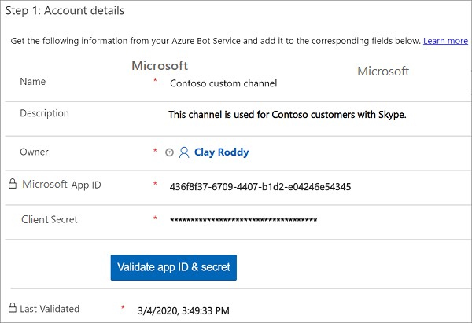
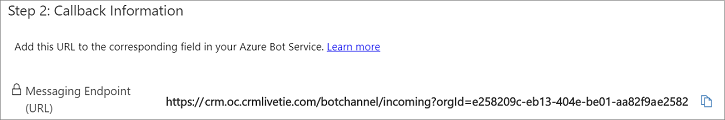
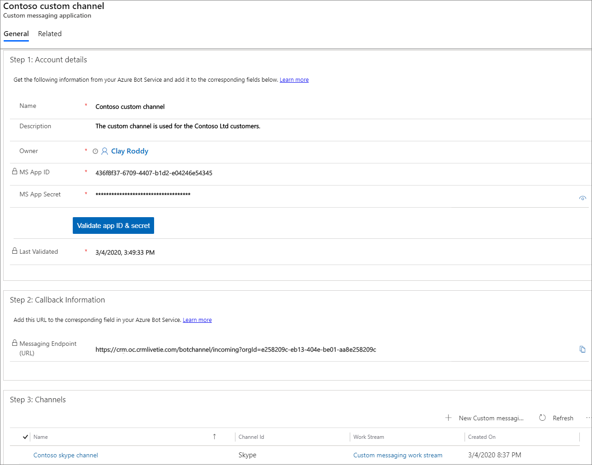

# Preview: Configure a custom messaging channel

[!INCLUDE[cc-use-with-omnichannel](../../includes/cc-use-with-omnichannel.md)]

[!include[cc-beta-prerelease-disclaimer](../../includes/cc-beta-prerelease-disclaimer.md)]

> [!IMPORTANT]
> - A preview is a feature that is not complete, as it may employ reduced privacy, security, and/or compliance commitments, but is made available before it is officially released for general availability so customers can get early access and provide feedback. Previews are provided “as-is,” “with all faults,” “as available,” and without warranty.​
> - This preview feature does not come with technical support and Microsoft Dynamics 365 Technical Support won’t be able to help you with issues or questions.  If Microsoft does elect to provide any type of support, such support is provided "as is," "with all faults," and without warranty, and may be discontinued at any time.​
> - Previews are not meant for production use, especially to process Personal Data or other data that is subject to heightened compliance requirements, and any use of "live" or production data is at your sole risk.  All previews are subject to separate [Terms and Conditions](../../legal/dynamics-insider-agreement.md).

## Overview of custom channel

Many organizations have line-of-business (in-house) messaging channels that they use to interact with their customers. Also, many customers use social messaging channels for their personal communication needs, and these customers prefer using the messaging channels to engage with businesses. Expectations of customer service via social channels are rising to the point that customers now expect the same level of service on social channels that they’re used to from call and live chat. 

As an organization, you want the ability to integrate your line-of-business (in-house), social, or any other messaging channels with Omnichannel for Customer Service. The custom channel feature lets you do this so you can engage with customers. Here are some of the messaging channel integrations that are supported:

- Kik
- Telegram
- [Direct Line](#bring-channels-using-direct-line)

### Value proposition

- Integrate line-of-business (in-house) messaging channels that are specific to your organization.

- Integrate social media messaging channels as per the requirement of your customers and organization.

- Easy configuration experience in the Omnichannel Administrator app.

- Single and unified agent experience in the Omnichannel for Customer Service app.

## Prerequisites

- Make sure channels are provisioned in your environment. For information, see [Provision Omnichannel for Customer Service](omnichannel-provision-license.md).

  > [!NOTE]
  >
  > To enable the custom channel in an existing environment, you must upgrade to the latest version of Omnichannel for Customer Service. For information, [Upgrade Omnichannel for Customer Service](upgrade-omnichannel.md).

## End-to-end walk-through

[Step 1: Register your messaging channel](#step-1-register-your-messaging-channel)

[Step 2: Add the messaging channel to bot channel registration](#step-2-add-the-messaging-channel-to-bot-channel-registration)

[Step 3: Create a work stream](#step-3-create-a-work-stream)

[Step 4: Create a custom messaging account](#step-4-create-a-custom-messaging-account)

## Step 1: Register your messaging channel

To integrate your messaging channel with Omnichannel for Customer Service, register your channel in **Azure Bot Service**. To learn how to register, see [Register a bot with Azure Bot Service](https://docs.microsoft.com/azure/bot-service/bot-service-quickstart-registration).

After you register, save the **Microsoft app ID** and **Client secret** values safely for future use. These two values are required to create a custom channel configuration in the Omnichannel Administrator app.  To learn more, see [Get registration password](https://docs.microsoft.com/azure/bot-service/bot-service-quickstart-registration#get-registration-password).

## Step 2: Add the messaging channel to bot channel registration

After registering your messaging channel, add the messaging channel to the bot channel registration. To learn more, see [Connect a bot to channels](https://docs.microsoft.com/azure/bot-service/bot-service-manage-channels).

## Step 3: Create a work stream

After you add the messaging channel to the Bot Channel registration in Azure Bot Service, create a work stream for the custom channel. To create a custom channel work stream, follow these steps:

1. Sign in to Omnichannel Administrator.

2. Select **Work Streams** under **Work Distribution Management**.

3. Select **+ New** to create a new work stream.

4. Specify the values for the fields.

5. Select the **Custom (preview)** option for the **Channel** field.

6. Select **Save** to save the changes.

You've created a work stream for a custom channel. To learn more, see [Create work streams](work-streams-introduction.md).

To configure other options in the work stream, see the following:

- [Skill-based routing](overview-skill-work-distribution.md)
- [Productivity tools](productivity-tools.md)
- [Smart assist](smart-assist.md)
- [Templates](templates-overview.md)

## Step 4: Create a custom messaging account

After you create a work stream for a custom channel, you need to create a custom channel with the details of the **Microsoft app ID** and **Client secret** that you retrieved while registering your messaging channel in Azure Bot Service.

To create a custom channel, follow these steps:

1. Sign in to Omnichannel Administrator.

2. Select **Custom (preview)** under **Channels**.

3. Select **+ New** in the **Active Custom messaging account** view.

4. In the new **Custom messaging account** page, specify the values for the following fields:

    | Section | Field | Description | Example  value |
    |-------------|-------------------|---------------------------|--------------------------------------|
    | Account details |Name| Specify a name for the custom channel.| Contoso custom channel |
    | Account details |Microsoft app ID| Copy and paste the **Microsoft app ID** that you saved earlier from the Azure Bot Channel Registration page.   To learn more, see [Get registration password](https://docs.microsoft.com/azure/bot-service/bot-service-quickstart-registration#get-registration-password). | cae1d83e-8b07-4fca-8072-c2eb3444vxyz |
    | Account details |Client secret| Copy and paste the **Client secret** that you saved earlier from the Azure Bot Channel Registration page.    To learn more, see [Get registration password](https://docs.microsoft.com/azure/bot-service/bot-service-quickstart-registration#get-registration-password).| |

5. Select **Validate app ID + secret**  to validate the **Microsoft app ID** and **Client secret** values. After the validation, a toast notification is displayed. Also, the **Last validated** field shows time and date. This ensures that bots are active and client secret refreshes are consumed. 

    > [!div class=mx-imgBorder]
    > 

6. Select **Save** to save the changes. After you save, in the **Callback information** section, the **Message endpoint (URL)** field is generated with a URL. Copy the URL from the field.

    > [!div class=mx-imgBorder]
    > 

7. Go to the **Azure Portal** > **Bot Channel Registration** page, paste the URL into the **Message endpoint** field, and save the changes.

8. In the **Channels** section, select **+ Add Custom messaging channel**. The **New Custom messaging channel** page is displayed.

   After you create a **Custom messaging account**, you need to create a custom messaging channel, which is the actual channel from which Omnichannel for Customer Service agents will receive messages from the customer.

9. In the **New Custom messaging account** page, specify the values for the following fields:

    | Section | Field | Description | Example  value |
    |-------------|-------------------|---------------------------|--------------------------------------|  
    | Details | Name | Specify a name for the custom channel | Contoso channel |
    | Details | Custom Messaging Account | The **Custom messaging account** field is populated. However, you can change the value using the lookup. | Contoso custom channel |
    | Details | Channel ID | Select a channel from the list. The list might contain line-of-business (in-house) messaging, social, or any other messaging channel. A few social channel options are:   - Kik   - Telegram   - Direct Line | Kik |
    | Work distribution | Work stream | Select a work stream from the lookup. | Contoso custom channel work stream |

    > [!Note]
    > A **Custom messaging account** can have multiple unique channel IDs. Don't add two or more same Channel IDs to a **Custom messaging account** because the Azure Bot Framework supports only one messaging account per App ID. For example, for **Contoso custom account**, you can't add two or more **Kik** Channel IDs.

    > [!div class=mx-imgBorder]
    >  

10. Select **Save** to save the custom messaging channel.       

11. Select the back button on the browser to go to the custom messaging account page. You can see that the custom messaging channel is added in the **Channels** section. 

12. Select **Save** to save the configurations.

    > [!div class=mx-imgBorder]
    > 

## Bring channels using Direct Line 

If you want to help your customers using your line-of-business (in-house) messaging channels, you can use the Direct Line channel (Bot Framework method).

The Bot Framework **Direct Line** channel helps you to integrate your line-of-business (in-house) messaging channels into the Omnichannel for Customer Service app.

For more information, see [Bring your own channel](../developer/how-to/bring-your-own-channel.md).

## See also

[Skill-based routing](overview-skill-work-distribution.md) 
[Bring your own channel](../developer/how-to/bring-your-own-channel.md) 
[Productivity tools](productivity-tools.md) 
[Smart assist](smart-assist.md) 
[Templates](templates-overview.md)