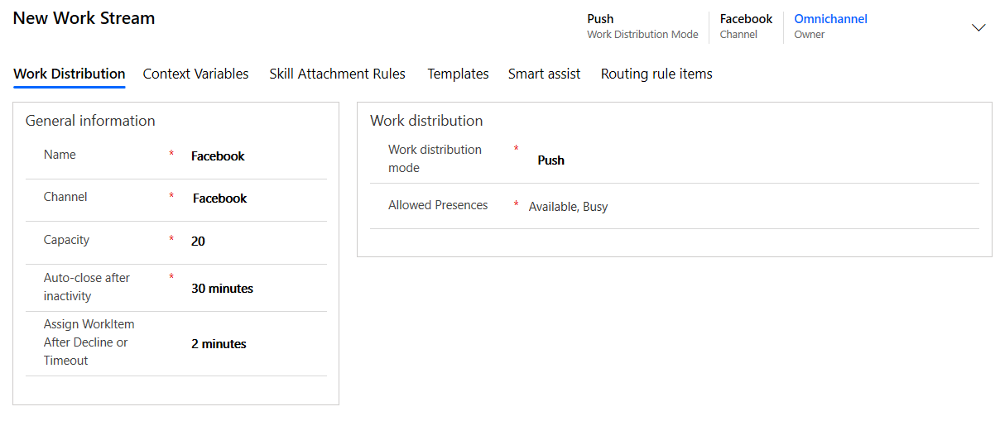
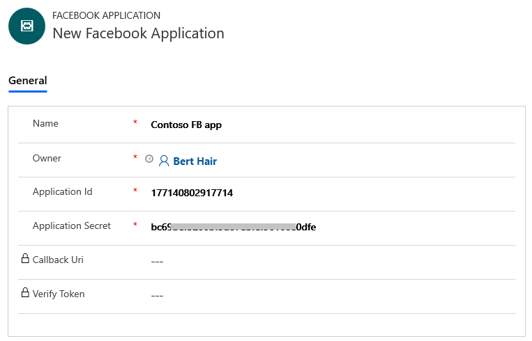
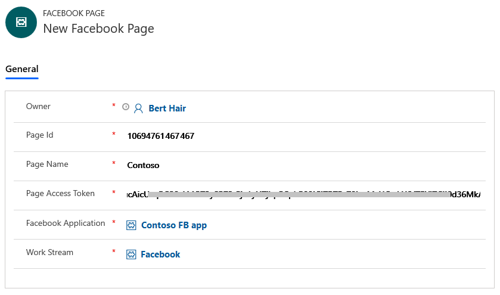
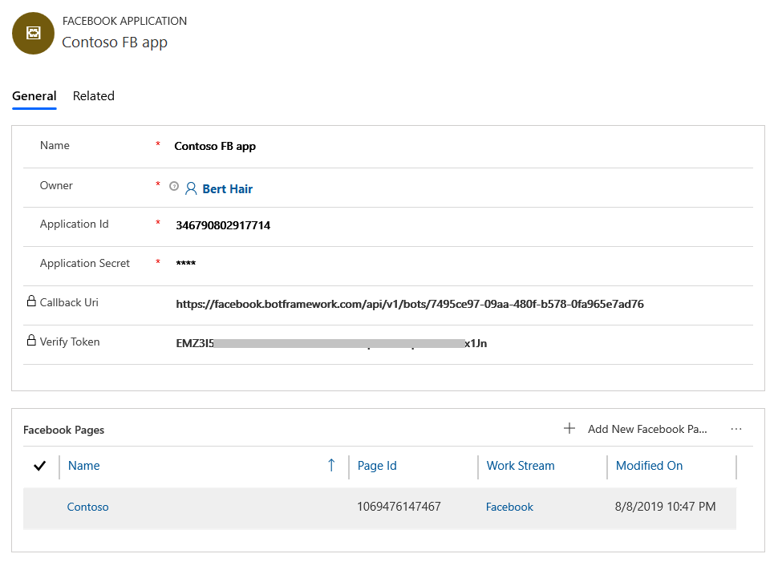
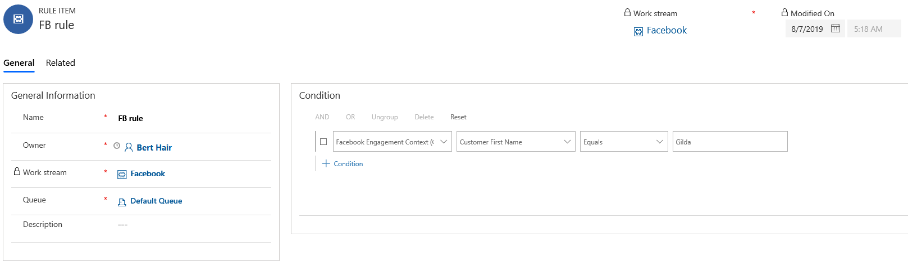
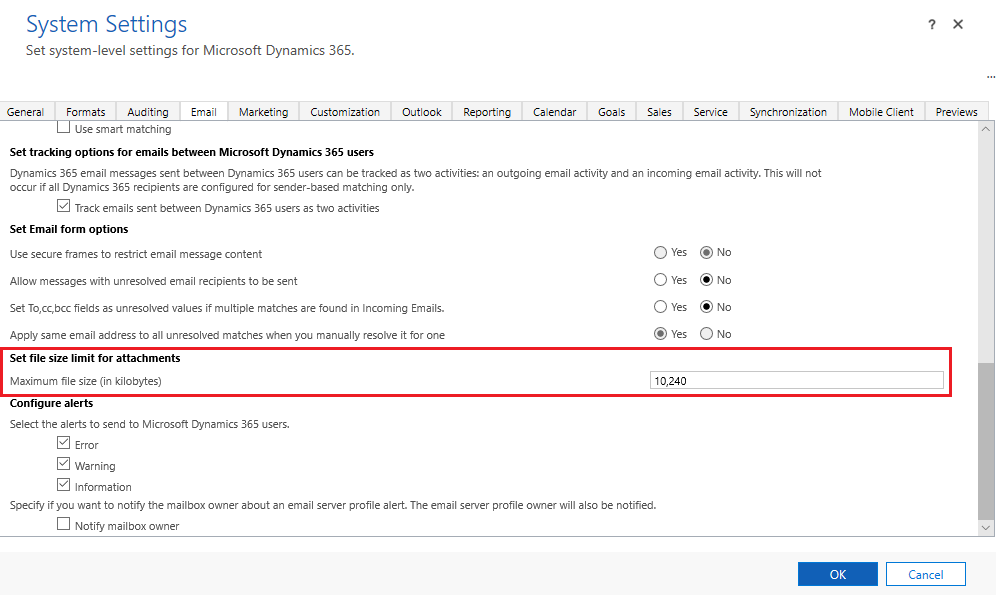
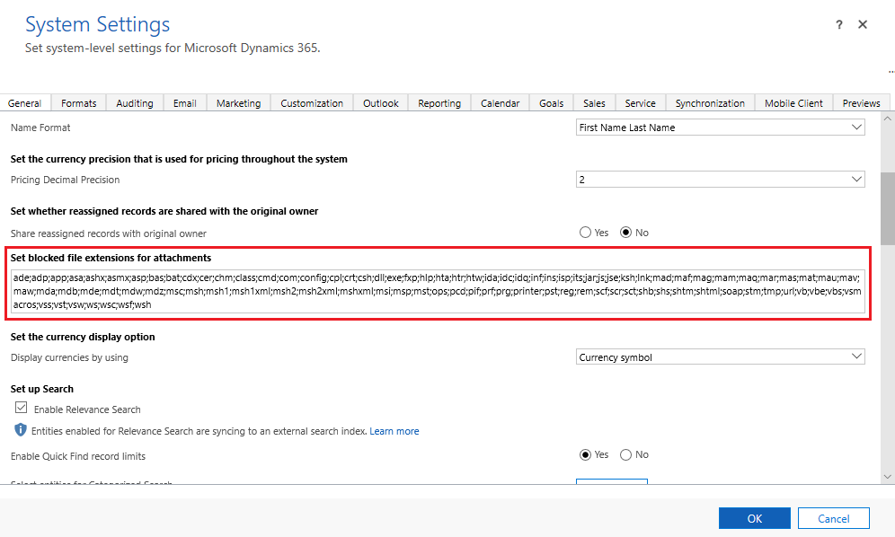
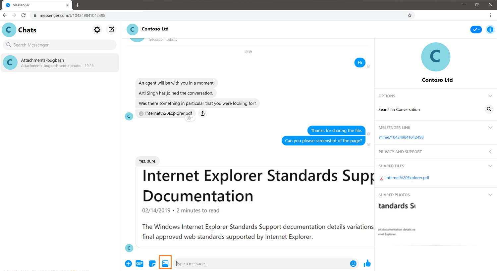

# Configure a Facebook channel

[!INCLUDE[cc-use-with-omnichannel](../../includes/cc-use-with-omnichannel.md)]

Many customers use social messaging channels like Facebook Messenger for their personal communication needs. Many also prefer using these messaging channels to engage with businesses. The asynchronous nature of these channels gives customers the convenience of getting their issues resolved as and when they find time, unlike real-time channels like Chat for Dynamics 365 where the session ends when the chat window is closed.

The Facebook channel gives you an incredible opportunity to capitalize on the social media trend and engage with your customers in a seamless and personalized experience.

**Prerequisites**: Following are the prerequisites before configuring the Facebook channel in Omnichannel for Customer Service:

1.	Create a Facebook page and enable Messenger. More information: [Create and Manage a Page and Messaging](https://www.facebook.com/help/994476827272050/?helpref=hc_fnav)
2.	Create a Facebook application. More information: [App Development](https://developers.facebook.com/docs/apps/)
3.	Add Messenger and Webhooks to the Facebook application. More information: [Setting Up Your Facebook App](https://developers.facebook.com/docs/messenger-platform/getting-started/app-setup/)

After completing the prerequisites, you can add the Facebook channel for your organization by following these steps:

1. [Create a Facebook work stream](#step-1-create-a-facebook-work-stream)
2. [Create a Facebook channel](#step-2-create-a-facebook-channel)
3. [Create routing rules](#step-3-create-routing-rules)

## Step 1: Create a Facebook work stream

1. Sign in to Omnichannel Administration.

2. Go to **Work Distribution Management** > **Work Streams**.

3. Select **New** to create a Facebook work stream.

4. On the **Work Distribution** tab, in the **Channel** field, select **Facebook**.

    > [!div class=mx-imgBorder]
    > 

5. Specify other details as required. To learn more, see [Understand and create work streams](work-streams-introduction.md).

6. Select **Save**.

## Step 2: Create a Facebook channel

1. Go to **Channels** > **Facebook**.

2. Select **New** to create a Facebook channel.

3. On the **New Facebook Application** page, provide the following information:

    - **Name**: Name of the Facebook application. 

    - **Application Id**: ID of the Facebook application. To get the application ID, go to your Facebook application, select **Settings** > **Basic**, and copy the value in the **App ID** field.

    - **Application Secret**: Application secret of the Facebook application. To get the application secret, go to your Facebook application, select **Settings** > **Basic**, and copy the value in the **App Secret** field.

    More information about Facebook app: [Setting up your Facebook app](https://developers.facebook.com/docs/messenger-platform/getting-started/app-setup)

    > [!div class=mx-imgBorder]
    > 

4. Select **Save**. After you save the record, the **Facebook Pages** section is enabled, and it allows you to add the Facebook pages through which a customer can connect to an agent.

    > [!NOTE]
    > In this release, you can create only one Facebook application per organization. However, you can add multiple pages in a Facebook application.

5. In the **Facebook Pages** section, select **Add New Facebook Page** to add a Facebook page.

6. On the **New Facebook Page** page, provide the following information:

    - **Page Id**: ID of the Facebook page. To get the page ID, go to your Facebook page, select **About**, and copy the value in the **Page ID** field.

    - **Page Name**: Name of the Facebook page.

    - **Page Access Token**: Page access token from the Facebook application. To get the page access token, go to your Facebook application and then go to **Messenger** > **Settings**. In the **Access Tokens** section, select the page, and copy the value in the **Page Access Token** field.

    - **Facebook Application**: The Facebook application record is auto filled from which you added a Facebook page.
    
    - **Work Stream**: Browse and select the work stream you created for the Facebook channel.

    - **Enable file attachments for customers**: Set **Yes** to allow customers to send file attachments to agents. Otherwise, set **No**. To learn more about attachments, see [File attachments](#file-attachments). 

    - **Enable file attachments for agents**: Set **Yes** to allow agents to send file attachments to customers. Otherwise, set **No**. To learn more about attachments, see [File attachments](#file-attachments). 

    > [!div class=mx-imgBorder]
    > 

7. Select **Save** to create the record.

After you add a Facebook page, values for **Callback Uri** and **Verify Token** are generated automatically. These values are used to configure webhooks in the Facebook application.

   > [!Note]
   > You can add multiple Facebook **Page Id** (pages) to a **Facebook Application** channel. However, a Facebook **Page Id** can be linked to one **Facebook Application** only. If you link the same Facebook **Page Id** to multiple **Facebook Application** channels, then **Callback Uri** and **Verify Token** won't be generated automatically.

> [!div class=mx-imgBorder]
> 

## Step 3: Create routing rules

1.	Go to **Work Distribution Management** > **Work Streams**.

2.	Open the work stream you created in Step 1.

3.	On the **Routing rules items** tab, create a routing rule to transfer the message to an appropriate agent. Select the entity as **Facebook Engagement Context**.

    For example, you can create a rule to transfer Facebook chat from a customer named Gilda to the default queue. 

    > [!div class=mx-imgBorder]
    > 

## File attachments

You can enable or disable the capability for your agents and customers to send file attachments during a Facebook channel conversation. 

When you enable the option for customers in the Facebook page configuration, customers can send attachments from their messenger. Similarly, when you enable the option for agents in the Facebook page configuration, agents can send the attachments from the communication panel to the customers. To learn how to enable the option, see step 6 in [Create a Facebook channel](#step-2-create-a-facebook-channel).

If an agent transfers the conversation to another agent, the agent who receives the chat can also access the files attached in the conversation.

### File size limit and unsupported extensions (types) for attachments

By default, Omnichannel for Customer Service has a file size limit of 5 megabytes (MB) (5,120 kilobytes). However, you can configure the file as per your organization's requirements. 

> [!Tip]
> We recommend that you configure a maximum limit of 25 MB (25,600 kilobytes) because the Facebook messenger file size limit is 25 MB.

You can set the file extension types that customers and agents can share. 

#### Configure file size limit and file extensions

To configure the file size limit and file extensions, follow these steps:

1. Sign in to Omnichannel Administrator.

2. Select the settings icon in the nav bar, and then select **Advanced Settings**.

3. Go to **Settings** > **Administration** > **System Settings**.

2. In the **System Settings** window, go to the **Email** tab.

3. Go to the **Set file size limit for attachments** section, and in the **Maximum file size (in kilobytes)** field, enter the value in kilobytes.

    > [!div class=mx-imgBorder]
    > 

4. To specify unsupported file types, go to the **General** tab.

5. In the **Set blocked file extensions for attachments** field, add or edit the file types.

    > [!div class=mx-imgBorder]
    > 

6. Select **OK**.

Now, agents and customers can share file attachments during their conversation.

## Customer experience

A customer can initiate a conversation in any of the following ways:

- Messenger on the Facebook page
- [www.messenger.com](https://www.messenger.com/)
- Messenger app on a mobile device
- Messenger widget on a custom website

If a customer initiates a conversation from the Facebook page and then later switches to the mobile device, the previous conversation persists, and the customer can continue the conversation.

The agent receives the notification of the incoming conversation request. More information: [Use Facebook channel](../agent/agent-oc/facebook.md)

If the customer is identified based on name, the conversation is automatically linked to the contact record and the customer summary is populated. More information: [View customer summary](../agent/agent-oc/oc-customer-summary.md)

If the customer is not identified based on name, a new contact record can be created.

Customer can send attachments only if you enable.  If you don't enable the option for the customers, they can send the file. However, agents won't receive the file and will see an error. To learn more, see [File attachments](#file-attachments).

> [!div class=mx-imgBorder]
> 

## Privacy notice

By enabling this feature, your data will be shared with Facebook and flow outside of your organization's compliance and geo boundaries (even if your organization is in a Government Cloud Community region). Consult the feature technical documentation for more information [here](https://docs.microsoft.com/azure/bot-service/bot-service-channel-connect-facebook?view=azure-bot-service-4.0).

Customers are solely responsible for using Dynamics 365, this feature, and any associated feature or service in compliance with all applicable laws, such as laws relating to monitoring, recording, and storing communications with their end users. This includes adequately notifying end users that their communications with agents may be monitored, recorded, or stored and, as required by applicable laws, obtaining consent from end users before using the feature with them. Customers are also encouraged to have a mechanism in place to inform their agents that their communications with end users may be monitored, recorded, or stored.

### See also

[Understand and create work streams](work-streams-introduction.md) 
[Create and manage routing rules](routing-rules.md)
