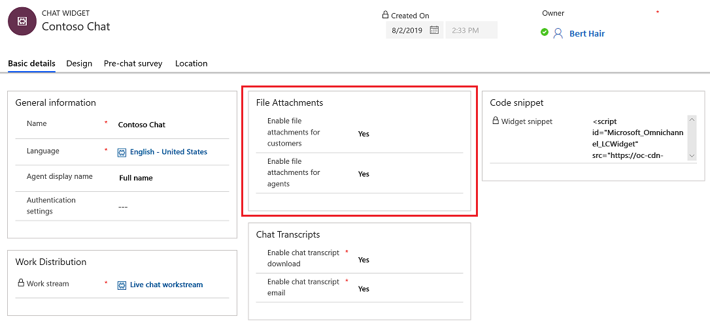

# Configure file attachment capability 

As an administrator, you can enable or disable the capability of attaching file(s) during a conversation for your agents and customers. When enabled, it allows your customers and agents to send files and share more information about the issues. For example, if a customer receives an error while trying to complete a process, they can send the screenshots of the steps and error message to the agent. 

If an agent transfers the chat to another agent, the agent who receives the chat can also access the files attached in the conversation. 

1.	Sign in to Omnichannel Administration.

2.	Go to **Channels** > **Chat**.

3.	Open the chat widget in which you need to configure the file attachment capability.

4.	Go to the **Basic details** tab.

5.	Under **File attachments**, select **Yes** or **No** for the following:

    - **Enable file attachments for customers**: Allows your customers to send a file to the customer service agent during a conversation. By default, it is set to No.
    - **Enable file attachments for agents**: Allows your customer service agents to send a file to a customer during a conversation. By default, it is set to Yes.

    > [!div class=mx-imgBorder]
    > 

## Customer experience of attaching a file

When the file attachment capability is enabled for customers, the attachment icon is displayed in the chat widget. A customer can then use the Attach icon to send the file(s).

`image`

If a customer tries to attach an unsupported file type , a file with the size more than the allowed limit , or a file with malicious content, the file is not uploaded and a corresponding error message is displayed. 

`image`

