# Configure Omnichannel Insights dashboards

[!INCLUDE[cc-use-with-omnichannel](../../includes/cc-use-with-omnichannel.md)]

Customer service managers or supervisors are responsible for managing agents who work to resolve customer queries every day through various service channels, including chat. They need to know key operational metrics to ensure that their agents are providing quality support. The Omnichannel Insights consists of Omnichannel Chat and Sentiment Analysis dashboards.

> [!IMPORTANT]
> The supervisor dashboards that are based on Power BI such as Chat and Sentiment Analysis are not available on Government Community Cloud (GCC).

As an administrator, you must configure the Omnichannel Insights to display Omnichannel Chat and Sentiment Analysis dashboards in Omnichannel for Customer Service app. You must perform the following steps to configure:

[Step 1: Review prerequisites](#step-1-review-prerequisites)

[Step 2: Install Omnichannel Insights for Dynamics 365 app](#step-2a-install-omnichannel-insights-for-dynamics-365-app)

[Step 3: Connect to Omnichannel Insights for Dynamics 365 app](#step-3-connect-to-omnichannel-insights-for-dynamics-365-app)

[Step 4: Configure refresh frequency on Power BI Dataset](#step-4-configure-refresh-frequency-on-power-bi-dataset)

[Step 5: Publish application within your organization](#step-5-publish-application-within-your-organization)

[Step 6: Enable Power BI reporting in Dynamics 365 for Customer Engagement](#step-6-enable-power-bi-reporting-in-dynamics-365-for-customer-engagement)

[Step 7: Add Power BI Dashboards to Omnichannel for Customer Service](#step-7-add-power-bi-dashboards-to-omnichannel-for-customer-service)

### Step 1: Review Prerequisites

Review the following prerequisites before configuring the dashboard:
-  You have administrative privileges for Dynamics 365 Customer Service and Power BI.
-  You have a Power BI Pro license for all supervisors.
-  You must enable to embed Power BI reports in Dynamics 365 Customer Service.
    1.	Sign in to **Dynamics 365 Customer Service** and go to **Settings** > **Administration** > **System Settings**.
    2.	Go to **Reporting** tab and configure **Allow Power BI visualization embedding** as **Yes**.

      > [!div class=mx-imgBorder]
      > 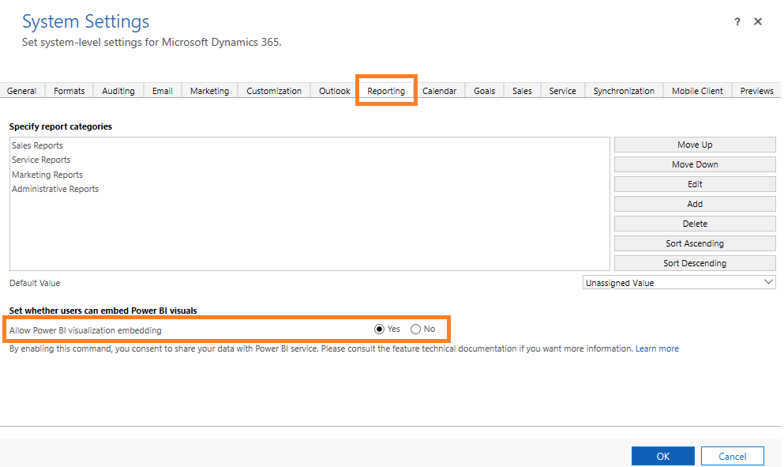

    3.	Select **OK**.

### Step 2A: Install Omnichannel Insights for Dynamics 365 app

1.	Sign in to the [Power BI](https://app.powerbi.com/) app as an administrator.

2.	As a Power BI admin, open [Omnichannel Insights for Dynamics 365](http://aka.ms/d365-oc-insights) app page.

3.  Select **GET IT NOW** to install the app.

    > [!div class=mx-imgBorder]
    > 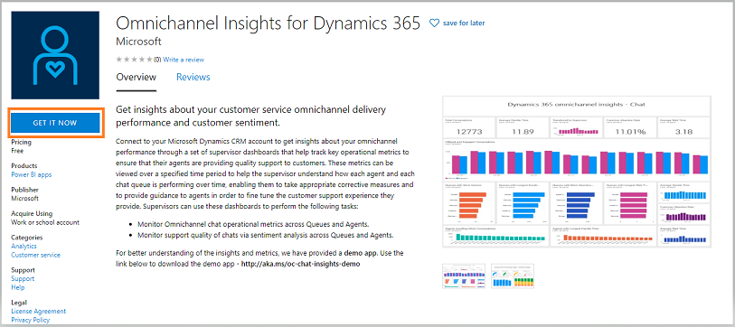

4.	After the **Omnichannel Insights** app is installed, select the app and configuration options page displays.

    > [!div class=mx-imgBorder]
    > 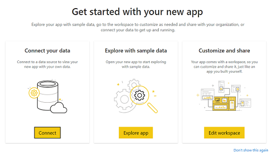

    Proceed to configure the app by connecting your organization.

### Step 2B: Configure existing Omnichannel Insights for Dynamics 365 app

If previous version of Omnichannel Insights app was installed, it is strongly recommended that the latest version of the Omnichannel Instights app is installed to avoid losing any customization. 

1. During Omnichannel Insights app install, the following appears:

    > [!div class=mx-imgBorder]
    > 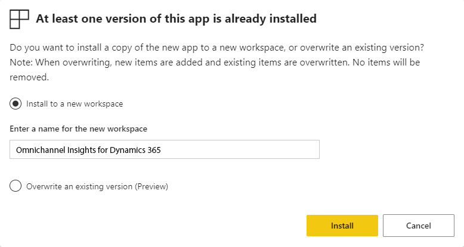

2. Choose **Install to a new workspace** option
3. Click **Install**
4. **Re-implement** customizations into new workspace.

### Step 3: Connect to Omnichannel Insights for Dynamics 365 app

1.	On the **Omnichannel Insights for Dynamics 365** app configuration page, select **Connect**.

    > [!div class=mx-imgBorder]
    > 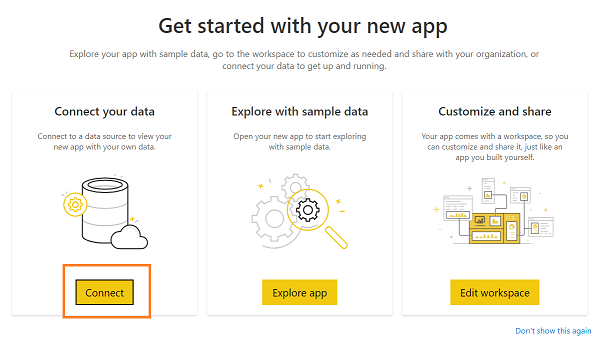

2.	On the connect data page, enter your organization's CRM OData feed URL and select **Next**.

    > [!div class=mx-imgBorder]
    > 

3.	(Optional) To find the Microsoft Dynamics 365 OData URL, follow these steps:

    a.	Sign in to the Common Data Service platform.
    
    b.	Go to **Settings** > **Customizations** and then select **Developer Resources**. 
    
    c.	Find the OData URL under **Service Root URL**.

       > [!div class=mx-imgBorder]
       > 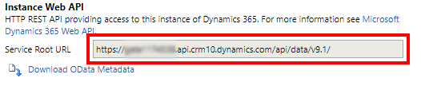

4.	Select **Authentication method** as **OAuth2** and **Privacy level** as **Organizational**. Select **Sign in**.

    > [!div class=mx-imgBorder]
    > 

5.	Enter your Dynamics 365 Customer Service credentials and press **Enter**.

    When you are successfully signed in, the existing report is updated with the data from your organization.

### Step 4: Configure refresh frequency on Power BI dataset

After you successfully connect Dynamics 365 Omnichannel Chat Insights app with Dynamics 365 organization, you need to configure the refresh frequency on the Power BI dataset so reports and dashboards refresh properly.

1.	Sign in to [Power BI](https://app.powerbi.com/) app as administrator.

2.	Go to the **Omnichannel Insights** app workspace.

    > [!div class=mx-imgBorder]
    > 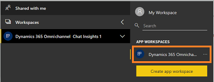

3.	Go to **Datasets** tab and select **Settings**.

    > [!div class=mx-imgBorder]
    > 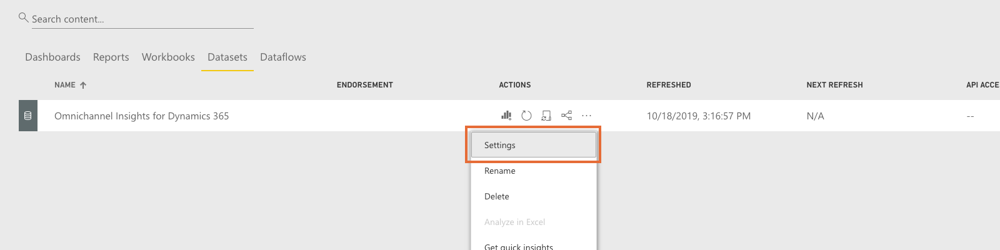

4.	Turn on the **Scheduled refresh**.

    > [!div class=mx-imgBorder]
    > 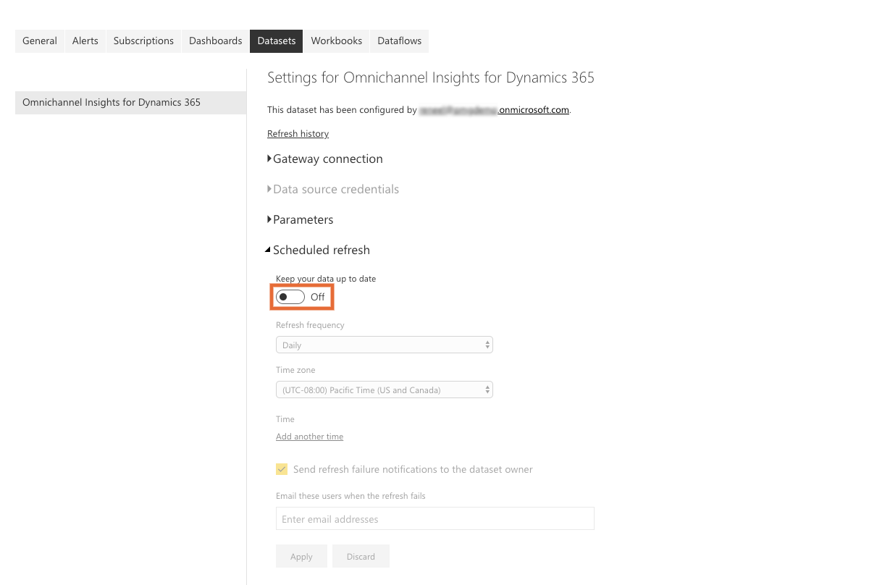

    > [!NOTE]
    > We recommend you configure the refresh frequency to **Daily**.

5. Select **Apply**.

Omnichannel insight reports and dashboards refresh daily. Now, publish the application in your organization.

### Step 5: Publish application within your organization

You must share the configured application with your entire organization for supervisors to view the **Omnichannel Insights** dashboards and reports with their own **Power BI Pro** accounts.

1.	On the App workspace, select **Update app** to open the Update app wizard. 

    > [!div class=mx-imgBorder]
    > 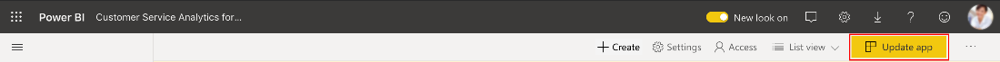

2.	On the **Update app** wizard, go to the **Access** tab.

3.	Choose **Entire organization** and select **Update app**.

    > [!div class=mx-imgBorder]
    > 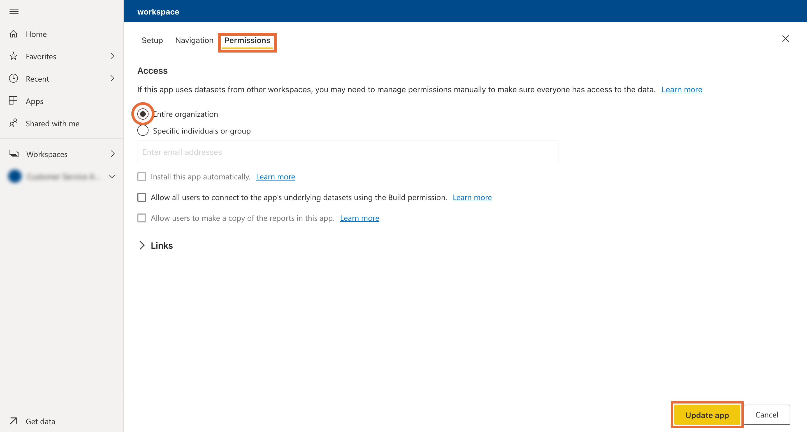

    The app is now available to install for all individuals in your organization.

> [!NOTE]
> Verify your administrator has allowed users in your organization to have read/write data permissions in Omnichannel Engagement Hub. To learn more, see  [Provide data access consent](omnichannel-provision-license.md#provide-data-access-consent).

### Step 6: Enable Power BI reporting in Dynamics 365 for Customer Engagement

Administrators must enable Power BI reporting in the Dynamics 365 for Customer Engagement organization for supervisors to view dashboards in the Omnichannel Administration app.

1.  Sign in to Dynamics 365 Customer Service and go to **Settings**.
 
2.	Select **Administration** under System settings.

    > [!div class=mx-imgBorder]
    > 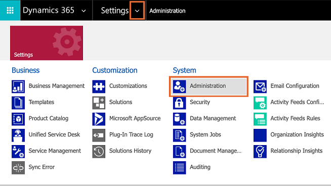

3.  Go to the **Reporting** tab and enable **Allow Power BI visualization embedding**.

    > [!div class=mx-imgBorder]
    > 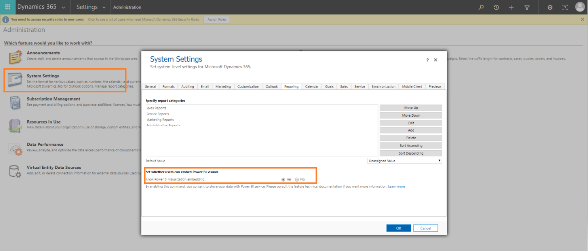

    Supervisors can now configure dashboards in Dynamics 365. 

### Step 7: Add Power BI Dashboards to Omnichannel for Customer Service

Each supervisor must configure their Dynamics 365 Customer Service environment to integrate the Omnichannel Chat Insights and Omnichannel Sentiment Analysis Insights dashboards.

1. Sign-in to Dynamics 365 for Customer Engagement and open the **Omnichannel Administration** app.

    > [!div class=mx-imgBorder]
    > 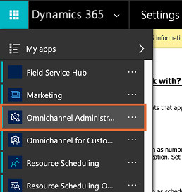

2. Open **Supervisor Dashboards**.

    > [!div class=mx-imgBorder]
    > 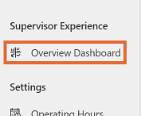

3.	Select **New**, then **Power BI Dashboard**.

    > [!div class=mx-imgBorder]
    > 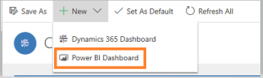

4. a. In Workspace field select **Omnichannel Insights for Dynamics 365**.  
   b. In Dashboard field select **Omnichannel Insights - Chat**.

    > [!div class=mx-imgBorder]
    > 

5.	Save and close.

6.	Repeat Step 3 to step 5 to add Omnichannel Insights - Sentiment Analysis dashboard

    > [!div class=mx-imgBorder]
    > 

    The Omnichannel Chat Insights and Omnichannel Sentiment Analysis Insights dashboards are now available in Dynamics 365. 

## Add users to supervisor configuration

You must add users in the supervisor configuration to access any supervisor dashboard in **Unified Service Desk**. To add users in supervisor configuration, follow these steps:

1.  Sign in to Dynamics 365 Customer Service.

2.  Go to **Settings** > **Unified Service Desk** and then select **Configuration**.

3.  On the configuration page, select **Supervisor Configuration**.

    > [!div class=mx-imgBorder]
    > 

4.  On the **Users** section, select **+ Add User record** and enter the user name to add the user.

    > [!div class=mx-imgBorder]
    > 

5.  Save and close the configuration.

    Users are added to the supervisor dashboard and when they sign in to Omnichannel on Unified Service Desk, the supervisor dashboard tabs are available.

## Configuring Omnichannel Insights Demo app

There is an accompanying demo application which uses a predefined dataset to help demonstrate the features and capabilities of Omnichannel Insights. Follow the stepsto configure the Omnichannel Insights Demo application:

You must perform the following steps to configure the Omnichannel Insights Demo app:

1.	[Step 1: Review the prerequisites](#step-1-review-the-prerequisites)
2.	Install Omnichannel Historical Chat Analytics app

    a.	Sign in to the [Power BI](https://app.powerbi.com/) app as an administrator.

    b.	Open [Omnichannel Insights for Dynamics 365 - Demo](https://aka.ms/d365-oc-insights-demo) app page.

    c.  Select **GET IT NOW** to install the app.

       > [!div class=mx-imgBorder]
       > 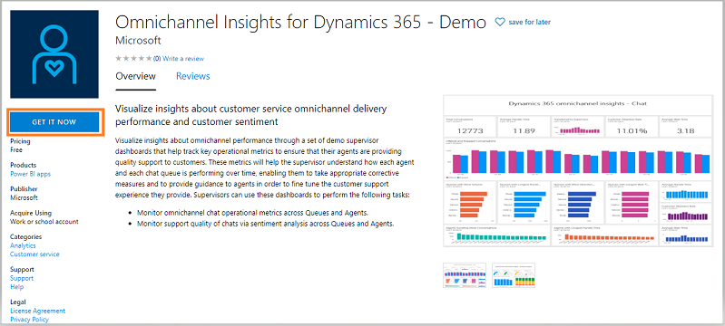

    d.	After the **Omnichannel Insights - Demo** app is installed, select the app and configuration options page displays.

       > [!div class=mx-imgBorder]
       > 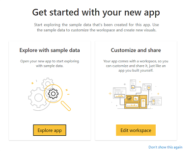

4.	[Step 5: Publish application within your organization](#step-5-publish-application-within-your-organization)
5.	[Step 6: Add Power BI Dashboard to Omnichannel for Customer Service](#step-6-add-power-bi-dashboard-to-omnichannel-for-customer-service)

## Customize Omnichannel insights

> [!IMPORTANT]
> Microsoft does not support customizations made to the Power BI template app and do not provide updates once modifications are made. 

Power BI is a comprehensive collection of services and tools that are used to visualize business data. The Power BI Template apps make it easy to visualize and analyze the Omnichannel Insights data with Power BI based on a standard data model. 

The Omnichannel Insights template app is built with a set of entities and fields that are useful for most reporting scenarios. Dynamics 365 apps are often extended with custom fields. These custom fields don’t automatically show up in the Power BI model. 

The following shows you how edit and extend the report included in the template app to include custom fields in the Power BI model.

Before customizing the template app, read the following information first and perform each task as necessary.

## Requirements

1. [Power BI service registration](https://app.powerbi.com/)
2. [Power BI Desktop](https://powerbi.microsoft.com/en-us/desktop/) application for editing Power BI reports.
3. PBIX file for Omnichannel Insights template app that you want to customize.[Download the Omnichannel Insights PBIX] (NEED LINK)

## Prepare PBIX for customization

1.	a. Start Power BI Desktop. 
 
b. Select **File** > **Open**, open Omnichannel Insights for Dynamics 365.pbix, and then select **Open**. 

c. Several pages of reports are loaded and displayed in Power BI Desktop.

2.	On the Power BI Desktop ribbon, select **Edit Queries**.

3.	a. In the left navigation pane of the Edit Queries window, under **Queries**, select the **Dynamics 365 Service Root URL** query, 

b. In the ribbon, select **Advanced Editor**.
 
c. In the source definition, replace **contosuites.crm10.dynamics.com** with your apps instance URL.
 
Example: if the organization name is Contoso, the URL looks like this:
Source = https://contoso.crm.dynamics.com/api/data/v9.1/

4.	a. Select **Done**, 

    b. Select **Close & Apply** in Query Editor.

5.	a. When the 'Access an OData feed' appears, select **Organizational account** 

b. Select **Sign-in**.

    > [!div class=mx-imgBorder]
    > 

6.	When the sign-in appears, enter your credentials to authenticate to your instance.

7.	In the Access an OData feed dialog, select **Connect**.

    Queries are updated. This may take several minutes.

## See also

[Introduction to Omnichannel Insights dashboard](../supervisor/intro-dynamics-365-omnichannel-insights-dashboard.md)

[View and understand Omnichannel Insights dashboards](../supervisor/omnichannel-insights-dashboard.md)
