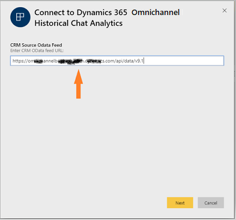
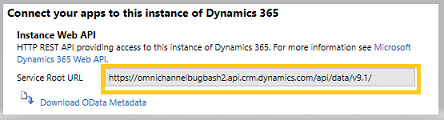
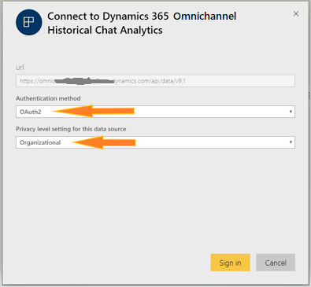
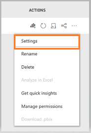
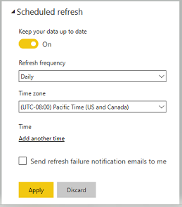
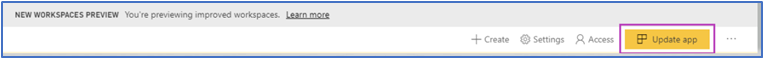
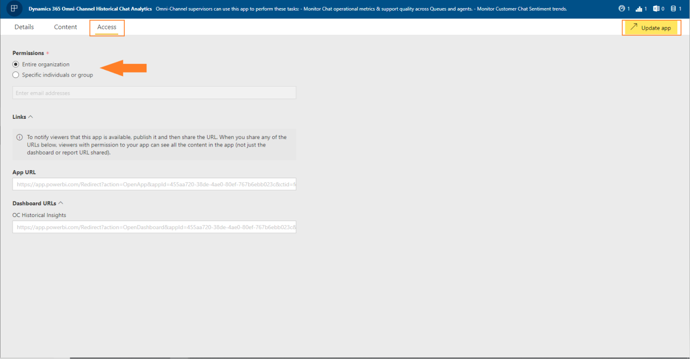
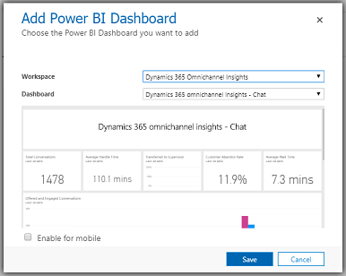
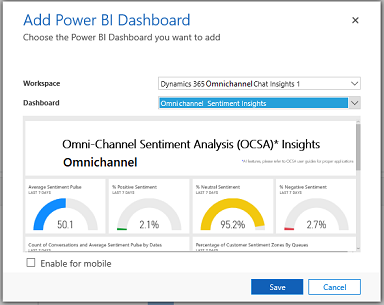

# Configure Omnichannel Insights dashboards

[!INCLUDE[cc-use-with-omnichannel](../../includes/cc-use-with-omnichannel.md)]

Customer service managers or supervisors are responsible for managing agents who work to resolve customer queries every day through various service channels, including chat. They need to know key operational metrics to ensure that their agents are providing quality support. The Omnichannel Insights consists of Omnichannel Chat and Sentiment Analysis dashboards.

> [!IMPORTANT]
> The supervisor dashboards that are based on Power BI such as Chat and Sentiment Analysis are not available on Government Community Cloud (GCC).

As an administrator, you must configure the Omnichannel Insights to display Omnichannel Chat and Sentiment Analysis dashboards in Omnichannel for Customer Service app. You must perform the following steps to configure:

[Step 1: Review the prerequisites](#step-1-review-the-prerequisites)

[Step 2: Install Omnichannel Insights for Dynamics 365 app](#step-2-install-omnichannel-insights-for-dynamics-365-app)

[Step 3: Connect Dynamics 365 organization to Omnichannel Insights for Dynamics 365 app](#step-3-connect-dynamics-365-organization-to-omnichannel-insights-for-dynamics-365-app)

[Step 4: Configure refresh frequency on Power BI Dataset](#step-4-configure-refresh-frequency-on-power-bi-dataset)

[Step 5: Publish application within your organization](#step-5-publish-application-within-your-organization)

[Step 6: Add Power BI Dashboard to Omnichannel for Customer Service](#step-6-add-power-bi-dashboard-to-omnichannel-for-customer-service)

## Step 1: Review the prerequisites

Review the following prerequisites before configuring the dashboard:
-  You have administrative privileges for Dynamics 365 and Power BI.
-  You have a Power BI Pro license for all supervisors.
-  You must enable to embed Power BI reports in Dynamics 365 for Customer Service.
    1.	Sign in to **Dynamics 365 for Customer Service** and go to **Settings** > **Administration** > **System Settings**.
    2.	Go to **Reporting** tab and configure **Allow Power BI visualization embedding** as **Yes**.

      > [!div class=mx-imgBorder]
      > 

    3.	Select **OK**.

## Step 2: Install Omnichannel Insights for Dynamics 365 app

1.	Sign in to the [Power BI](https://app.powerbi.com/) app as an administrator.

2.	As a Power BI admin, open [Omnichannel Insights for Dynamics 365](https://aka.ms/d365-oc-insights) app page.

3.  Select **GET IT NOW** to install the app.

    > [!div class=mx-imgBorder]
    > 

4.	After the **Omnichannel Insights** app is installed, select the app and configuration options page displays.

    > [!div class=mx-imgBorder]
    > 

    Now you can proceed to configure the app by connecting your Dynamics 365 organization.

## Step 3: Connect Dynamics 365 organization to Omnichannel Insights for Dynamics 365 app

1.	On the **Omnichannel Insights for Dynamics 365** app configuration page, select **Connect**.

    > [!div class=mx-imgBorder]
    > 

2.	On the connect data page, enter your organization's CRM OData feed URL and select **Next**.

    > [!div class=mx-imgBorder]
    > 

3.	(Optional) To find the Microsoft Dynamics 365 OData URL, follow these steps:

    a.	Sign in to Dynamics 365 for Customer Service.

    b.	Go to **Settings** > **Customizations** and then select **Developer Resources**.

    c.	Find the OData URL under **Service Root URL**.

       > [!div class=mx-imgBorder]
       > 

4.	Select **Authentication method** as **OAuth2** and **Privacy level** as **Organizational**. Select **Sign in**.

    > [!div class=mx-imgBorder]
    > 

5.	Enter your Dynamics 365 organization credentials and press **Enter**.

    When you are successfully signed in, the existing report will be updated with the data from your organization.

Now configure the refresh frequency for the reports and dashboards.

## Step 4: Configure refresh frequency on Power BI dataset

After you connect Omnichannel Chat Insights app with Dynamics 365 organization, you need to configure the refresh frequency on the Power BI dataset to refresh the report and dashboards properly.

1.	Sign in to [Power BI](https://app.powerbi.com/) app as administrator.

2.	Go to the **Omnichannel Insights** app workspace.

    > [!div class=mx-imgBorder]
    > 

3.	Go to **Datasets** tab and select **Settings**.

    > [!div class=mx-imgBorder]
    > 

4.	Turn on the **Scheduled refresh**.

    > [!div class=mx-imgBorder]
    > 

    > [!NOTE]
    > We recommendation you to configure the refresh frequency as **Daily**.

5. Select **Apply**.

Omnichannel insight reports and dashboards will refresh daily. Now, publish the application in your organization.

## Step 5: Publish application within your organization

You must share the configured application with your entire organization so the supervisors can view the **Omnichannel Insights** dashboards and reports with their own **Power BI Pro** accounts.

1.	On the App workspace, select **Update app**.

    > [!div class=mx-imgBorder]
    > 

2.	On the **Update app** wizard, go to the **Access** tab.

3.	Choose **Entire organization** and select **Update app**.

    > [!div class=mx-imgBorder]
    > 

The app is now available to install for all individuals in your organization.

> [!NOTE]
> Verify that your administrator has allowed Omnichannel for Customer Service to read and write data on behalf of users in your organization. To learn more, see [Provide data access consent](omnichannel-provision-license.md#provide-data-access-consent).

## Step 6: Add Power BI Dashboard to Omnichannel for Customer Service

Each supervisor must configure their Dynamics 365 for Customer Service environment to integrate the Omnichannel Chat Insights and Omnichannel Sentiment Analysis Insights dashboards.

1.  Sign in to Dynamics 365 for Customer Service and go to **Omnichannel Administration** app.

2.  Go to **Supervisor Experience** > **Dashboard**.

3.  On the dashboard page, select **New** > **Power BI Dashboard**.

    > [!div class=mx-imgBorder]
    > 

4.	Choose **Workspace** as **Omnichannel Insights** and **Dashboard** as **Omnichannel Insights - Chat**.

    > [!div class=mx-imgBorder]
    > 

5.	Save and close.
6.	Repeat Step 3 to step 5 to add **Omnichannel Insights - Sentiment Analysis**.

    > [!div class=mx-imgBorder]
    > 

The Omnichannel Chat Insights and Omnichannel Sentiment Analysis Insights dashboards are now available in Dynamics 365.

## Add users to supervisor configuration

You must add users in the supervisor configuration to access any supervisor dashboard in **Unified Service Desk**. To add users in supervisor configuration, follow these steps:

1.  Sign in to Dynamics 365 for Customer Service.

2.  Go to **Settings** > **Unified Service Desk** and then select **Configuration**.

3.  On the configuration page, select **Supervisor Configuration**.

    > [!div class=mx-imgBorder]
    > 

4.  On the **Users** section, select **+ Add User record** and enter the user name to add the user.

    > [!div class=mx-imgBorder]
    > 

5.  Save and close the configuration.

    Users are added to the supervisor dashboard and when they sign in to Omnichannel on Unified Service Desk, the supervisor dashboard tabs are available.

## Configuring Omnichannel Insights Demo app

There is an accompanying demo application which uses a predefined dataset to help demonstrate the features and capabilities of Omnichannel Insights. Follow the stepsto configure the Omnichannel Insights Demo application:

You must perform the following steps to configure the Omnichannel Insights Demo app:

1.	[Step 1: Review the prerequisites](#step-1-review-the-prerequisites)
2.	Install Omnichannel Historical Chat Analytics app

    a.	Sign in to the [Power BI](https://app.powerbi.com/) app as an administrator.

    b.	Open [Omnichannel Insights for Dynamics 365 - Demo](https://aka.ms/d365-oc-insights-demo) app page.

    c.  Select **GET IT NOW** to install the app.

       > [!div class=mx-imgBorder]
       > 

    d.	After the **Omnichannel Insights - Demo** app is installed, select the app and configuration options page displays.

       > [!div class=mx-imgBorder]
       > 

4.	[Step 5: Publish application within your organization](#step-5-publish-application-within-your-organization)
5.	[Step 6: Add Power BI Dashboard to Omnichannel for Customer Service](#step-6-add-power-bi-dashboard-to-omnichannel-for-customer-service)

### See also

-  [Introduction to Omnichannel Insights dashboard](../supervisor/intro-dynamics-365-omnichannel-insights-dashboard.md)

-   [View and understand Omnichannel Insights dashboards](../supervisor/omnichannel-insights-dashboard.md)
