# Configure Intraday insights for supervisors

[!INCLUDE[cc-use-with-omnichannel](../../includes/cc-use-with-omnichannel.md)]

Supervisors have a dual responsibility with respect to agents and customers. They monitor and manage agents, and make sure that they remain highly productive. At the same time, they help guarantee a superior experience for customers. To help supervisors carry out this dual responsibility, the insights consists of intraday health tracking of agent productivity and performance.

> [!IMPORTANT]
> The supervisor insights that are based on Power BI such as Intraday insights is not available on Government Community Cloud (GCC). 

As an administrator, you must configure the Intraday insights in your organization before supervisors can use it. You can configure the insights for **Omnichannel for Customer Service** app on web and **Unified Service Desk**.

## Prerequisites

Review the following prerequisites before configuring the supervisor insights: 

-  You have administrative privileges for Dynamics 365 Customer Service and Power BI. 

-  You must have **Power BI Pro** or **Power BI Premium** license for all supervisors and administrators. 

-  Verify that your administrator has allowed **Omnichannel for Customer Service** app to read and write data on behalf of users in your organization. To learn more, see [Provide data access consent](omnichannel-provision-license.md).

-  Assign the omnichannel supervisor role to supervisor users in your organization to access the report and dashboard. To learn more, see [Enable users for Omnichannel Customer Service](../administrator/add-users-assign-roles.md).

-  As a system administrator, you must create and add security group for Power BI service. Follow these steps to create and add security group:

   1. Create a security group in Azure Active Directory (AAD) and add **Omnichannel for Customer Service** as a member to that security group. To learn more, see [Create a basic group and add members using Azure Active Directory](https://docs.microsoft.com/azure/active-directory/fundamentals/active-directory-groups-create-azure-portal). 

   2. As a Power BI admin, you need to enable service principal in the **Developer settings** in the Power BI admin portal and the security group that you created in Azure AD.
        a.  Sign in to [Power BI service](http://app.powerbi.com) and go to **Settings** > **Admin portal**.
           
         > [!div class=mx-imgBorder]
         > 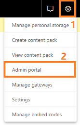 

        b.  In the Admin portal, go to **Tenant settings** > **Developer settings** > **Allow service principals to use Power BI APIs**.

        c.  Enable **Allow service principals to use Power BI APIs** and specify the security group that you want to give access.
        
         > [!div class=mx-imgBorder]
         > 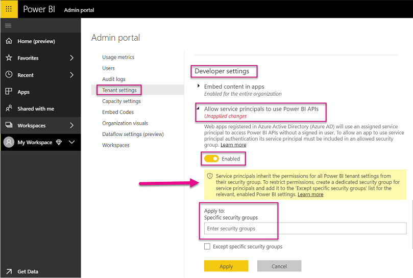

        d. Select **Apply**.

## Configure Intraday insights for Omnichannel for Customer Service app on web

Follow these steps to configure Intraday insights for Omnichannel for Customer Service app on web:

1. [Configure Power BI workspace in Omnichannel Administration app](#configure-power-bi-workspace-in-omnichannel-administration-app)

2. [Verify workspace creation and share reports with supervisors](#verify-workspace-creation-and-share-reports-with-supervisors)

### Configure Power BI workspace in Omnichannel Administration app

You must configure the Power BI workspace using the **Omnichannel Administration** app to create datasets and reports in Power BI. When configured, the supervisor users in your organization can see the Intraday insights reports as an app tab. Follow these steps to configure Power BI workspace to display Intraday insights reports as app tab in **Omnichannel for Customer Service** app on web.

1.  Sign in to **Dynamics 365 Customer Service** and open **Omnichannel Administration** app. 

    > [!div class=mx-imgBorder]
    > 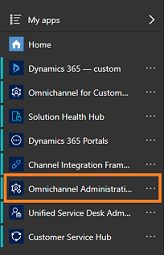

2.  From the **Site Map** , select **Supervisor Experience**, **Overview Dashboard**.  

    > [!div class=mx-imgBorder]
    > 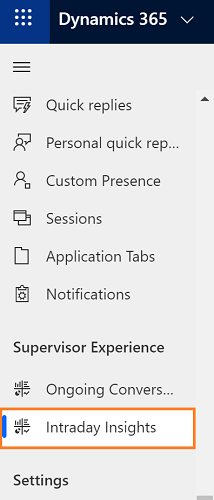

    The Power BI configuration view opens.

    > [!div class=mx-imgBorder]
    > 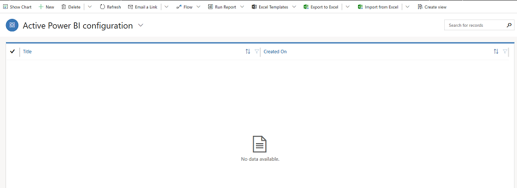

3.  Select **+ New**. 

    The **Power BI Configuration** form opens.

    > [!div class=mx-imgBorder]
    > 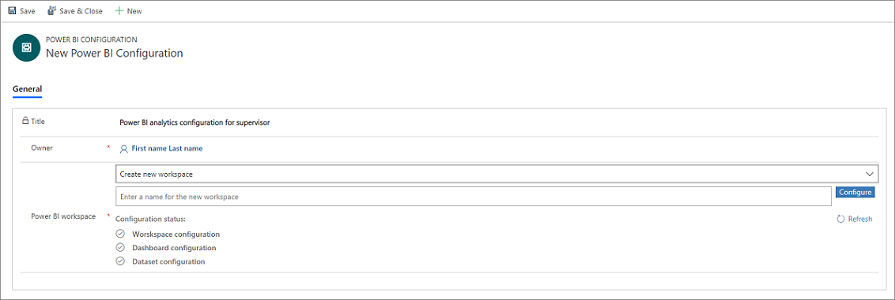

4. Enable the **Enable Intraday Insights for multi session web** option to make Intraday insights as an app tab on the home session for supervisors. 

    > [!div class=mx-imgBorder]
    > 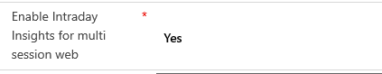
  
5.  In the **Power BI workspace** section, select **Create New Workspace** and enter a name for the workspace in **Power BI workspace** (this name must be unique).

    > [!div class=mx-imgBorder]
    >   
    
    -OR-

    If you want to add an existing Power BI workspace, select **Add existing work space** and the existing workspaces are listed. Select the workspace that you want to add.

    > [!div class=mx-imgBorder]
    > 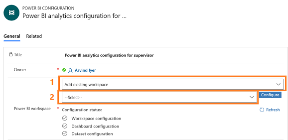  
        
6.  Select **Configure**. The workspace creation takes a few seconds and a confirmation message is displayed with the generated workspace ID.

    > [!div class=mx-imgBorder]
    > 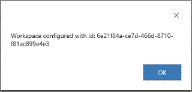  

    In Power BI, a workspace is created.

7.  Save and close the configuration. 

    After you save the configuration, it may take up to 15 minutes for the datasets, dashboard, and reports to appear in your created workspace.

    > [!NOTE]
    > You can also see the status of different configuration stages such as workspace, dashboard, and datasets. When a workspace is created successfully, all the statuses will be in Green check. If failed, the respective configuration stage check will be in Red, and an error message is displayed. Resolve the error and create the workspace again.

8. In [Power BI Service](https://app.powerbi.com), share the reports with supervisor users to access the report in **Omnichannel for Customer Service** app on web. To learn more, see [Share your Power BI dashboards and reports with coworkers and others](https://docs.microsoft.com/power-bi/service-share-dashboards).

   > [!IMPORTANT]
   > - You can configure only one record in **Omnichannel Administration** app. 
   > - If you want to create a new configuration, deactivate and delete the existing configuration.
   > - You can edit an existing configuration to update the Power BI workspace details.

### Verify workspace creation and share reports with supervisors

1.  Sign in to [Power BI Service](https://app.powerbi.com).

2.  Go to **Workspaces** and verify that a workspace with the name that you have entered is created.

    > [!div class=mx-imgBorder]
    >   

3.  Open the workspace that you have created and verify that the following are available:

    -   An empty dashboard with the name of the workspace.

    -   The report and datasets **Intraday Monitoring**.

4.  Share the reports with supervisor users to access the report as app tab in **Omnichannel for Customer Service** app on web. To learn more, see [Share your Power BI dashboards and reports with coworkers and others](https://docs.microsoft.com/power-bi/service-share-dashboards).

## Configure Intraday insights for Unified Service Desk 

Before you configure the Intraday insights for Unified Service Desk, you must [configure Intraday insights for Omnichannel for Customer Service app on web](#configure-intraday-insights-for-omnichannel-for-customer-service-app-on-web). This configures the Power BI datasets, reports, and dashboards for Omnichannel for Customer Service and enable you to configure the insights for Unified Service Desk. 

You must perform the following tasks to configure the Intraday insights for **Unified Service Desk**:

1. [Configure Intraday insights for Omnichannel for Customer Service app on web](#configure-intraday-insights-for-omnichannel-for-customer-service-app-on-web)
2. [Configure dashboard in Power BI](#configure-dashboard-in-power-bi)
3. [Configure Unified Service Desk to display Intraday insights](#configure-unified-service-desk-to-display-intraday-insights)
4. [Add users to supervisor configuration](#add-users-to-supervisor-configuration)
5. [Update client cache version](#update-client-cache-version)

### Configure dashboard in Power BI

Configuring the Power BI workspace provides you only the **Intraday Monitoring** report. Create the dashboard out of **Intraday Monitoring** Power BI report after it is available.

> [!IMPORTANT]
> In Power BI settings for **Intraday Monitoring**, DO NOT select the option **Take over**. If you select this option, the dataset will not connect to the datasource and you have to reconfigure intraday insights. 

Follow these steps to configure Power BI dashboards.

1.  In [Power BI Service](https://app.powerbi.com), open the reports that are available in the workspace. To learn more, see [Open a report in Power BI service](https://docs.microsoft.com/power-bi/consumer/end-user-report-open).

2.  Pin the required tiles to dashboards. 
    The following screen shows how to pin a visual to the dashboard.

   > [!div class=mx-imgBorder]
   > 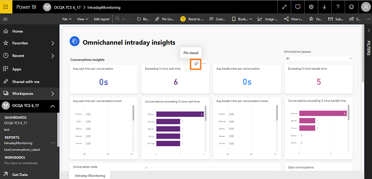  

  Choose on which dashboard you want to pin and select **Pin**. The report is pinned to the chosen dashboard.

   > [!div class=mx-imgBorder]
   > 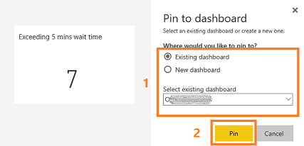  

  To learn more, see [Pin a tile to a Power BI dashboard from a report](https://docs.microsoft.com/power-bi/service-dashboard-pin-tile-from-report).

3.  Select **Set as featured** for the created dashboard to display on the top for each time you open the Power BI service.

4.  Share the dashboard and reports with supervisor users. This allows supervisors to access the dashboards. To learn more, see [Share your Power BI dashboards and reports with coworkers and others](https://docs.microsoft.com/power-bi/service-share-dashboards).  

5.  For Unified Service Desk configuration, copy the URL of the dashboard.  

   The dashboard is ready, and you can configure the **Unified Service Desk** to make this dashboard available for supervisors.

### Configure Unified Service Desk to display Intraday insights

You must configure the **Unified Service Desk** to display the supervisor Intraday insights when a supervisor signs in to the workspace in Omnichannel. To configure the **Unified Service Desk**, follow these steps:

1.  Sign in to **Dynamics 365 Customer Service** and go to **Settings** > **Unified Service Desk**.

    The Unified Service Desk settings page opens.

2.  Select **Action Calls** and open **Load Supervisor Dashboard**.

3.  In the **Action** section, enter the **Data** as “*url=* *https://powerbi.com/dashboards/&lt;id&gt;*” that you copied in [Configure dashboard in Power BI](#configure-dashboard-in-power-bi). Also, add the parameters **chromeless=1** and **nosignupcheck=1** at the end of the URL.  

    For example,

    url=*https://powerbi.com/dashboards/g12466b5-a452-4e55-8634-xxxxxxxxxxxx?chromeless=1&nosignupcheck=1*

4.  Save and close the settings page.

The supervisor insights is configured and available. Add users to supervisor configuration to view the dashboards when signing on to the Omnichannel in **Unified Service Desk**. 

### Add users to supervisor configuration

You must add users in the supervisor configuration to access any supervisor insights in **Unified Service Desk**. To add users in supervisor configuration, follow these steps:

1.  Sign in to Dynamics 365 Customer Service.

2.  Go to **Settings** > **Unified Service Desk** and then select **Configuration**.

3.  On the configuration page, select **Supervisor Configuration**.

    > [!div class=mx-imgBorder]
    >   

4.  On the **Users** section, select **+ Add User record** and enter the user name to add the user.

    > [!div class=mx-imgBorder]
    > 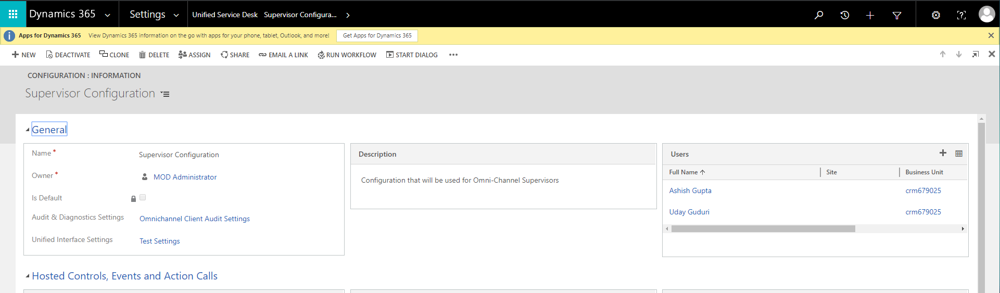  

5.  Save and close the configuration.

    Users are added to the supervisor dashboard and when they sign in to Omnichannel on Unified Service Desk, the supervisor dashboard tabs are available.

### Update client cache version

Update the client cache version number to reduce the amount of bandwidth required at the startup of the Unified Service Desk client on the computers of agents, and over the life cycle of the client application.

To learn more, see [Client caching overview](https://docs.microsoft.com/dynamics365/customer-engagement/unified-service-desk/admin/configure-client-caching-unified-service-desk?view=dynamics-usd-4.1).  

1.  Sign in to **Dynamics 365 Customer Service**.

2.  Go to **Settings** > **Unified Service Desk** and then select **Options**.

    > [!div class=mx-imgBorder]
    >   
 
3.  Select **ClientCacheVersionNumber**.

    > [!div class=mx-imgBorder]
    > 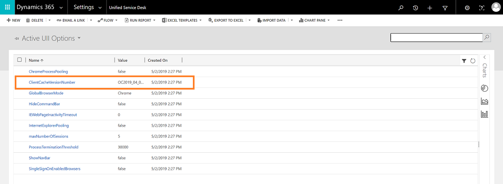  

4.  In the **Value** box, updated the existing alphanumeric number. For example, the existing alphanumeric number is OC2019\_04\_010 and updated this number as OC2019\_04\_011.

    > [!div class=mx-imgBorder]
    > 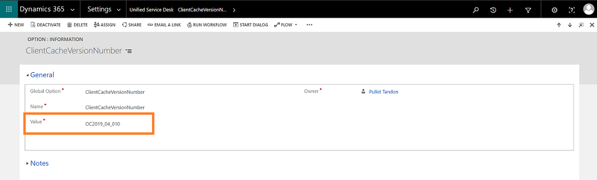  

5.  Select **Save**.

### See also

[Introduction to Intraday insights](../supervisor/intro-intraday-insights-dashboard.md)

[Add custom KPIs to Intraday insights dashboard](add-custom-kpis-intraday-insights-dashboard.md)