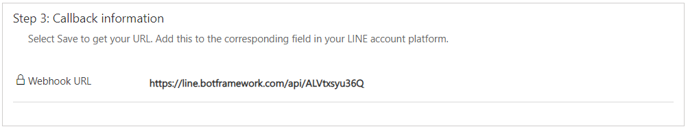
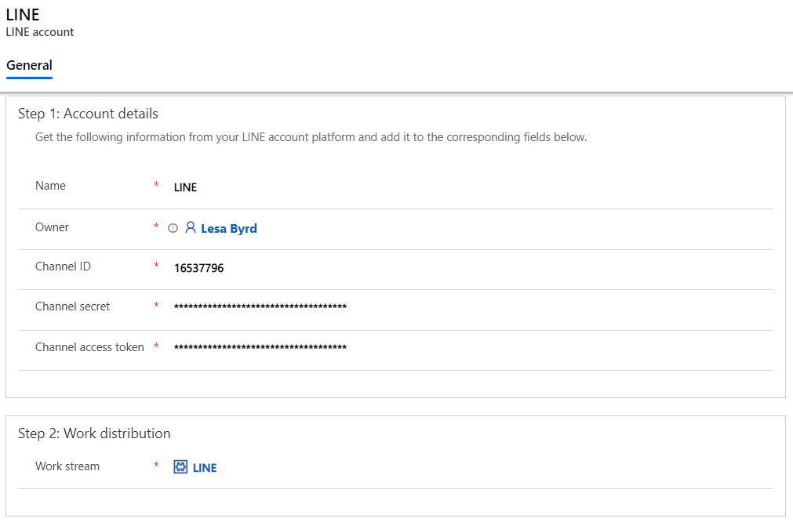

# Configure a LINE channel

[!INCLUDE[cc-use-with-omnichannel](../../includes/cc-use-with-omnichannel.md)]

Many customers use social messaging channels like LINE for their personal communication needs. Many also prefer using these messaging channels to engage with businesses. The asynchronous nature of these channels gives customers the convenience of getting their issues resolved as and when they find time, unlike real-time channels like Chat for Dynamics 365 Customer Service, where the session ends when the chat window is closed.

The LINE channel gives you an incredible opportunity to capitalize on the social media trend and engage with your customers in a seamless and personalized experience.

  > [!NOTE]
  > The LINE channel isn't available in the Government Community Cloud (GCC) region.

**Prerequisites**: Following are the prerequisites before configuring the LINE channel in Omnichannel for Customer Service.
> [!NOTE]
> To enable the LINE channel in an existing Omnichannel for Customer Service environment, you must [upgrade to the latest version of Omnichannel for Customer Service](upgrade-omnichannel.md).

1.	Create a LINE handle. More information: [Create and Manage a LINE profile](https://account.line.biz/signup)
2.	Create a LINE channel in the LINE Developers console. More information: [Create a LINE channel](https://developers.line.biz/en/docs/messaging-api/getting-started/#creating-a-channel)

After completing the prerequisites, you can add the LINE channel for your organization by following these steps:

1.	[Create a LINE channel](#create-a-line-channel).
2.	[Create routing rules](#create-routing-rules).

## Create a LINE channel

1.	Go to **Channels** > **LINE**.

2.	Select **New** to create a LINE channel.

3.	On the **New LINE Application** page, provide the following account details:

    - **Name**: Name of the LINE application. 

    - **Channel ID**: ID of the LINE application. Go to the [LINE developer portal](https://developers.line.biz/console/) > **Provider** > **Channel** (ensure that it's a Messaging API) > **Basic settings**, and then copy the value in the **Channel ID** field.

    - **Channel secret**: Application secret of the LINE application. Go to the [LINE developer portal](https://developers.line.biz/console/) > **Provider** > **Channel** (ensure that it's a Messaging API) > **Basic settings**, and then copy the value in the **Channel secret** field.
    
    - **Channel access token**: Token of the LINE application. Go to the [LINE developer portal](https://developers.line.biz/console/) > **Provider** > **Channel** (ensure that it's a Messaging API) > **Messaging API**, and then copy the value in the **Channel access token (long-lived)** field.
    
    - **Enable Webhooks**: Webhooks in the LINE application must be enabled. Go to the [LINE account manager](https://manager.line.biz/account/) > **Settings** > **Response settings**. Under **Main settings**, select **Bot** for **Response mode**, and then under **Detailed Settings**, select **Enabled** for **Webhooks**.

4. Browse to and select the out-of-the-box work stream for the LINE channel, and then select **Save**. After you save the record, the **LINE** channel is enabled. The Callback URL has been created. The next step is to save it.

   To create a work stream, see [Create work streams](work-streams-introduction.md).
 
   > [!div class=mx-imgBorder]
   > 

5. The Callback URL might take a few minutes to generate. Select **Refresh**.

6. Go to the the [LINE developer portal](https://developers.line.biz/console/) > **Provider** > **Channel** (make sure it's a Messaging API) > **Messaging API**. Copy the **Webhook URL** from Omnichannel for Customer Service, and then paste it into the **Webhook URL** field in the LINE developer console.

7. Make sure that **Use webhook** is enabled in the LINE app dashboard.
 
   > [!div class=mx-imgBorder]
   > 

More information about the LINE app: [Setting up your LINE app](https://developers.line.biz/en/docs/messaging-api/getting-started/#creating-a-channel)
 
> [!div class=mx-imgBorder]
> 

> [!div class=mx-imgBorder]
> 

The LINE channel setup is complete.
> [!NOTE]
> You can only add one **LINE account** per **LINE Application** channel.

## Create routing rules

1.	Go to **Work Distribution Management** > **Work Streams**.

2.	Open the out-of-the-box work stream or the one you created.

3.	On the **Routing rules items** tab, create a routing rule to transfer the message to an appropriate agent. Select the entity as **LINE Engagement Context**. For example, you can create a rule to transfer LINE chat from a customer named LINE to the default queue.

> [!div class=mx-imgBorder]
> 

## Customer and agent experiences

A customer can initiate a conversation in any of the following ways:

- LINE app on a mobile device
- LINE app on a desktop device
- [line.me/en/](https://line.me/en/)

If a customer initiates a conversation from the LINE website and then later switches to the mobile device, the previous conversation persists and the customer can continue the conversation.

The agent receives the notification of the incoming chat request, along with customer details. More information: [View notifications](../agent/agent-oc/oc-notifications.md)

> [!div class=mx-imgBorder]
> 

If the customer is identified by name, the conversation is automatically linked to the contact record and the customer summary is populated. More information: [View customer summary](../agent/agent-oc/oc-customer-summary.md)

If the customer isn't identified by name, a new contact record can be created.

## Privacy notice

By enabling this feature, your data will be shared with LINE and flow outside of your organization's compliance and geo boundaries (even if your organization is in a Government Cloud environment). Please consult the feature technical documentation for more information [here](https://docs.microsoft.com/azure/bot-service/bot-service-channel-connect-line?view=azure-bot-service-4.0).

Customers are solely responsible for using Dynamics 365, this feature, and any associated feature or service in compliance with all applicable laws, such as laws relating to monitoring, recording, and storing communications with their end-users. This includes adequately notifying end-users that their communications with agents may be monitored, recorded, or stored and, as required by applicable laws, obtaining consent from end users before using the feature with them. Customers are also encouraged to have a mechanism in place to inform their agents that their communications with end-users may be monitored, recorded, or stored.

### See also

[Understand and create work streams](work-streams-introduction.md) 
[Create and manage routing rules](routing-rules.md)
