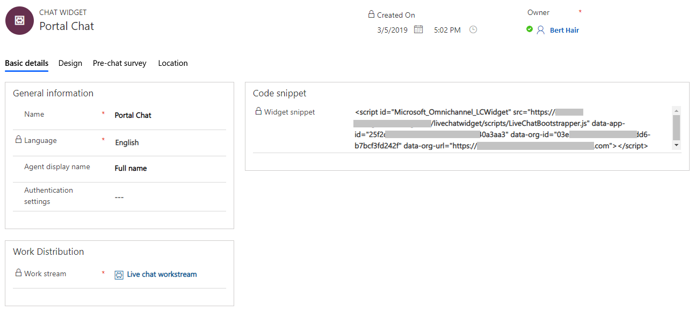
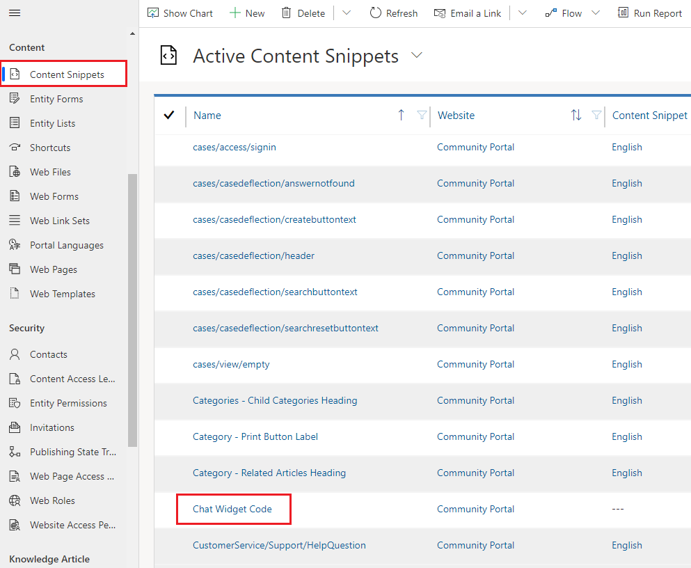
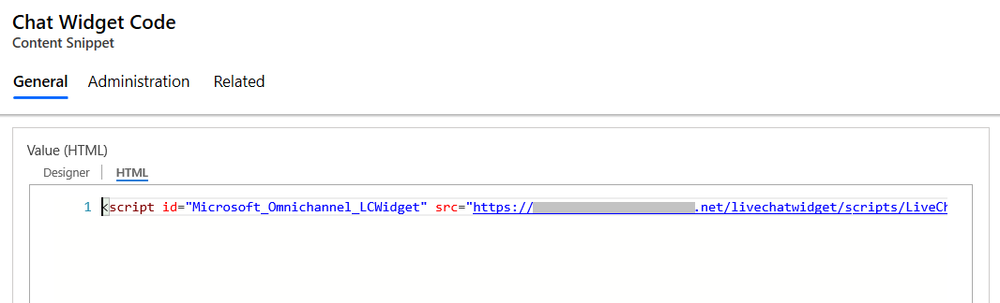
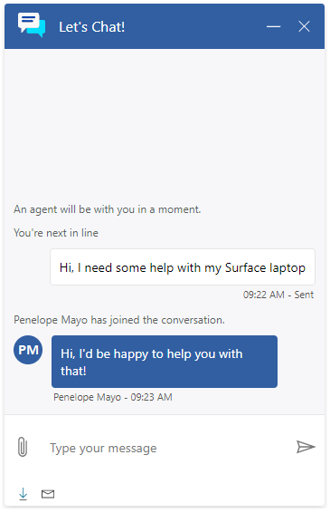

# Quickly configure a chat widget

[!INCLUDE[cc-use-with-omnichannel](../../includes/cc-use-with-omnichannel.md)]

Quickly configure and add a chat widget to your portal to chat with your website visitors. To configure a chat widget and embed it in portal, you must:

1. [Create a live chat work stream](#step-1-create-a-live-chat-work-stream)
2. [Configure a chat widget](#step-2-configure-a-chat-widget)
3. [Embed chat widget in portal](#step-3-embed-chat-widget-in-portal)

## Step 1: Create a live chat work stream

1. In the Omnichannel site map, go to **Work Streams** and select **New** from the command bar.
2. On the **Summary** tab of the new work stream page, provide the name of the work stream.
3. In the **Channel** drop-down list, select **Live chat** as the channel.
4. Select **Save** to save the live chat work stream.

   > [!div class=mx-imgBorder]
   > 

## Step 2: Configure a chat widget

1. Go to **Channels** &gt; **Chat**.
2. Select **New** to create a chat widget. The **New Chat Widget** page opens.
3. On the **Basic details** tab, provide the following information:
   1. In the **General information** section, enter a name for the chat widget.
   2. In the **Work Distribution** section, browse and select the work stream you created for the chat widget, and save the record.
4. Copy the widget snippet code from the **Code snippet** section. This snippet code will be used in [Step 3](#step-3-embed-chat-widget-in-portal).

    > [!div class=mx-imgBorder]
    > 

## Step 3: Embed chat widget in portal

1.	Open the Dynamics 365 Portals app.
2.	Go to **Portal** > **Content Snippets**.
3.	Find the **Chat Widget Code** content snippet and open it.
    > [!div class=mx-imgBorder]
    > 
4.	On the **General** tab, scroll-down to the **Value (HTML)** section.
5.	Paste the chat widget snippet code in the **HTML** tab.
    > [!div class=mx-imgBorder]
    > 
6.	Save the changes. The chat widget is now embedded into the portal. By default, the chat widget is displayed in minimized mode as follows:

    > [!div class=mx-imgBorder]
    > 
    
You can maximize the chat widget by selecting it.

> [!div class=mx-imgBorder]
> 
    
### See also

[Understand and create work streams](work-streams-introduction.md)  
[Create and manage routing rules in Omnichannel](routing-rules.md)  
[Configure a chat widget](set-up-chat-widget.md)
