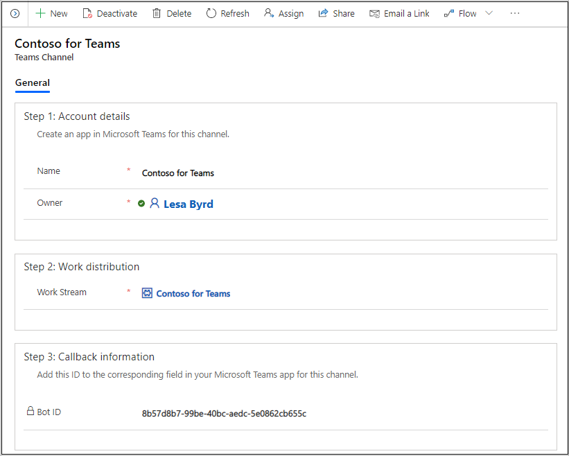

# Preview: Configure a Microsoft Teams channel

[!INCLUDE[cc-use-with-omnichannel](../../includes/cc-use-with-omnichannel.md)]

[!include[cc-beta-prerelease-disclaimer](../../includes/cc-beta-prerelease-disclaimer.md)]

> [!IMPORTANT]
>
> - A preview is a feature that is not complete, as it may employ reduced privacy, security, and/or compliance commitments, but is made available before it is officially released for general availability so customers can get early access and provide feedback. Previews are provided "as-is," "with all faults," "as available," and without warranty.​
> - This preview feature does not come with technical support and Microsoft Dynamics 365 Technical Support won't be able to help you with issues or questions.  If Microsoft does elect to provide any type of support, such support is provided "as is," "with all faults," and without warranty, and may be discontinued at any time.​
> - Previews are not meant for production use, especially to process Personal Data or other data that is subject to heightened compliance requirements, and any use of "live" or production data is at your sole risk.  All previews are subject to separate [Terms and Conditions](../../legal/dynamics-insider-agreement.md).

## Microsoft Teams channel

Using Microsoft Teams as an engagement channel for support of internal functions&mdash;such as technical support, human resources, and finance&mdash;allows organizations to connect their employees with internal support personnel by using the Omnichannel Add-in for Dynamics 365 Customer Service.

## Prerequisites

Make sure that the following prerequisites are met:

- Teams is provisioned in your environment. More information: [Provision Omnichannel for Customer Service](omnichannel-provision-license.md)

  > [!NOTE]
  > To enable the Teams channel in an existing Omnichannel for Customer Service environment, you must upgrade to the latest version of Omnichannel for Customer Service. More information: [Upgrade Omnichannel for Customer Service](upgrade-omnichannel.md)

- An app is created and configured in **Teams** > **App Studio**.

## Configure a Microsoft Teams channel in Omnichannel for Customer Service

### Create a Teams channel

1. In Omnichannel Administration under **Channels**, select **Teams**. The **New Teams Channel** page appears.

2. In **Step 1: Account details**, enter the following details:

   - **Name:** Specify a name for the channel.
   - **Owner:** Accept the default value, or specify a different value.

3. In **Step 2: Work distribution**, select the out-of-the-box work stream for Teams. Alternatively, you can create a [work stream](work-streams-introduction.md) for Teams and associate it with the Teams channel.

4. Select **Save**. The Teams channel is saved.

5. In **Step 3: Callback information**, copy the value that's displayed in **Bot ID**.

    > [!div class=mx-imgBorder]
    > 

### Configure Teams details

1. In the Teams app, go to **App Studio** > **Manifest editor**, and then select the app that you configured for Omnichannel for Customer Service.

2. Select the ellipsis (...), and then select **Edit**.

3. Select **Bots** > **Edit**, and then paste the **Bot ID** value in the box that appears under **Connect to a different Bot id**.

4. Make sure that you've configured the options in **App details**.

5. Select **Test and distribute**, and then select **Install** to test your app.

### See also

[Channels in Omnichannel for Customer Service](channels.md)  
[Use a Microsoft Teams channel](../agent/agent-oc/teams-channel.md)