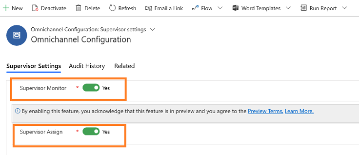

# Enable supervisors to monitor and assign conversations

[!INCLUDE [cc-beta-prerelease-disclaimer](../../includes/cc-beta-prerelease-disclaimer.md)]

> [!IMPORTANT]
> - [!INCLUDE[cc_preview_features_definition](../../includes/cc-preview-features-definition.md)]  
> - [!INCLUDE[cc_preview_features_expect_changes](../../includes/cc-preview-features-expect-changes.md)]
> - Microsoft doesn't provide support for this preview feature. Microsoft Technical Support won’t be able to help you with issues or questions. Preview features aren't meant for production use and are subject to a separate [supplemental terms of use](https://go.microsoft.com/fwlink/p/?linkid=870960).

As an administrator, you must enable the settings for supervisors to monitor conversations or assign them to a queue or an agent. To do so, follow these steps:

1. Sign in to the **Omnichannel Administration** app.

2. Go to **Supervisor Experience** > **Ongoing Conversation Dashboards**.
 
3. Select the **Supervisor Settings** tab and perform the following:

    1. **Supervisor Monitor**: Enable this option for supervisors to monitor conversations that are handled by agents. By default, the monitor option is enabled. 

    2. **Supervisor Assign**: Enable this option for supervisors to assign incoming conversations to queues or agents. 
 
    > [!div class=mx-imgBorder]
    > 

### See also

[Monitor conversations](../supervisor/monitor-conversations.md)

[Assign conversations](../supervisor/assign-conversations.md)
