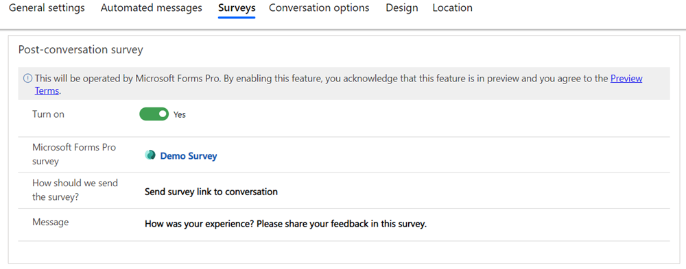

# Configure a post-conversation survey

[!INCLUDE[cc-use-with-omnichannel](../../includes/cc-use-with-omnichannel.md)]

## Introduction

You can configure your chat widget to show users a survey that they can respond to after they finish a conversation.

> [!NOTE]
> Post-conversation survey is not supported in Government Community Cloud.

## How post-conversation surveys work

When you enable a post-conversation survey for a channel, the survey will appear for the customer after the agent or customer ends the conversation. While configuring the survey, you can use the settings for the response options available in Dynamics 365 Customer Voice. More information: [Work with survey settings](https://docs.microsoft.com/dynamics365/customer-voice/distribution-settings)

To enable post conversation surveys, you need to complete the following steps:

1. Create a survey
2. Configure a survey
3. Run-time experience  
<!-- Can step 3 be considered as a procedural step? It's not something that the agent/admin will need to set up, right? Can the procedure only have the first and second steps, instead? Meghana -->

You can enable post-conversation surveys for the following channels:

- Live chat
- SMS
- Facebook
- LINE
- Twitter
- WeChat
- WhatsApp
- Custom channel
- Microsoft Teams

For a chat channel only, you can configure the survey link or survey questions to be displayed in the chat window.

## Prerequisite

The post-conversation survey uses Dynamics 365 Customer Voice to create surveys. Make sure you have access to create surveys in Dynamics 365 Customer Voice in the same org as Omnichannel for Customer Service, and you've created the required survey. The survey that you create will be listed as an option to choose for linking to the conversation. More information: [Create surveys with Dynamics 365 Customer Voice](https://go.microsoft.com/fwlink/p/?linkid=2135108)

## Configure a post-conversation survey

You can set up surveys when configuring a channel or update an existing channel instance that is already configured.

1. Sign in to Omnichannel Administration.

2. Go to **Channels**, and select a channel for which you want to configure a post-conversation survey.

3. Select the **Surveys** tab.

4. In the **Post-conversation survey** area, set the toggle for **Turn on** to **Yes**.

5. In **Dynamics 365 Customer Voice survey**, search for a survey and select it.
6. Optionally, if you want to create a survey, select **Open Dynamics 365 Customer Voice**. The Dynamics 365 Customer Voice page opens on a new tab.
7. After you create the survey, it will be available for selection in the **Dynamics 365 Customer Voice survey** box in the **Post-conversation survey** area.

8. In the **How should we send the survey?** box, the following options are available depending on the channel you select:
   - **Send survey link to conversation:** When selected, sends the survey link to customers.

       - In the **Message** box that appears, select the default message text or type a custom message. The personalized survey link will be appended to the message and displayed to the customer.
   - **Insert survey in conversation:** This option is available only for the Chat channel. When you configure this option, the agent can insert a survey link in an active session. The survey questions are displayed on the customer chat window.

9. Select **Save**.

> [!div class=mx-imgBorder]
> 

## Run time experience of post-conversation surveys

When a conversation ends, a pre-designed survey is sent to the customer. This survey allows you to track and analyse service feedback and experience as a key metric for the service delivered. Any conversation can be considered as closed when one of the following scenarios happen.

+ Agent ends the chat conversation
+ Customer ends the chat conversation
+ Auto closure of the conversation

When a conversation comes to an end, the customer receives a feedback that they can respond to. Customers can typically receive survey links in two ways.

+ Embedded survey mode: You can configure embedded survey mode only for live chats. This allows you to embed the survey directly to the conversation.
+ Link survey mode: This allows you to get a detailed feedback from the customer, since it allows customers to take the survey whenever they want to. You can also set a pre-defined message as a trigger for the survey link to be sent to the customer.

While you are configuring your surveys, you can choose what kind of survey you want to send to your customers. See: Configure a post conversation survey
<!-- Meghana- Is it a good idea to link to the configure section? -->

> [!NOTE]
> The surveys that you create and survey data that is processed are not hosted or stored in Omnichannel for Customer Service.

### See also

[Add a chat widget](add-chat-widget.md)  
[Channels](channels.md)  
