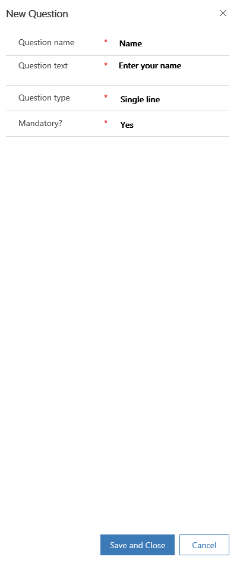
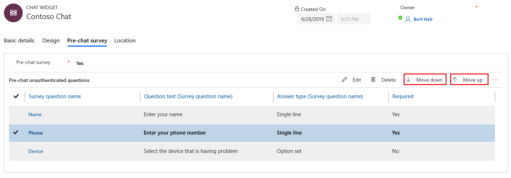
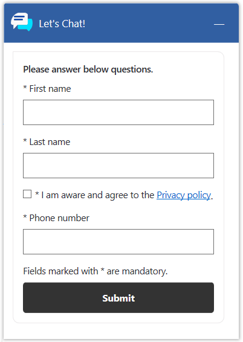

# Configure a pre-chat survey

[!INCLUDE[cc-use-with-omnichannel](../../includes/cc-use-with-omnichannel.md)]

You can configure your chat widget to show users a survey that they should respond to before they start the conversation.

1. Sign in to Omnichannel Administration.
2. Go to **Channels** &gt; **Chat**.
3. Open the chat widget in which you want to configure a pre-chat survey, and select **Pre-chat survey**.
4. In the **Pre-chat survey** box, select **Yes**. The options to add questions and refresh are displayed.
5. Select **Add question**.

    > [!NOTE]
    > You can add only five questions to a pre-chat survey.

6. In the **New Question** pane, provide the following information:

    - **Question name**: Enter a name for the question.
    - **Question text**: Enter the text of the question.
    - **Question type**: Select the type of answer that is required from users:

        - **Single line**: The user can enter a single line of text.
        - **Multiple lines**: The user can enter multiple lines of text.
        - **Option set**: The user can select an option in a drop-down list. You must enter options separated by a semi-colon.
        - **User Consent**: Use this option to request user consent for the pre-chat survey. You can provide a link to a webpage, such as privacy policy. The links should be in the following format: [link text](link to the webpage). A check box will appear beside the question text in the pre-chat survey.

    - **Mandatory**: Select **Yes** or **No** to indicate whether the question is mandatory. If  question type is **User Consent**, make sure you specify **Yes**.

    > [!NOTE]
    > Validations in pre-chat survey are supported only for mandatory fields.
    

    > [!div class=mx-imgBorder]
    > 

7. Select **Save and Close**. The questions are added in the **Pre-chat unathenticated questions** area.
  
    > [!div class=mx-imgBorder]
    > 

8. Select a question and select **Move up** or **Move down** in the right corner to change its order.

    > [!div class=mx-imgBorder]
    > 

A sample screenshot of the pre-chat survey that will be displayed for customers is as follows.

> [!div class=mx-imgBorder]
> 

More information: [Automatically identify customers using pre-chat responses](record-identification-rule.md)

### See also

[Add a chat widget](add-chat-widget.md)  
[Configure agent display name](agent-display-name.md) 
[Configure file attachment capability](configure-file-attachment.md) 
[Create quick replies](create-quick-replies.md)  
[Create and manage operating hours](create-operating-hours.md)  
[Create chat authentication settings](create-chat-auth-settings.md)  
[Embed chat widget in Dynamics 365 Portals](embed-chat-widget-portal.md)
