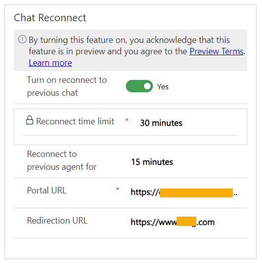

# Preview: Configure reconnection to a previous chat session

[!INCLUDE[cc-use-with-omnichannel](../../includes/cc-use-with-omnichannel.md)]

[!include[cc-beta-prerelease-disclaimer](../../includes/cc-beta-prerelease-disclaimer.md)]

## Overview

When customers are disconnected in the middle of a conversation on account of reasons, such as restarting their system while troubleshooting or network disruption, they can reconnect to the same agent, if you as an administrator, enable the settings to reconnect. The options to reconnect to the same agent helps save time and effort and improves customer satisfaction.

### How reconnection to a previous chat works

When enabled, the reconnection to a chat session works as follows:

#### Reconnect with link

Administrators configure the link information as a quick response for agents. During the conversation, the agent shares the reconnection link with the customer, if a reconnection scenario is anticipated. This option is available for both authenticated and unauthenticated chat widget settings.

#### Reconnect through prompt

Customers interacting through chat widgets that have authentication settings configured are presented with options to continue with the previous session or start a new conversation when they come back to the chat session.

#### Redirection link

You can optionally configure a redirection link for the customer to navigate to when they come back after a timeout period that is configured in the reconnection settings. If no redirection link is configured, a fresh conversation starts when the customer selects the reconnect link.

> [!IMPORTANT]
>
> The reconnection feature works as designed only when the following prerequisites are met for the conversation:
>
> - The customer connects back within the reconnection time that is configured for the feature.
> - The agent doesn't end the session using the **End** button.
> - The customer doesn't end the session by closing the chat window.
> - If agent closes the chat window, the customer might not be reconnected to the same agent.

## Enable reconnection to a previous chat session

You can enable the reconnection options in the chat widget either while setting up the chat widget for the first time or later based on your needs.

1. In the Omnichannel Administration app, go to **Channels** > **Chat**.

2. On the page that appears, select **New** on the toolbar to create a chat widget or in the **Active Chat Widgets** list, select the chat widget for which you want to enable reconnect chat.

3. On the ***<widget_name>* Chat Widget** page, in the **Chat Reconnect** area, set the toggle to **Yes** to enable reconnection to previous chat. The following options are displayed:
   - **Reconnect time limit:** The value that is set for the **Auto-close after inactivity** field in the work stream associated with the chat widget is displayed.
   - **Reconnect to previous agent for:** Select a value to indicate the time within which the customer can connect back to the same agent. This value should be less than or equal to the value specified in the **Reconnect time limit** box. The agent's capacity is blocked for the specified duration unless the agent closes the conversation using the close button, which releases the agent's capacity.
   - **Portal URL:** Specify the link that will be shared by the agent with the customer to reconnect to the chat session. This must be the portal link on which the chat widget is displayed.
   - **Redirection URL:** Optionally, specify the link that the customer will be redirected to when the reconnect timeout occurs. When left blank, the customer sees the option to start a new chat conversation.

    > [!div class=mx-imgBorder]
    > 

4. Select **Save**.

### See also

[Add a chat widget](add-chat-widget.md)  
[Create a work stream](work-streams-introduction.md)  
[Slug for reconnection link](automation-dictionary-keys.md#slug-for-reconnection-link)  
