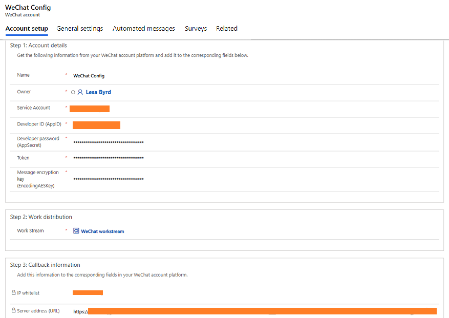

# Configure a WeChat channel

[!INCLUDE[cc-use-with-omnichannel](../../includes/cc-use-with-omnichannel.md)]

## WeChat channel

By leveraging social messaging channels, such as WeChat, that has a large user base in Asia, business efficiencies in certain geographical areas can be addressed by integrating their services into Omnichannel for Customer Service.

## Prerequisites

Make sure that the following prerequisites are met:

- WeChat is provisioned in your environment. For information, see [Provision Omnichannel for Customer Service](omnichannel-provision-license.md).
  > [!NOTE]
  >
  > To enable WeChat channel in an existing Omnichannel environment, you must upgrade to the latest version of Omnichannel for Customer Service. For information, [Upgrade Omnichannel for Customer Service](upgrade-omnichannel.md).
- An active subscription to the WeChat Service Account exists and is stored as a contact on your phone. You will initiate WeChat conversations by contacting the subscription account. For information about WeChat Service Account, see [WeChat documentation](https://go.microsoft.com/fwlink/?linkid=2124569).

## Configure a WeChat channel in Omnichannel

### Step 1: Get WeChat account details

To integrate a WeChat channel with Omnichannel for Customer Service, get the following details:

- **Service Account:** **Original ID** in WeChat Service Account.
- **Developer ID:** Application ID associated with your WeChat Service Account. 
- **Developer password:** Application secret associated used for authentication.
- **Token:** Customer-defined string.
- **Message encryption key:** Message encryption key in WeChat.
  
### Step 2: Create a work stream

Perform the following steps to create a work stream:

1. Sign in to Omnichannel Administrator.

2. Select **Work Streams** under **Work Distribution Management**.

3. Select **New**. The **New Work Stream** page appears.

4. Specify the details in the **General information** and **Work distribution** sections. For information, see [Understand and create work streams](work-streams-introduction.md)

5. Select **WeChat** in **Channels**.
6. Select **Save**. The work stream for WeChat is saved.

> [!NOTE]
>
> To configure other options in the work stream, see the following:
>
> - [Skill-based routing](overview-skill-work-distribution.md)
> - [Productivity tools](productivity-tools.md)
> - [Smart assist](smart-assist.md)
> - [Templates](templates-overview.md)

### Step 3: Create a WeChat channel

Perform the following steps to create a WeChat channel:

1. In Omnichannel Administrator, select **WeChat** under **Channels**.
2. Select **New**. The **New WeChat** page appears.
3. In the **General** > **Step 1: Account details** area, enter the following details:

    - **Name:** Specify a name for the channel.
    - **Owner:** Accept the default owner or change to specify a different owner.
    - **Service Account:** Specify the WeChat Service Account number.
    - **Developer ID (AppID):** Specify the WeChat Developer ID.
    - **Developer password (AppSecret):** Specify the WeChat Developer password.
    - **Token:** Specify the WeChat token.
    - **Message encryption key (EncodingAESKey):** Specify the WeChat Message encryption key.
  
4. In **Step 2: Work distribution** > **Work Stream**, select the work stream that you created for WeChat.
5. Select **Save**. The details are saved, and data is populated in **Step 3: Callback information**.
6. In **Step 3: Callback information**, copy the information that is displayed in the **IP whitelist** and **Server address (URL)** boxes.
    > [!div class=mx-imgBorder]
    >  

### Step 4: Configure WeChat details

1. Sign in to your WeChat Service Account, and paste the IP whitelist and server address, which you copied from Omnichannel application, in the respective boxes. The IP address of the Omnichannel application is white listed in the WeChat firewall. The server address helps establish the connection between WeChat and Omnichannel application.
2. In WeChat, make sure that you select **Security Mode** under **Message Encryption Method** for encryption of the chat messages.
3. Select **Submit**.

## Privacy notice

By enabling this feature, your data will be shared with WeChat and flow outside of your organization's compliance and geo boundaries (even if your organization is in a Government Cloud Community region). Consult the feature technical documentation for more information [here](https://go.microsoft.com/fwlink/?linkid=2124947).

Customers are solely responsible for using Dynamics 365, this feature, and any associated feature or service in compliance with all applicable laws, such as laws relating to monitoring, recording, and storing communications with their end users. This includes adequately notifying end users that their communications with agents may be monitored, recorded, or stored and, as required by applicable laws, obtaining consent from end users before using the feature with them. Customers are also encouraged to have a mechanism in place to inform their agents that their communications with end users may be monitored, recorded, or stored.

### See also

[Channels in Omnichannel](channels.md)
 
[Use WeChat channel](../agent/agent-oc/wechat-channel.md)