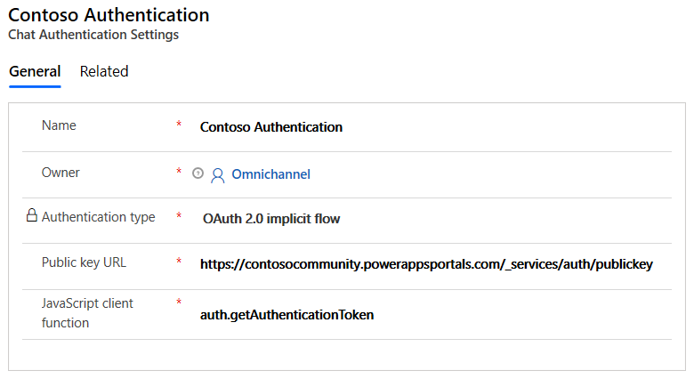

# Create chat authentication settings

[!INCLUDE[cc-use-with-omnichannel](../../includes/cc-use-with-omnichannel.md)]

You can create authentication settings to validate a signed-in customer from a domain, and extract information based on the context variables that are defined. You can differentiate your anonymous customers from authenticated customers, and you can create rules based on the context variables.

For example, you can have separate queues for anonymous customers and authenticated customers. Because you have more information about your authenticated customers, you can also prioritize them based on specific variables, such as shopping cart value or a privileged status.

After you create an authentication settings record, you must add it in the **Basic details** tab of the appropriate chat widget to make it work.

An agent will get a notification in the **Conversation summary** section whether a customer is authenticated or not. The **Authenticated** field is set to **Yes** or **No** based on the authentication of the customer. If a chat widget does not have any authentication setting associated with it, **Authenticated** field is set to **No** even if a customer is logged in to the portal. For information on conversation summary, see [Conversation summary](../agent/agent-oc/oc-customer-summary.md#conversation-summary).


## Create a chat authentication setting record

1. Sign in to Omnichannel Administration.
2. Go to **Settings** \> **Authentication Settings**.

    A list of existing authentication settings is shown.

3. Select **New** to add an authentication settings record.
4. On the **New Chat Authentication Settings** page, provide the following information:

    - **Name**: Enter a name for the authentication setting.
    - **Public key URL**: Specify the public key URL of the domain. This URL is used to validate the information that comes in from the JavaScript Object Notation (JSON) Web Token (JWT) of the domain that a customer has signed in to.
    - **JavaScript client function**: Specify the JavaScript client function to use for authentication. This function extracts a token from the token endpoint.

        > [!div class=mx-imgBorder]
        > 

    For more information about how to find the public key URL and JavaScript client function, see the [Setup for a Power Apps portals](#setup-for-power-apps-portals) section or the [Setup for portals that don't use Power Apps (custom portal)](#setup-for-portals-that-are-not-created-using-power-apps-custom-portal) section later in this topic.

5. Select **Save**.

## Add authentication to chat widget

1.	Open the chat widget to which you want to add authentication.
2.	Go to the **Basic details** tab.
3.	In the **Authentication settings** field, browse and select the chat authentication record.

    > [!div class=mx-imgBorder]
    > 

When a signed-in customer on a portal opens the chat widget, the JavaScript client function passes the JWT from the client to the server. The JWT is decrypted and validated by using the public key, and the information is then passed to the chat agent in Omnichannel for Customer Service. As an admin, you can also pass additional information about the signed-in customer in the JWT by defining custom context variables. The context variables must be defined exactly as they are defined in the work stream that is associated with the chat widget.

## Setup for Power Apps portals

If you're adding authentication for a chat widget on a website developed using Power Apps portals, the public key URL, JavaScript client function, and JWT are available out of the box. Here is how you can get the required values:

- **Public key URL**: `<portal_base_URL>/_services/auth/publickey`
- **JavaScript client function**: `auth.getAuthenticationToken`
- **Token endpoint**: `<portal_base_URL>/_services/auth/token`

## Setup for portals that are not created using Power Apps (custom portal)

If you're adding authentication for a chat widget on a portal that doesn't use Dynamics 365 (that is, on a custom portal), follow these steps to set up the environment.

1. Define the private/public key pairs on your server. These keys are used to sign and encrypt the JWT that is sent to the server. Only RSA256 keys are supported.

    Here is sample code for generating private/public key pairs.

    ```
    openssl genpkey -algorithm RSA -out private_key.pem -pkeyopt rsa_keygen_bits:2048
    openssl rsa -pubout -in private_key.pem -out public_key.pem
    ```

2. Expose the public key endpoint as a URL that contains the public key as a string.
3. Create a client-side JavaScript function that returns the signed JWT and the public key.

    Here is sample code for defining the JavaScript client function.

    ```JavaScript
    window["getAuthenticationToken"] = function(callback){
        var xhttp = new XMLHttpRequest();
        xhttp.onreadystatechange = function() {
            if (this.readyState == 4 && this.status == 200) {
                callback(xhttp.responseText);
            }
        };
        xhttp.onerror = function(error) {
            callback(null);
        };
        xhttp.open("GET", "https://contosohelp.com/token", true);
        xhttp.send();
    }
    ```

4. After authentication, you must identify your customer from among Dynamics 365 contacts. You must extract the globally unique identifier (GUID) that Dynamics 365 uses for the contact. Here is an example of a GUID: `87b4d06c-abc2-e811-a9b0-000d3a10e09e`.
5. Create a JSON payload that includes `sub` (the GUID) and three attributes (`iss`, `iat`, `exp`) as mandatory claims.

    Here is a sample JSON payload.

    ```json
    {
        "sub" : "87b4d06c-abc2-e811-a9b0-000d3a10e09e",
        "preferred_username" : "a184fade-d7d0-40e5-9c33-97478491d352",
        "phone_number" : "1234567",
        "given_name" : "Bert",
        "family_name" : "Hair",
        "email" : "admin@contosohelp.com",
        "lwicontexts" :"{\"msdyn_cartvalue\":\"10000\", \"msdyn_isvip\":\"false\"}",
        "iat" : 1542622071,
        "iss" : "contosohelp.com",
        "exp" : 1542625672,
        "nbf" : 1542622072
    }
    ```

6. Add custom context variables, if they are required. The context variables must be defined exactly as they are defined in the work stream that is associated with the chat widget.

    Here is a sample definition of custom context variables.

    ```JavaScript
    def create_token(user_json):
        with open('private_key.pem', 'r') as myfile:
            data = myfile.read()
        json_token = json.loads(user_json)
        lwicontexts = {}
        lwicontexts['msdyn_cartvalue'] = 10000
        lwicontexts['msdyn_isvip'] = "false"
        json_token['lwicontexts'] = json.dumps(lwicontexts)
        encoded_jwt = jwt.encode(json_token, data, algorithm='RS256')
        return encoded_jwt
    ```

    > [!NOTE]
    > - The `user_json` parameter comes from the identity provider (for example, Microsoft Azure Active Directory or Google).
    > - `lwicontexts` is the key whose value should have the custom context variable serialized as string. It must be must be defined exactly as they are defined in the work stream that is associated with the chat widget.

7. Sign and encrypt this payload by using the private key to generate the JWT. 

    Here is sample code for encrypting the payload. (This code is included in the previous sample code for defining custom context variables.)

    ```JavaScript
    encoded_jwt = jwt.encode(json_token, data, algorithm='RS256')
    return encoded_jwt
    ```

### See also

[Add a chat widget](add-chat-widget.md) <br>
[Configure a pre-chat survey](configure-pre-chat-survey.md) <br>
[Create quick replies](create-quick-replies.md) <br>
[Create and manage operating hours](create-operating-hours.md) <br>
[Embed chat widget in Power Apps portals](embed-chat-widget-portal.md)
