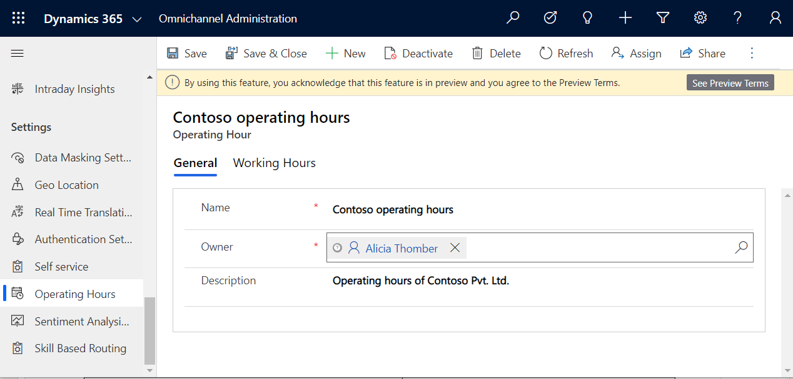

# Create and manage operating hours

[!INCLUDE[cc-use-with-omnichannel](../../includes/cc-use-with-omnichannel.md)]

[!include[cc-beta-prerelease-disclaimer](../../includes/cc-beta-prerelease-disclaimer.md)]

## Introduction

Operating hours define the hours when your organization's customer support team is active and available to serve customers. By setting up operating hours, you help your customers and your organization work together to resolve issues.

The operating hours schedules cater to the following scenarios:

- Display non availability of customer support on public holidays that are otherwise operating hours.
- Accommodate change of calendar timings for daylight saving time twice an year.
- Set up separate schedules for agents, bots, and queues to cater to different business scenarios and product lines seamlessly.
- Define schedules to transition customer queues from bots to agents.
- Customize the display and other settings of the chat widget during non-business hours.

After you create an operating hour record, you must add it to the **Design** tab of the appropriate chat widget to control the display of the widget. For social channels and queues, the operating hour will be available for selection on the **General** and **Summary** tabs respectively.

## Create an operating hour record

1. Sign in to Omnichannel Administration.

2. Go to **Settings** \> **Operating Hours**.

3. Select **New**. The **New Operating Hour** page is displayed.

4. On the **General** tab, provide the following information:

    - **Name**: Enter a name for the operating hour record.
    - **Owner:** Accept the default value or search to specify a different owner.
    - **Description**: Enter an optional description of the operating hour record.
5. Select **Save**. The **Working Hours** tab is displayed.
   
    > 

6. On the **Working Hours**, select **New** > **Working hours** in the calendar.
7. In the **Working hours** pane, set the following options to define the working hours schedule.
   - **All Day:** Set to **Yes**, if the chat widget should be available 24/7.
   - **Calendar:** Set the period for the schedule. The option to choose dates is available only when **All Day** is **Yes**.
   - **Time:** Select the start and end timings for the schedule. This option is available only when **All Day** is **No**.
   - **Repeat:** Select a recurrence option and the days of the week for the schedule to be applicable. The repeat option is available only when the calendar is set to one day.
   -  **Time zone:** Select an applicable time zone.
    
        > 

8. Select **Save**. You are returned to the **Working Hours** tab.
9. To set unavailability of customer support for a public holiday, on the calendar view, select **New** > **Holiday**.
10. Select the date or date range, and specify a reason.
11. Save the settings.
12. Select **Save** on the navigation bar.

 > [!NOTE]
 > If you set up a recurring schedule, you can't specify a different schedule that overlaps the recurring schedule.

## Add operating hours to a chat widget

Do the following to specify operating hours for a chat widget:

1. Open the chat widget, and select the **Design** tab.
2. In the **Operating hours** box, browse, and select the operating hour record. The chat widget is displayed during the hours specified in the selected operating hour record.
3. Specify the offline settings in the **Offline** area.
4. Save the changes.

    > [!div class=mx-imgBorder]
    > 

## Add operating hours to a queue

Do the following to specify operating hours for a queue:

1. Open the queue for which you want to specify the operating hours.
2. On the **Summary** tab, in the **Operating Hours** box, search and select the operating hour record that you want to specify.
3. Save the changes.

### See also

[Add a chat widget](add-chat-widget.md)  
[Configure a pre-chat survey](configure-pre-chat-survey.md)  
[Create quick replies](create-quick-replies.md)  
[Create chat authentication settings](create-chat-auth-settings.md)  
[Embed chat widget in Power Apps portals](embed-chat-widget-portal.md) 
