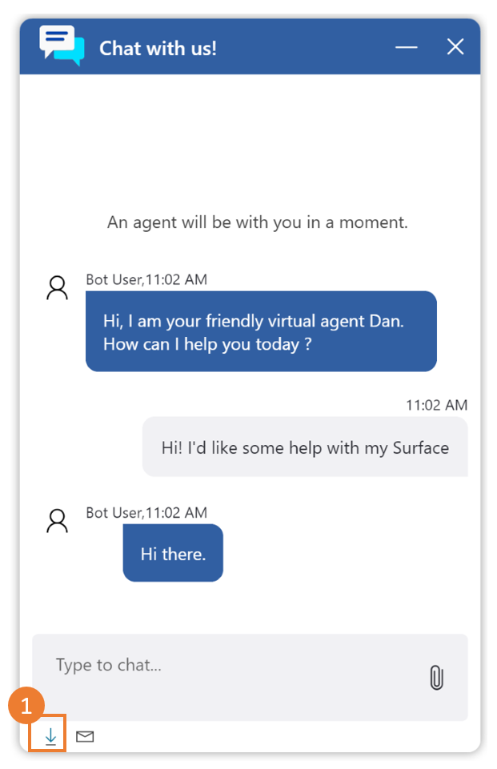
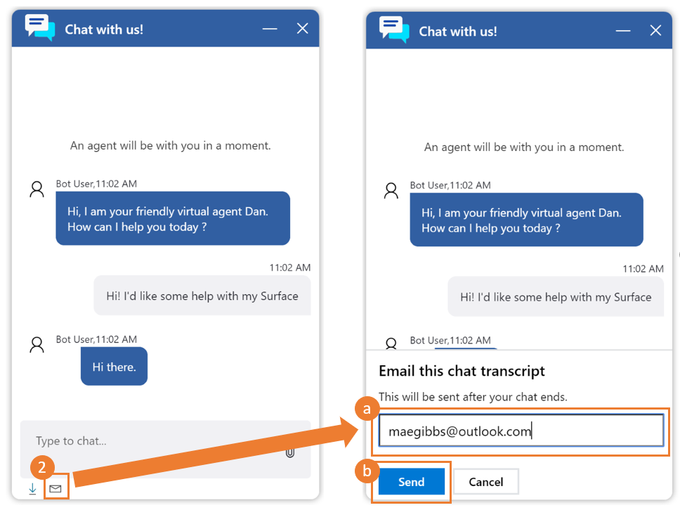
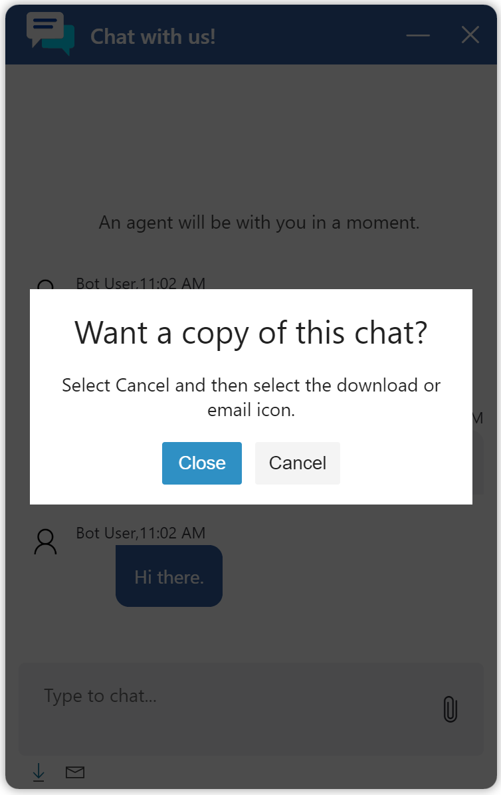
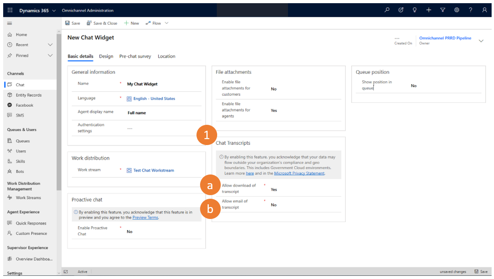
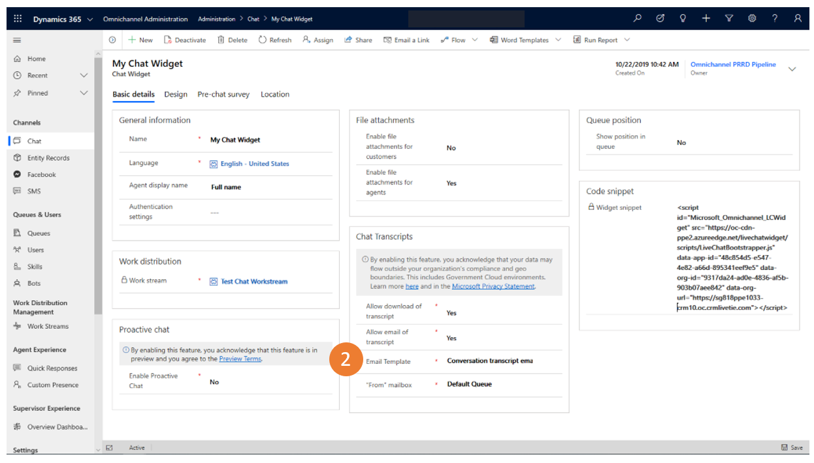

# Chat Transcripts 

[!INCLUDE[cc-use-with-omnichannel](../../includes/cc-use-with-omnichannel.md)]

Chat for Dynamics 365 Customer Service allows customers to download and/or email a copy of their chat transcripts.  When download/email options are enabled by admin, customers can request a copy of their chat transcript at any time during a chat session and will be reminded at the end of the conversation to request a transcript. Icon buttons at the bottom of the live chat widget allow the customer to initiate an email or download a copy of their chat transcript, which is sent once the chat ends. 

Customers can elect to download and/or email a copy of their chat transcript conversation directly from the live chat window when prompted by either: 

1. Download Transcripts  

    Selecting the download icon button at the bottom of the live chat screen:  

    > [!div class=mx-imgBorder]
    > 

2. Email Transcripts 

    Selecting email icon at bottom of the live chat screen

    a. Entering email address in pop-up window
    
    b. Click send to receive email copy of chat transcript and email will be sent once conversation ends.

    > [!div class=mx-imgBorder]
    > 

    At the end of the chat conversation, the following window will appear reminding the customer they can either download and/or email a copy of their chat transcript to themselves.

    > [!div class=mx-imgBorder]
    > 

## Prerequisites

- Admins will want to confirm they have set up mailboxes before enabling emailed transcripts. 

    See [Dynamics 365 email setup](https://support.microsoft.com/en-us/help/4020807/dynamics-365-e-mail-setup-configuration-and-dynamics-365-for-mobile-ho) for more information.

## Configuration

Admins can enable customers to download and/or email chat transcripts by going to the Omnichannel Administration Chat Widget and following these steps:

**Step 1:** Under Chat transcripts section header, at a chat widget level:

a. Enable download transcript 

b. Enable email transcript

> [!div class=mx-imgBorder]
> 

> [!NOTE]  
> Both download and email transcript settings are disabled by default.

**Step 2:** When email transcripts are enabled, admin have a choice to either:

a. Use an email template provided by Chat for Dynamics 365 Customer Service
    
b. Modify the email template provided by Chat for Dynamics 365 Customer Service
    
c. Create their own email template.

> [!div class=mx-imgBorder]
> 

> [!NOTE] 
> Whether admin chooses to use the email template provided or create their own, the "{conversation.transcript}" text determines where the transcript is injected into email.

> [!div class=mx-imgBorder]
> 

## See Also

[Add a chat widget](https://docs.microsoft.com/en-us/dynamics365/omnichannel/administrator/add-chat-widget)

[Configure a pre-chat survey](https://docs.microsoft.com/en-us/dynamics365/omnichannel/administrator/configure-pre-chat-survey)

[Configure agent display name](https://docs.microsoft.com/en-us/dynamics365/omnichannel/administrator/agent-display-name)

[Configure file attachment capability](https://docs.microsoft.com/en-us/dynamics365/omnichannel/administrator/configure-file-attachment)

[Create quick replies](https://docs.microsoft.com/en-us/dynamics365/omnichannel/administrator/create-quick-replies)

[Create and manage operating hours](https://docs.microsoft.com/en-us/dynamics365/omnichannel/administrator/create-operating-hours)

[Create chat authentication settings](https://docs.microsoft.com/en-us/dynamics365/omnichannel/administrator/create-chat-auth-settings)

[Embed chat widget in Dynamics 365 Portals](https://docs.microsoft.com/en-us/dynamics365/omnichannel/administrator/embed-chat-widget-portal)

    

