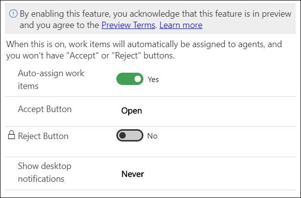

# Preview: Enable conversations to be assigned automatically

[!INCLUDE[cc-use-with-omnichannel](../../includes/cc-use-with-omnichannel.md)]

[!include[cc-beta-prerelease-disclaimer](../../includes/cc-beta-prerelease-disclaimer.md)]

## Introduction

Some customer conversation requests, such as those coming from a Facebook channel or an SMS channel, might not need an immediate response because of a longer service-level agreement. For such requests, you can enable the auto-assign option in the notification templates. When an incoming notification appears, the conversation is assigned to the agent automatically, either instantly or after the timeout period elapses.

> [!IMPORTANT]
> The auto-assign feature isn't supported in Omnichannel for Customer Service on Unified Service Desk.

## To enable conversations to be assigned automatically

Perform the following steps:

1. Sign in to Omnichannel Administration.
2. In the site map under **Agent Experience**, select **Notifications**.
3. On the **Omnichannel Configuration** > **Omnichannel Configuration - Notifications** page, select the template for which you want to enable the incoming conversation to be assigned.
4. On the ***<notification_name>* Notification Template** > **General** tab, set the toggle to **Yes** for **Auto-assign work items**. The label for **Accept Button** changes to **Open**, and the toggle for **Reject Button** is disabled.
5. Select **Save**.

   > 

### See also

[Manage notification templates](notification-templates.md)  
[View notifications](../agent/agent-oc/oc-notifications.md)