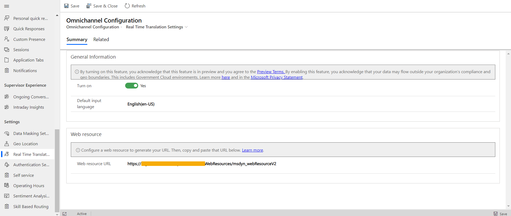

# Preview: Enable real-time translation of conversations

[!INCLUDE[cc-use-with-omnichannel](../../includes/cc-use-with-omnichannel.md)]

[!include[cc-beta-prerelease-disclaimer](../../includes/cc-beta-prerelease-disclaimer.md)]

> [!IMPORTANT]
>
> - This feature is a preview, which means that it is made available to you before general availability so you can test and evaluate the preview and provide feedback to Microsoft.
> - This preview may employ reduced or different privacy, security, or compliance commitments than a commercial version. As such, this preview is not meant to be used with any "live" or production Customer Data, Personal Data, or other data that is subject to heightened compliance requirements. Any use of "live" data is at your sole risk and it is your sole responsibility to notify your end users that they should not include sensitive information with their use of the Preview.
> - This preview, and any support Microsoft may elect to provide, is provided "as-is," "with all faults," "as available," and without warranty. This preview is subject to the [Preview Terms](../../legal/supp-dynamics365-preview.md).

## Introduction

With the real-time message translation feature, agents can support customers in the language they elect to be serviced in. When you enable language translation in the Omnichannel Administration app, messages between the customer and support agent&mdash;and messages among support agents who consult and collaborate internally, such as supervisors or SMEs&mdash;are translated. The real-time translation feature is enabled as a plug-in that exposes APIs to bring in third-party translation services and also provides a native implementation.

All the languages that are supported in Omnichannel for Customer Service are supported for the agent in the conversations. For the list of supported languages, see [Language availability](../international-availability.md).

> [!Important]
> The language translation feature isn't supported in Omnichannel for Customer Service on Unified Service Desk.

## Prerequisites

You must add a web resource and make sure that the required language translation services are configured. More information: [Add a web resource for real-time translation](../developer/how-to/add-web-resource-real-time-translation.md)

## Enable real-time translation for agent and customer conversations

1. Sign in to the Omnichannel Administration app.
1. Under **Settings**, select **Real Time Translation**.
1. On the **Omnichannel Configuration·Real Time Translation Settings** page, in the **General Information** area, set the toggle for **Turn on** to **Yes**.
1. In **Default input language**, select the language for agents to converse with customers. The translation engine translates the customer messages for agents to the language specified. By, default, it's set to English (en-us).
1. In the **Web resource** area, in the **Web resource URL** box, enter the link of the web resource.
    > [!div class=mx-imgBorder]
    > 
1. Select **Save**.

### See also

[Real-time language translation of conversations for agents and customers](../agent/agent-oc/oc-real-time-translation.md)  