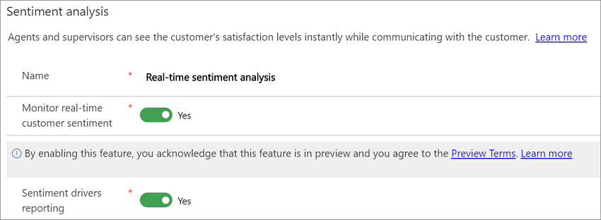

# Enable sentiment analysis

[!INCLUDE[cc-use-with-omnichannel](../../includes/cc-use-with-omnichannel.md)]

Enable sentiment analysis so supervisors can use the **Omnichannel Ongoing Conversation** dashboard to view customer sentiment in real time during conversations between customers and agents. You can enable or disable real-time sentiment through **Sentiment Analysis Settings** in **Omnichannel Administration**.

> [!NOTE]
> Sentiment analysis is enabled by default.

<!--note from editor: In most cases, it looks like "Sign in to Omnichannel Administration" is the way this step is being worded.-->
1. Sign in to **Omnichannel Administration**.

2. Go to **Settings** > **Sentiment Analysis**, and then select **Real-Time Sentiment Analysis**.

    > [!div class=mx-imgBorder]
    > 

3. On the **General** tab, set **Monitor real-time customer sentiment** to **Enabled**, and then select **Save**.

<!--note from Nona: Looks like the former editor's note ("the image shows Enabled as No. Is that OK?") has been resolved.-->

  > [!div class=mx-imgBorder]
  > 

<!--note from editor: Made this a relative link.-->
After you enable real-time customer sentiment, you can view scores in the [Omnichannel Insights dashboards](configure-historical-sentiment-dashboard-supervisor.md).

Multi-language sentiment scoring is enabled by default. Conversations in more than 40 languages are scored. The languages are listed in the following table.

<!--note from editor: This information should be in an actual table, not solely in a graphic. I'd be happy to whip one up; just let me know.-->

   > [!div class=mx-imgBorder]
   > 

### See also

[Monitor conversations](../supervisor/monitor-conversations.md)
