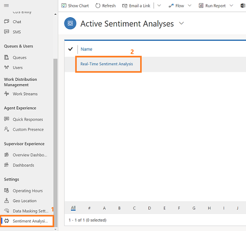
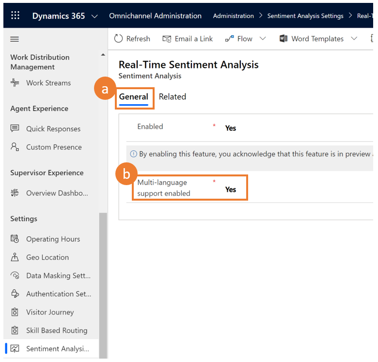
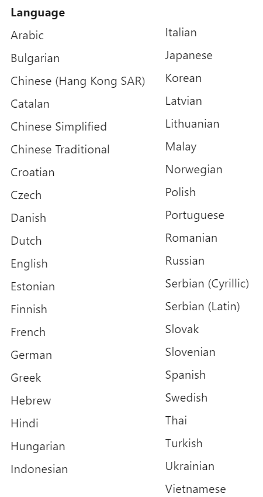

# Enable sentiment analysis

[!INCLUDE[cc-use-with-omnichannel](../../includes/cc-use-with-omnichannel.md)]

Enable sentiment analysis for supervisors to view the real-time sentiment of conversations on the **Omnichannel Ongoing Conversation** dashboard in **Omnichannel for Customer Service**. You can enable or disable real-time sentiment through **Sentiment Analysis Settings** in **Omnichannel Administration**.

> [!NOTE]
> Sentiment analysis is enabled by default.

1. Go to *https://yourorganization.dynamics.com/apps* and select the **Omnichannel Administration** app.

2. Go to **Settings** > **Sentiment Analysis** and select **Real-Time Sentiment Analysis**.

    > [!div class=mx-imgBorder]
    > 

3. On the **General** tab, select **Enabled** as **Yes**.

    <!--from editor: Note that the image shows Enabled as No. Is that OK? -->
    

    > [!div class=mx-imgBorder]
    > 

4.  To enable multi-language sentiment (preview): 

    a. Go to the **General** tab.

    b. Select **Multi-language support enabled** as **Yes**.

    > [!div class=mx-imgBorder]
    >  

    After you enable multi-language sentiment, you can view scores in the Omnichannel Insights Dashboard.  
    
    > [!Note]
    > If you turn off multi-language sentiment, you can't view the real-time score of non-English conversations. However, the Omnichannel Insights Dashboard displays the scores for conversations that were previously scored. 

    Enabling multi-language sentiment also provides scoring of conversations in more than 40 languages:

    > [!div class=mx-imgBorder]
    >  

5. Select **Save**.
    
   Sentiment analysis is now enabled and available.

## See also

[Monitor conversations](../supervisor/monitor-conversations.md)
