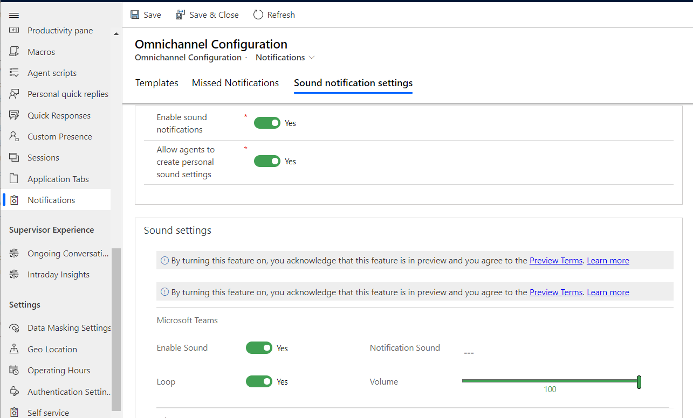

# Enable sound notifications for incoming conversations

[!INCLUDE[cc-use-with-omnichannel](../../includes/cc-use-with-omnichannel.md)]

[!include[cc-beta-prerelease-disclaimer](../../includes/cc-beta-prerelease-disclaimer.md)]

## Introduction

Sound notifications for incoming conversations, such as live chat, that require immediate response are helpful in making sure the requests are not missed. Administrators can enable the sound notification settings in the configuration settings of Omnichannel for Customer Service. The option to personalize allows agents to customize their preferences for sound and volume selections, among other things. The sound notifications are available across all channels.

> [!IMPORTANT]
> Make sure that the browser settings allow sound notifications to be played.

## Enable sound notifications for incoming conversations

1. In the Omnichannel Administration app, select **Notifications** under **Agent Experience** in the site map.
2. On the Omnichannel Configuration - Notifications page, select **Sound notification settings**.
3. Set the toggle to **Yes** for **Enable sound notifications**. The **Allow agents to create personal sound settings** toggle is enabled and the **Sound settings** area is displayed with options to configure sound notifications for the different channels that are provisioned in your environment.
4. Set the toggle to **Yes** for **Allow agents to create personal sound settings** to let agents personalize the settings.
5. Customize the notification settings for the required channels. The following settings are for Teams chat:

  -  **Enable Sound:** Set the toggle to **Yes**.
  -  **Loop:** Set the toggle to **Yes** if you want the sound to be played till the agent responds.
  -  **Notification Sound:** Accept the default setting or search and select a different audio file.
  -  **Volume:** Accept the default setting or use the slider to adjust the volume.
     
     > 
6. Select **Save.**