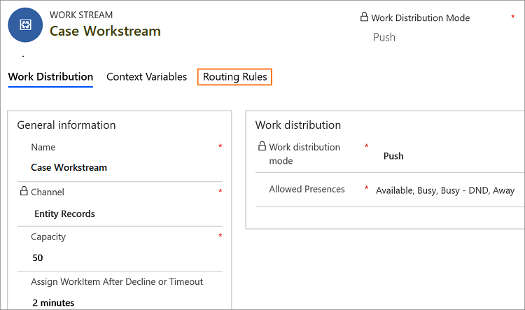

---	
title: Automate case routing using entity records channel | MicrosoftDocs	
description: Learn how you can route cases automatically using entity records channel in the Omnichannel for Administrator app."		
author: kabala123	
ms.author: kabala	
manager: shujoshi	
applies_to: 	
ms.date: 08/16/2019
ms.service: dynamics-365-customerservice	
ms.topic: article	
ms.assetid: 5e6285ee-4b79-473d-b920-d1fab636c82e	
ms.custom: 	
---	
# Entity records routing

[!INCLUDE[cc-use-with-omnichannel](../../includes/cc-use-with-omnichannel.md)]

[!include[cc-beta-prerelease-disclaimer](../../includes/cc-beta-prerelease-disclaimer.md)]

> [!IMPORTANT]
> - A preview is a feature that is not complete, as it may employ reduced privacy, security, and/or compliance commitments, but is made available before it is officially released for general availability so customers can get early access and provide feedback. Previews are provided “as-is,” “with all faults,” “as available,” and without warranty.​
> - This preview features does not come with technical support and Microsoft Dynamics 365 Technical Support won’t be able to help you with issues or questions.  If Microsoft does elect to provide any type of support, such support is provided "as is," "with all faults," and without warranty, and may be discontinued at any time.​
> - Previews are not meant for production use, especially to process Personal Data or other data that is subject to heightened compliance requirements, and any use of "live" or production data is at your sole risk.  All previews are subject to separate [Terms and Conditions](../../legal/dynamics-insider-agreement.md).

## Overview
 
In Omnichannel, entity records channel helps you to automatically route cases to the agents based on the agents' capacity and availability.

> [!Note]
> Only case entity record is supported in this release. Other entity records routing will be supported in future releases.

### Automatic distribution of cases

Today, case routing in Dynamics 365 Customer Service enables organizations to route cases to static queues, and then these cases are either manually by supervisors or manually picked by agents.

With unified routing, cases can be routed to omnichannel enabled queues along with work items that originate from other channels such as Chat and SMS.

That is, the cases are routed to the queues based on the routing rules, and then the work distribution engine distributes the cases automatically to the agents based on the availability and capacity.

This allows organizations to tightly define the work profile that their agents are supposed to handle, and organizations can automate the work flow assignment across channels and assign the work items based on agents capacity and availability.

## Prerequisites

To configure entity records channel for case routing and automatic distribution, ensure:

- You are on the latest version of Omnichannel for Customer Service.
- You've installed the **Routing Rules - Preview** solution. To learn more, see [Install Routing Rules - preview solution]().

## Entity records channel

Omnichannel leverages the CDS queue entity to automatically route entity records. In omnichannel, first, the application routes the entity records to the queues. From the queues the work distribution engine automatically distributes the entity records to the agents.

### Automatic case distribution work flow

**Entity Records** appears under the **Channels** in the Omnichannel for Administrator app. When you select the **Entity Records**, a blank **Entity Record Workstreams** view appears. You must create workstreams to route the case records.

To setup the **Entity Record** channel and route the cases, follow the steps:

| Step | Description |
|---------------|----------------------------|--------------------------------------------------------------------------------------------|
| [Step 1: Create queues](#step-1-create-queues) | You must create a new Omnichannel queue or use an existing Omnichannel queue to route cases to the queues. |
| [Step 2: Create works stream for case routing](#step-2-create-workstream-for-case-routing) | You must create new workstreams to route the cases. |
| [Step 3: Create routing rules](#step-3-create-routing-rules) | You must create routing rules, to automatically distribute the cases to the agents. |
| [Step 4: Update Cases Work Distribution Flow](#step-4-update-cases-work-distribution-flow) | You must update the Cases Work Distribution Flow with the workstream ID, to automatically distribute the cases to the agents. The Omnichannel application creates **Cases Work Distribution Flow** when you enable an entity records channel. |

## Step 1: Create queues

You must create a queue or enable existing queue to, automatically route the cases to the queue. To learn more, see [Create a queue](queues-omnichannel.md#create-a-new-queue).

> [!Note]
> If you enable the option - **Automatically move records to the owner's default queue when a record is created or assigned**, in the case entity customization, then the case entity record won't be automatically distributed to the agents. You must clear the checkbox, to automatically distribute the case records.    

## Step 2: Create workstream for case routing

You must create workstreams, to automatically route the cases to the agents. To learn more, see [Create a case entity workstream](set-up-entity-workstream.md).

## Step 3: Create routing rules

After creating the workstream for the cases, you must create the routing rules. 

> [!Note]
> To create routing rules for cases, you must install the **Routing Rules - Preview** solution. To learn more, see [Link to the topic will be added here]().

1. Sign in to the Omnichannel for Administrator app.

2. Select **Entity Records** under **Channels** in the sitemap.

3. Select the workstream you created for routing the cases from the **Entity Record Workstreams** view.

    > [!div class=mx-imgBorder] 
    > 

4. Select the **Routing Rules** tab in the workstream.

    > [!div class=mx-imgBorder] 
    > 

5. Select **+ New** in the **All Routing Rule Sets** page.

6. Specify a name in the **New Routing Rule Set** page, and then select **Save** to save the rule. Once you save the record, you can see the **Rule Items** section in the page.

7. Select **+ Add New Rule Item** in the **Rule Items** section. A **New Rule Item** page appears. 

    > [!div class=mx-imgBorder] 
    > 

8. Specify the following in the **New Rule Item** page.

    | Tab | Field | value | Description |
    |------------------|----------------------------|----------------------------------|--------------------------------------------|
    | General | Name | Push cases | Specify a name to the rule item. |
    | General | Description | This rule item is used to for pushing high priority cases to the agents. | Specify a description for you to identify the purpose of the rule item. |

9. Select **+ Add v** in the **Rule Criteria** section, and then select **+ Add row**.

    a. Select a rule from the list for the first box. For example, **Priority**.

    b. Select a condition from the list. For example, **Equals**.

    c. Select a value for the rule from the list. For example, **High**.

10. Select **Queue** for the **Route to** field. 

11. Select an Omnichannel queue for the **Add to Queue** field.

    The steps 9 to 11 indicate if the **Priority** of a case is **High**, then route the case to the selected omnichannel queue.

    > [!div class=mx-imgBorder] 
    > 

    > [!Note]
    > You must select an Omnichannel queue for automatic work distribution in the **Add to Queue** field to automatically assign entity records to agents.

12. Select **Save** to save the rule item.

## Step 4: Update cases work distribution flow

After creating the routing rules for the cases workstream, you must update **Cases Work Distribution Flow**. The Omnichannel application creates **Cases Work Distribution Flow** when you enable an entity records channel.

**Cases Work Distribution Flow** contains the following components.

| Component | Modification recommendation |
|-----------------------------------|-----------------------------------|
| When the record is created | No need to modify. However, you can extend it for custom scenarios. |
| Initialization | Do not modify. |
| Workstream Initialization | Do not modify. |
| Current record | Do not modify. |
| Work Stream Selection - Set LiveWorkStreamId to route this record to | Update the condition and workstreams Id.   **Note:** <li> Workstream Id is mandatory. </li> <li>Condition is optional.</li> |
| Invoke Omnichannel | Do not modify. |

### Update work distribution flow

#### Navigate to the flow

1. Sign in to Microsoft Flow.

2. Select **Solutions** in the sitemap, and then select **Default Solution** from the list.

    > [!div class=mx-imgBorder] 
    > 

3. Select the **All** button in the menu and select **Flow** to filter the flows.

    > [!div class=mx-imgBorder] 
    > 

4. Select **Case Work Distribution Flow** from the list.

    > [!div class=mx-imgBorder] 
    > 

5. Select the **Edit** button from the command bar at the top. The flow appears in a new tab.

    > [!div class=mx-imgBorder] 
    > 

#### Authenticate

6. Select the flow component that shows the warning icon, and select **+ Add new connection** to resolve the warning. The flow component uses the current user credentials and resolves the warning.

    

#### Update the workstream Id

7. Select the **Work Stream Selection - Set LiveWorkStreamId to route this record to** section, and then select **Condition**.

    > [!div class=mx-imgBorder] 
    > 

8. Select the **Set variable** option.

9. Select the **Value** field search box to add a variable. A flyout control appears. Type the name of the workstream you created in the search box. For example, **Case Workstream** is one of the workstream that you created earlier. The value appears in the list, and when you select the value, it is added to the field. 

    > [!Note]
    > If you update the name of the workstream, then you must perform step 12. Otherwise, the cases won't be automatically distributed to the agents.

    > [!div class=mx-imgBorder] 
    > 

10. Select **Save** to save **Cases Work Distribution Flow**.

### See also 	

[Understand and create workstreams](work-streams-introduction.md)

[Cases entity workstreams](set-up-entity-workstream.md)

[Work with queues](queues-omnichannel.md)