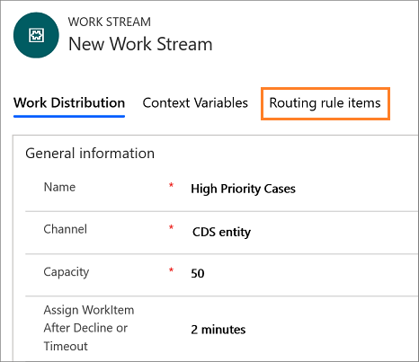

---	
title: Automate case routing using entity records channel | MicrosoftDocs	
description: Learn how you can route cases automatically using entity records channel in the Omnichannel for Administrator app."		
author: kabala123	
ms.author: kabala	
manager: shujoshi	
applies_to: 	
ms.date: 08/16/2019
ms.service: dynamics-365-customerservice	
ms.topic: article	
ms.assetid: 5e6285ee-4b79-473d-b920-d1fab636c82e	
ms.custom: 	
---	
# Automate case routing

Applies to Dynamics 365 for Customer Engagement apps version 9.1.0	

[!include[cc-beta-prerelease-disclaimer](../../includes/cc-beta-prerelease-disclaimer.md)]

## Overview
 
In Omnichannel, Cases entity record channel helps you to automatically route cases to the agents based on the agents' skill, capacity, and availability.

### Existing case routing experience

Today, case routing in Dynamics 365 for Customer Service enables organizations to route cases to static queues, and then these cases are either manually distributed by supervisors or manually picked by agents. 

That is, the cases are routed to the queues based on the routing rules, and then the agents pick the cases manually, or the supervisor assigns it to the agents manually.

The routing rules don't consider the availability, capacity, and also the skill that agents require to address the case. The manual distribution of cases leads to an unbalanced case distribution and affects the productivity of the agents.

### Automatic distribution of cases

With unified routing, cases can be routed to omnichannel enabled queues along with work items that originate from other channels such as Chat and SMS.

That is, the cases are routed to the queues based on the routing rules, and then the work distribution engine distributes the cases automatically to the agents based on the availability, capacity, and skill.

This allows organizations to tightly define the work profile that their agents are supposed to handle, and organizations can automate the work flow assignment across channels and assign the work items based on agents capacity, availability, and skill.

## Cases channel

Omnichannel leverages the existing CDS queue entity to automatically route cases. In omnichannel, first, the application routes the cases to the queues. From the queues the work distribution engine automatically distributes the cases to the agents.

> [!Note]
> - If you have already setup queues for cases or other entities in Dynamics 365 for Customer Service, you can continue to use the same for omnichannel work distribution.
>
> - Only case entity record is supported in this release.

### Prerequisites to automate case routing

To automatically route the cases, ensure the following:

- You are on the latest version of Omnichannel for Customer Service.
- You've installed the **Routing Rules - Preview** solution. To learn more, see [Link to the topic on how to install routing rules - preview solution]().

### Automatic case distribution work flow

The **Cases** entity record appears under the **Channels** in the Omnichannel for Administrator app. When you select the **Cases** entity record, a blank **Case Workstreams** view appears. You must create workstreams to route the cases.

| Step | Description |
|---------------|----------------------------|--------------------------------------------------------------------------------------------|
| Step 1: Create works stream for case routing | You must create new workstreams to route the cases. To learn learn more, see [Create a case workstream](set-up-entity-workstream.md). |
| Step 2: Create routing rules | You must create routing rules, to automatically distribute the cases to the agents. |
| Step 3: Update Cases Work Distribution Flow | You must update the Cases Work Distribution Flow with the conditions, to automatically distribute the cases to the agents. The case distribution flow is the out-of-the-box Microsoft flow. |
## Step 1: Create work stream for case routing

You must create work streams, to automatically route the cases to the agents. To learn more, see [Create a case entity work stream](set-up-entity-workstream.md).

## Step 2: Create routing rules

After creating the work stream for the cases, you must create the routing rules. 

> [!Note]
> To create routing rules for cases, you must install the **Routing Rules - Preview** solution. To learn more, see [Link to the topic will be added here]().

1. Sign in to the Omnichannel for Administrator app.

2. Select **Cases** under **Channels** in the sitemap.

3. Select the work stream you created for routing the cases from the **Case Workstreams** view.

    > [!div class=mx-imgBorder] 
    > 

4. Select the **Routing rule items** tab in the work stream.

    > [!div class=mx-imgBorder] 
    > 

5. Select **+ New** in the **All Routing Rule Sets** page.

6. Specify a name in the **New Routing Rule Set** page, and then select **Save** to save the rule. Once you save the record, you can see the **Rule Items** section in the page.

7. Select **+ Add New Rule Item** in the **Rule Items** section. A **New Rule Item** page appears. 

    > [!div class=mx-imgBorder] 
    > 

8. Specify the following in the **New Rule Item** page.

    | Tab | Field | value | Description |
    |------------------|----------------------------|----------------------------------|--------------------------------------------|
    | General | Name | Push cases | Specify a name to the rule item. |
    | General | Description | This rule item is used to for pushing high priority cases to the agents. | Specify a description for you to identify the purpose of the rule item. |

9. Select **+ Add v** in the **Rule Criteria** section, and then select **+ Add row**.

    a. Select a rule from the list for the first box. For example, **Priority**.

    b. Select a condition from the list. For example, **Equals**.

    c. Select a value for the rule from the list. For example, **High**.

10. Select **Queue** for the **Route to** field. 

11. Select an Omnichannel queue for the **Add to Queue** field.

    The steps 9 to 11 indicate if the **Priority** of a case is **High**, then route the case to the selected omnichannel queue.

    > [!div class=mx-imgBorder] 
    > 

    > [!Note]
    > You must select an Omnichannel queue for automatic work distribution in the **Add to Queue** field to automatically assign entity records to agents.

12. Select **Save** to save the rule item.

## Step 3: Update cases work distribution flow

After creating the routing rules for the cases workstream, you must update **Cases Work Distribution Flow**. The flow is provided out-of-the-box to, automatically distribute the cases to the agents.

The out-of-the-box Cases Work Distribution Flow contains the following components.

| Component | Modification recommendation |
|-----------------------------------|-----------------------------------|
| When the record is created |  |
| Initialization | Do not modify |
| Workstream Initialization | Do not modify |
| Current record | Do not modify |
| Work Stream Selection - Set LiveWorkStreamId to route this record to | Update the condition and workstreams |
| Invoke Omnichannel | Do not modify |

### Update work distribution flow

1. Sign in to Microsoft Flow.

2. Select **Solutions** in the sitemap, and then select **Default Solution** from the list.

    > [!div class=mx-imgBorder] 
    > 

3. Select the **All** button in the menu and select **Flow** to filter the flows.

    > [!div class=mx-imgBorder] 
    > 

4. Select **Case Work Distribution Flow** from the list.

    > [!div class=mx-imgBorder] 
    > 

5. Select the **Edit** button from the command bar at the top. The flow appears in a new tab.

    > [!div class=mx-imgBorder] 
    > 

6. Select the **Work Stream Selection - Set LiveWorkStreamId to route this record to** section, and then select **Condition 4**.

    > [!div class=mx-imgBorder] 
    > 

7. Select the search box to add a rule. A flyout control appears. Type a rule name in the search box. For example, **Priority**. The rule appears in the list, and when you select the rule, it is added to the field. 

    > [!div class=mx-imgBorder] 
    > 

8. Select a condition from the list. For example, **is equal to**.

9. Type the rule value in the field. For example, **1**.

    > [!div class=mx-imgBorder] 
    > 

10. Select the **Set variable 4** option under the **If yes** section.

11. Select the **Value** field search box to add a variable. A flyout control appears. Type the name of the work stream you created in the search box. For example, **High Priority Cases** is one of the case work stream that you created to route high priority cases. The value appears in the list, and when you select the value, it is added to the field. 

    > [!Note]
    > If you update the name of the work stream, then you must perform the step 11. Otherwise the cases won't be automatically distributed to the agents.

    > [!div class=mx-imgBorder] 
    > 

12. Select the **Set variable 5** option under the **If no** section.

13. Select the **Value** field search box to add a variable. A flyout control appears. Type the name of the work stream you created in the search box. For example, **Low Priority Cases** is one of the case work stream that you created to route low priority cases. The value appears in the list, and when you select the value, it is added to the field.

    > [!Note]
    > If you update the name of the work stream, then you must perform the step 13. Otherwise the cases won't be automatically distributed to the agents.

    > [!div class=mx-imgBorder] 
    > 

14. Select **Save** to save **Cases Work Distribution Flow**.

    > [!div class=mx-imgBorder] 
    > 

### See also 	

[Understand and create work streams](work-streams-introduction.md)

[Cases entity work streams](set-upentity-workstream.md)