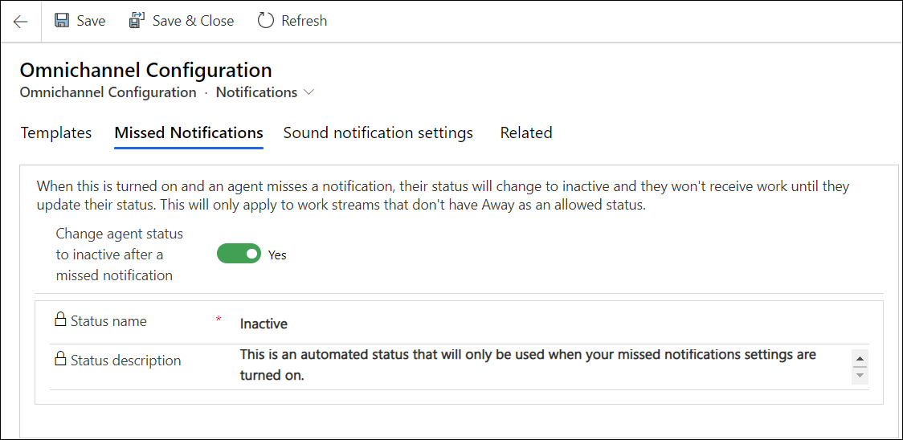

---
title: "Enable missed notification in Omnichannel Administration app | MicrosoftDocs"
description: "Learn about managing notification templates in Omnichannel Administration app"
author: neeranelli
ms.author: nenellim
manager: shujoshi
ms.date: 08/03/2020
ms.service:
  - "dynamics-365-customerservice"
ms.topic: article
---

# Preview: Manage missed notifications

[!INCLUDE[cc-use-with-omnichannel](../../includes/cc-use-with-omnichannel.md)]

[!include[cc-beta-prerelease-disclaimer](../../includes/cc-beta-prerelease-disclaimer.md)]

With the missed notifications feature, you can now choose for agent presence to be set to inactive automatically and new tasks are not assigned when agents miss notifications for incoming chat conversations. Apart from the status change, a message bar will display on the agent dashboard stating that a notification has been missed. The agents can reset their status using the reset presence option that is displayed with the notification or by manually changing their status.

> [!IMPORTANT]
>
> Missed notifications will work only when the "away" status is not an allowed presence for work streams. More information: [Understand and create work streams](work-streams-introduction.md).

## Enable auto update of agent presence on missing notifications

1. In the Omnichannel Administration app, select **Notifications** under **Agent Experience** in the sitemap.
2. On the **Omnichannel Configuration** page, select the **Missed Notifications** tab.
3. Set the toggle to **Yes** for **Change agent status to inactive after a missed notification**. The **Status name** and **Status description** settings appear.
4. Select **Save**.

> [!div class=mx-imgBorder] 
> 
