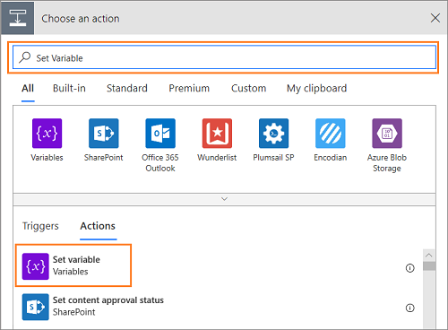

---	
title: "Create multiple workstreams for entity records routing | MicrosoftDocs"	
description: "This walkthrough demonstrates how you can route entity record automatically using Entity Records channel in the Omnichannel Administration app."	
author: kabala123	
ms.author: kabala	
manager: shujoshi	
applies_to: 	
ms.date: 10/25/2019
ms.service: dynamics-365-customerservice	
ms.topic: article	
ms.assetid: 3DBB1579-ECD2-43E6-B994-6D83A7C2C8F1
ms.custom: 	
---

# Walkthrough - Create multiple workstreams for entity records routing

[!INCLUDE[cc-use-with-omnichannel](../../includes/cc-use-with-omnichannel.md)]

## Overview

You can setup multiple workstreams for same entity records if you want to distribute the entity records to different workstreams based on certain conditions. 

For example, you want high priority cases to be pushed to agents and demand more capacity than low priority cases, which can be picked by agents. You can achieve it by configuring multiple workstreams.

This walkthrough demonstrates how to set up two workstreams, one each for high priority cases and low priority cases and to distribute the cases appropriately.

### In this section

[Step 1: Create queues](#step-1-create-queues)

[Step 2: Create workstream](#step-2-create-workstream)

[Step 3: Create routing rules](#step-3-create-routing-rules)

[Step 4: Update Entity Record Distribution Flow](#step-4-update-entity-record-distribution-flow)

## Step 1: Create queues

Create a new omnichannel queue or use an existing omnichannel queue. To learn more, see [Create a queue](queues-omnichannel.md#create-a-new-queue).

## Step 2: Create workstream

Create entity records workstream to define how records will be distributed. In this walkthrough, let us create two workstreams - **High Priority Cases** and **Low Priority Cases**.

To learn more, see [Entity record workstreams](set-up-entity-workstream.md).

## Step 3: Create routing rules

After creating an entity record configuration, and enabling an entity for routing, you can define routing rules to route these records to appropriate queues.

> [!Note]
> - To create routing rules for cases, you must install the **Routing Rules - Preview** solution. To learn more, see [Install Routing Rules - preview solution](../../customer-service/install-routing-rules-preview-solution.md).
>
> - Only one routing rule set can be active at any point of time. If you try to activate another rule when one rule is already active, it will deactivate the currently active rule. You can activate or deactivate only the rules that you own.
>
> - You can’t edit an active routing rule set. Therefore, if you’re importing a solution that includes an active routing rule set into an organization where the rule already exists with the same ID, the solution import will fail.

1. Sign in to the Omnichannel Administration app.

2. Select **Workstreams** under **Work Distribution Management** in the sitemap.

3. Select the record you created for routing the cases from the **Active Work Streams** view.

    > [!div class=mx-imgBorder] 
    >  

4. Select the **Routing Rules** tab in the workstream.

    > [!div class=mx-imgBorder] 
    > 

5. Select **+ New** in the **All Routing Rule Sets** page.

6. Specify a name in the **New Routing Rule Set** page, and then select **Save** to save the rule sets. Once you save the record, you can see the **Rule Items** section in the page.

7. Select **+ Add New Rule Item** in the **Rule Items** section. A **New Rule Item** page appears. 

    > [!div class=mx-imgBorder] 
    > 

8. Specify the following on the **New Rule Item** page.

    | Tab | Field | value | Description |
    |------------------|----------------------------|----------------------------------|--------------------------------------------|
    | General | Name | Product - Credit card | Specify a name to the rule item. |
    | General | Description | This rule item is used to for pushing high priority cases to the agents. | Specify a description for you to identify the purpose of the rule item. |

9. Select **+ Add** in the **Rule Criteria** section, and then select **+ Add row**.

    a. Select a rule from the list for the first box. For example, **Subject**.

    b. Select a condition from the list. For example, **Contains**.

    c. Select a value for the rule from the list. For example, **Credit card**.

10. Select **Queue** for the **Route to** field. 

11. Select an omnichannel queue for the **Add to Queue** field.

    The steps 9 to 11 indicate if the **Subject** of a case is **Credit card**, then route the case to the selected omnichannel queue.

    > [!div class=mx-imgBorder] 
    > 

    > [!Note]
    > You must select an omnichannel queue for automatic work distribution in the **Add to Queue** field to automatically assign entity records to agents.

12. Select **Save** to save the rule item.

## Step 4: Update entity record distribution flow

If you are creating or editing an entity record workstream, you must update **Entity records Distribution Flow**. The Omnichannel application automatically creates this flow out-of-the-box for distributing entity records. 

**Entity records Distribution Flow** contains the following components.

| Component | Modification recommendation |
|-----------------------------------|-----------------------------------|
| When the record is created | Do not modify. |
| Initialization | Do not modify. |
| Omnichannel Work Distribution | You can see the list of entity records for which work streams were created in the Omnichannel Administrator app. |
| /<Entity Record/> | Select to view the components under the Entity record. |
| Work Stream Initialization - /<Entity Record/> | Do not modify. |
| Entity record - /<Entity Record/> | Do not modify. |
| Work Stream Selection for Routing (/<Entity Record/> ) | Update the condition and workstreams Id. |
| Invoke Omnichannel | Do not modify. |

### Update work distribution flow

1. Sign in to the Omnichannel Administrator app.

2. Select **Work Streams** under **Work Distribution Management**.

3. Select the workstream for which you want to update the flow.

4. Select **Flow** menu in the command bar, and then select **See your flows**. Microsoft Flow opens in a new browser window.

5. Select **Solutions** in the sitemap, and then select **Default Solution** from the list.

    > [!div class=mx-imgBorder] 
    > 

6. Select the **All** button in the menu and select **Flow** to filter the flows.

    > [!div class=mx-imgBorder] 
    > 

7. Select **Entity Record Distribution Flow** from the list.

    > [!div class=mx-imgBorder] 
    > 

8. Select the **Edit** button from the command bar at the top. The flow appears in a new tab.

9. Select the flow component that shows the warning icon. Select an existing connection to resolve the warning. The flow component uses the current user credentials and resolves the warning.

    

10. Select the **Omnichannel Work Distribution** section, and then select **< Entity Record > Distribution flow** > **Work Stream Selection for Routing** section.

    > [!div class=mx-imgBorder] 
    > 

11. Remove the **Select Default Work Stream - < Entity Record >** section by selecting the ellipses, and then by selecting **Delete**.

12. Select **Add an action** in the  **Work Stream Selection for routing entity- < Entity Record >** section.

13. Select **Conditions** under the **Actions** tab.  

14. Select the **Choose a value** box to add a rule. A flyout control appears. Type in the search box to look up the attributes of the Case record that is being routed. For example, **Priority**. The rule appears in the list, and when you select the rule, it is added to the field. 

    > [!div class=mx-imgBorder] 
    > 

15. Select a condition from the list. For example, **is equal to**.

16. Type the rule value in the field. For example, **1**.

    > [!div class=mx-imgBorder] 
    > 

17. Select **Add an action** button under the **If yes** section. The **Choose an action** component appears. Now, type **Set Variable** in the **Search connectors and actions** box and the action appears in the list. Select it and the **Set Variable** action appears.

    > [!div class=mx-imgBorder] 
    > 

18. Select the **LiveWorkStreamId** from the Name drop-down list.

19. Select the **Value** field search box to add a variable. A flyout control appears. Type the name of the workstream you created in the search box. For example, **High Priority Cases** is one of the case workstream that you created to route high priority cases. The value appears in the list, and when you select the value, it is added to the field. 

    > [!Note]
    > If you update the name of the workstream in Omnichannel Administration app, then you must perform step 19. Otherwise, the cases won't be automatically distributed to the agents.

    > [!div class=mx-imgBorder] 
    > 

20. Select **Add an action** button under the **If yes** section. The **Choose an action** component appears. Now, type **Set Variable** in the **Search connectors and actions** box and the action appears in the list. Select it and the **Set Variable** action appears.

21. Select the **LiveWorkStreamId** from the Name drop-down list.

22. Select the **Value** field search box to add a variable. A flyout control appears. Type the name of the workstream you created in the search box. For example, **Low Priority Cases** is one of the case workstream that you created to route low priority cases. The value appears in the list, and when you select the value, it is added to the field.

    > [!Note]
    > - If you update the name of the workstream in Omnichannel Administration app, then you must perform step 22. Otherwise, the cases won't be automatically distributed to the agents.
    >
    > - Adding multiple workstreams in the conditions are optional. If your business process requires multiple workstream conditions, you can create it.

    > [!div class=mx-imgBorder] 
    > 

23. Select **Save** to save **Entity Record Distribution Flow**.

    > [!div class=mx-imgBorder] 
    > 

## See also

[Entity records routing](entity-channel.md)

[Understand and create workstreams](work-streams-introduction.md)

[Entity record workstreams](set-up-entity-workstream.md)

[Work with queues](queues-omnichannel.md)
