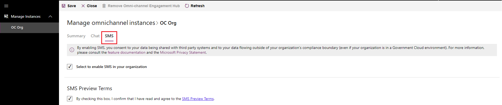
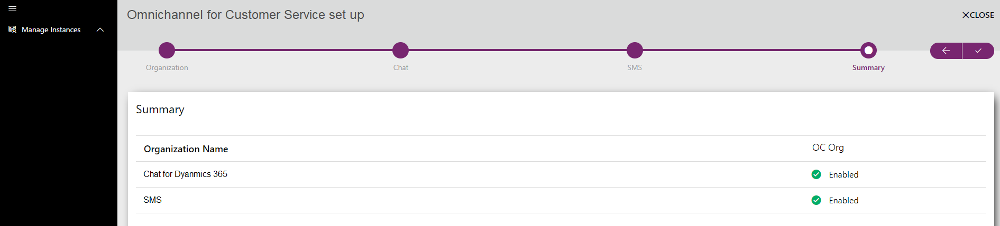

# Provision Omnichannel for Customer Service

Applies to Dynamics 365 for Customer Engagement apps version 9.1.0

Omnichannel for Customer Service provides a modern, customizable, high-productivity app that lets agents help customers across different channels via a unified interface. It lets organizations choose the channel that suits their business needs. It also ensures that a high level of responsive, quality service is received across channels.

> [!NOTE]
> Before you can provision Omnichannel for Customer Service on your org, a **Global Tenant Admin** must [Provide data access consent](#provide-data-access-consent).     Ensure that all the prerequisites are set up before the app is provisioned. More information, see [Pre-requisites](../system-requirements-omnichannel.md#pre-requisites). 

Looking for an upgrade? See [Upgrade Omnichannel for Customer Service](upgrade-omnichannel.md) for more information.

## Provide data access consent

To allow Omnichannel for Customer Service to read and write data on behalf of users, follow these below steps:

1. Go to [Data access consent URL](https://go.microsoft.com/fwlink/?linkid=2070932).
2. Sign in using **Global Tenant Admin** credentials.
3. Select the checkbox **Consent on behalf of your organization**.
4. Select **Accept** to grant data access consent.

    > [!div class=mx-imgBorder]
    > 

## Provision Omnichannel for Customer Service application

> [!IMPORTANT]
> Ensure that you are either a **Global Tenant Admin** or **Dynamics 365 Service Admin** of your Dynamics 365 org to be able to provision the Omnichannel for Customer Service application.

### Set up Omnichannel for Customer Service

> [!NOTE]
> Ensure that you have provided data access consent before you proceed with the set up. For more information, see [Provide data access consent](#provide-data-access-consent).

   1. In the **Dynamics 365 Administration Center**, select **Manage**.
      
        > [!div class=mx-imgBorder]
        > 

       The **Manage Omnichannel Instances** page is displayed.

   3. On the **Manage Omnichannel Instances** page, select **Add Org** to add an organization.   Omnichannel is set up on the organization instance that you add here.
   
       > [!div class=mx-imgBorder]
       > 

       > [!IMPORTANT]
       > As an admin, you can configure Omnichannel on multiple org instances. You can view the status of all org instances where the Omnichannel app has been configured in the **Manage Instances** view.

   3. Select the organization in the **Organization Selector** drop-down list. 

        > [!div class=mx-imgBorder]
        > 

        > [!IMPORTANT]
        > You must select the checkboxes for **Microsoft Privacy Statement** and **Terms & Conditions** to accept the terms and proceed with the set up.
      
      Select the continue arrow  to proceed.

     4. Select the check box to enable **Chat** channel on your org and select the continue arrow to proceed with the set up.

          > [!div class=mx-imgBorder]
          > 
         
        On successful set up, you can view the org and the enabled channel in the **Manage Instances** view.

        > [!div class=mx-imgBorder]
        > 

### Enable SMS channel

 You can enable SMS channel after you have upgraded to the latest release of Omnichannel. To upgrade Omnichannel for Customer Service, see [Upgrade Omnichannel for Customer Service](upgrade-omnichannel.md).

 Post upgrade, go to **Manage Omnichannel instances** page and enable SMS channel by selecting the checkbox in **SMS** tab.

> [!div class=mx-imgBorder]
> 

> [!IMPORTANT]
> You must select the checkbox for **SMS Preview Terms** to enable the channel. Either Chat or SMS channel must be selected to continue with the setup.

Once enabled, you can see the status for both the channels on the **Summary** page.

> [!div class=mx-imgBorder]
> 

## Locate your Org ID

Follow these steps to locate your Org ID in your Dynamics 365 instance.

1. In Dynamics 365, go to **Settings** > **Customizations**.
    > [!NOTE]
    > Ensure that you have System Administrator or System Customizer security role or equivalent permissions.

2. Select **Developer Resources**.

    You can find your Org ID in the **Instant Reference Information** section.

    > [!div class=mx-imgBorder]
    > 

### See also

[Upgrade Omnichannel for Customer Service](upgrade-omnichannel.md)

[Understand and create work streams](work-streams-introduction.md)

[Manage users](users-user-profiles.md)