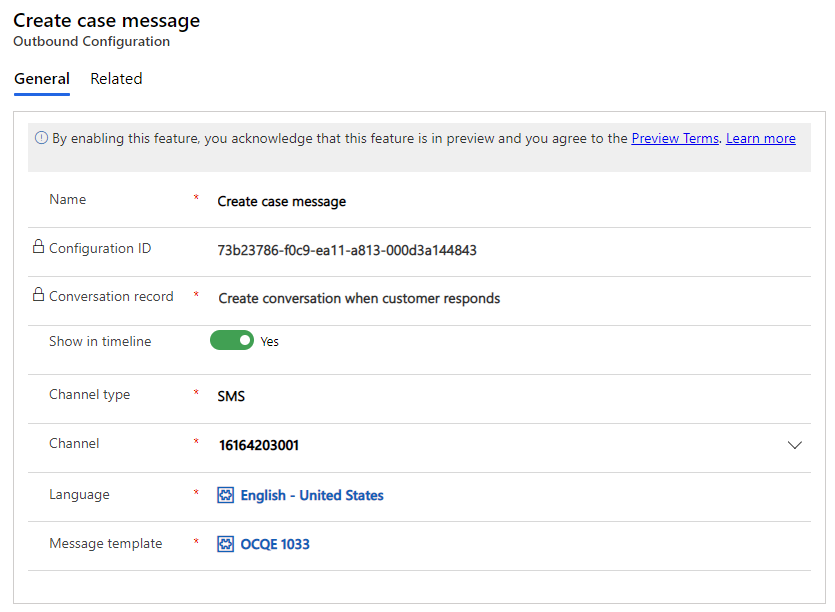
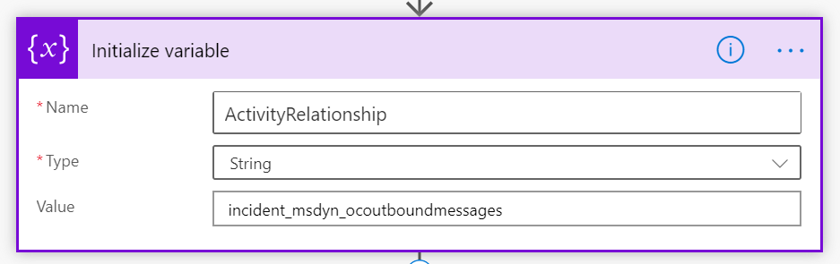
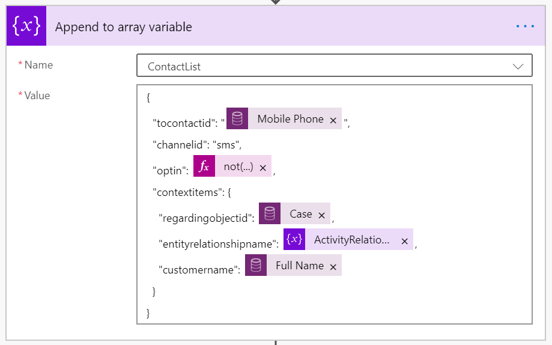

# Preview: Configure outbound messaging

[!INCLUDE[cc-use-with-omnichannel](../../includes/cc-use-with-omnichannel.md)]

[!include[cc-beta-prerelease-disclaimer](../../includes/cc-beta-prerelease-disclaimer.md)]

> [!IMPORTANT]
>
> - A preview is a feature that is not complete, as it may employ reduced privacy, security, and/or compliance commitments, but is made available before it is officially released for general availability so customers can get early access and provide feedback. Previews are provided "as-is," "with all faults," "as available," and without warranty.​
> - This preview feature does not come with technical support and Microsoft Dynamics 365 Technical Support won't be able to help you with issues or questions.  If Microsoft does elect to provide any type of support, such support is provided "as is," "with all faults," and without warranty, and may be discontinued at any time.​
> - Previews are not meant for production use, especially to process Personal Data or other data that is subject to heightened compliance requirements, and any use of "live" or production data is at your sole risk.  All previews are subject to separate [Terms and Conditions](../../legal/dynamics-insider-agreement.md).

## Overview

Outbound messaging enables organizations to send messages to their customers based on system-triggered or user-defined events through supported channels. In this preview, Omnichannel for Customer Service supports the sending of outbound messages through the SMS channel only.

With outbound messaging, organizations can do the following:

- Create message templates that can be adopted for outbound messages.
- Configure outbound messages based on certain events on any entity and send the messages when those events are triggered.
- Configure outbound messages to send manually based on non-system events.

Organizations can send messages to customers automatically based on a system event, such as case creation. Organizations also can send notices to customers based on non-system events such as a shipping delays due to weather. 

## Prerequisites

Before you configure outbound messaging, make sure that the following prerequisites are met:

- You must have the SMS channel provisioned in your environment. For information, see [Provision Omnichannel for Customer Service](omnichannel-provision-license.md).
- You must configure the SMS channel using an account with an SMS provider, either Twilio or TeleSign. 
- You must have a Power Automate account.

After completing the prerequisites, you can send outbound messages from your organization by following these steps:

- [Preview: Configure outbound messaging](#preview-configure-outbound-messaging)
  - [Overview](#overview)
  - [Prerequisites](#prerequisites)
  - [Step 1: Set up message templates](#step-1-set-up-message-templates)
  - [Step 2: Set up outbound configuration](#step-2-set-up-outbound-configuration)
  - [Step 3: Set up a Power Automate flow](#step-3-set-up-a-power-automate-flow)
    - [See also](#see-also)

## Step 1: Set up message templates

1. Consider the scenarios that require your organization to send outbound messages.

2. Log in to the Omnichannel Administration app. 

3. [Create a template](create-message-templates.md) for your outbound message.

## Step 2: Set up outbound configuration

1. Under **Settings**, click **Outbound**.

2. Complete the following fields:

    | Field               | Sample value                         |
    |---------------------|--------------------------------------|
    | Name                | Case create message                  |
    | Show in timeline    | Yes                                  |
    | Channel type        | SMS                                  |
    | Channel             | For SMS, the 10-digit SMS number     |
    | Language            | English                              |
    | Message template    | (your previously created template)   |

    The **Configuration ID** will be generated when you click **Save**. You will use this later to identify this outbound message when you set up the flow in Power Automate.

    The **Conversation record** is set to automatically create a conversation in Omnichannel for Customer Service when a customer responds to the outbound message. This field cannot be modified.

     **Show in timeline** displays the outbound message in the customer timeline and activities. Set to **Yes** for event-based messages that apply to the support journey of a specific set of customers. For bulk messages that will be sent to a high volume of customers, it is recommended to leave this setting at **No** in order to conserve resources in your Omnichannel environment and storage. 
    
    Choose a **Language** for the outbound message. 
    
    Choose a **Message template** for the outbound message. The list of message templates will contain only message templates that contain messages in the language you selected above. For instance, if you selected English for the outbound message, only message templates containing messages with the **Language** set to English will appear in the list. If you want to send the same message in other languages, you need to create a new outbound message configuration and select another language that is also contained in the message template.
    
    > [!div class=mx-imgBorder]
    > 
    
## Step 3: Set up a Power Automate flow

Power Automate provides a low code platform for workflow and process automation. For more information, refer to [Power Automate documentation](https://docs.microsoft.com/power-automate/).

1. Go to https://us.flow.microsoft.com/, sign in to your account, and click **My flows**.

    OR
    
    In the Omnichannel Administration app, **Message template view**, click the **Flow** button at the top of the screen, and click **Create a flow**.

2. In Power Automate, set up a flow that aligns with your outbound messaging scenario.

    - **Automated:** Send an automatic message triggered by a system event, for example, case creation.

    - **Instant:** Send a message manually about a non-system event, for example, a shipping delay or a sale on products.
    
    - **Scheduled:** Send a message at a point in time, one or more times, and/or after an amount of time that you specify.
    
    For more information about the current limits and configuration details for flows, refer to [Limits and configuration in Power Automate](https://docs.microsoft.com/power-automate/limits-and-config).

3. When you create a flow, you must add the action, incident_msdyn_ocoutboundmessages.

    > [!div class=mx-imgBorder]
    > 

4. Then, you must refer to it in the append variable step. In the example below, "entityrelationshipname" refers to the ActivityRelationship defined above.

    > [!div class=mx-imgBorder]
    > 

    <!--If you added slugs to your outbound messages, you must define them here as well. The example above shows the case ID and full name of the customer. For a list of supported slugs, refer to [Create message templates](create-message-templates.md). -->
    
    You must define any slugs used in your outbound message here. You can define any CDS entity to be used as a slug. Once defined they can be added to the message. Slugs not defined here will not resolve.
   
5. You must also refer to the outbound message configuration ID from Omnichannel Administration app. 
    
    > [!div class=mx-imgBorder]
    > 
        

When the customer responds back to the outbound messages, the customer messages will be treated like any other incoming conversation that exists today in Omnichannel for Customer Service. The conversation will be routed and assigned to an agent, and the agent will be able to respond back to the customer.

### See also

[Create message templates](create-message-templates.md) 
[Channels in Omnichannel for Customer Service](channels.md)   
[Configure an SMS channel for TeleSign](configure-sms-channel.md) 
[Configure an SMS channel for Twilio](configure-sms-channel-twilio.md) 
[SMS FAQ](../faqs.md#sms)
